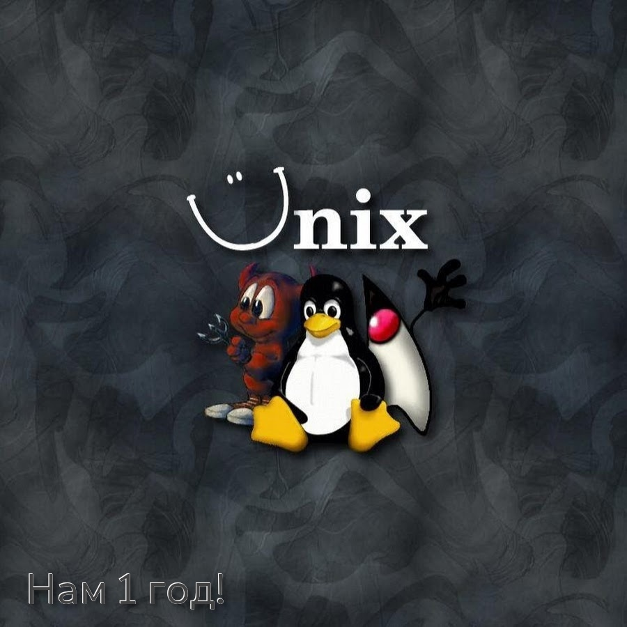

# LinuxSovet

## Разделы
[Новости сообщества](Group/news.md) | [Статьи](stats/stats.md) | [Правила](Group/rules.md)

Доброго времени суток! Ты попал в скромное сообщество GNU/Linux. Здесь ты узнаешь многое об ОС GNU/Linux.

## Основная тематика сообщества:
- новости
- игры
- подсказки (помощь новичку)
- советы (помощь новичку)

Не стесняйся задавать вопросы, ведь самый простой способ найти ответ — совет опытного пользователя. Взаимопомощь и общение — традиция в мире GNU/Linux. Всегда можно обратиться за помощью к сообществу пользователей и разработчиков GNU/Linux. Большинство вопросов повторяются, поэтому для начала стоит поискать ответ на свой вопрос в документации, затем в сети Интернет. Если вы не нашли ответа в перечисленных источниках, не стесняйтесь, пишите нам в чат, на стену сообщества. Так, как писали бы своим друзьям, и вам обязательно помогут. С уважением, с чувством, с толком и с расстановкой.

## Полезные статьи:
* [Программирование с использованием GTK4 (перевод официальной статьи)](stats/GTK/README.md)
* Строение GNU/Linux:
	* [Часть 1 - общие понятия](stats/LFS/LinuxStr.md)
	* [Часть 2 - принцип "всё есть файл"](stats/LFS/LinuxStr2/LinuxStr2.md)
	* [Часть 3 - права доступа к файлам](stats/LFS/LinuxStr3/LinuxStr3.md)
	* [Часть 4 - строение ELF файла (НЕ ЗАКОНЧЕНО!)](stats/LFS/LinuxStr4/LinuxStr4.md)
* [Оперативная память и подкачка](stats/RAM/ram.md)

> Не забывай подписываться на наше [сообщество](https://vk.com/linuxsovet) в ВК, а так же [канал](https://t.me/linuxsovet) и [чат](https://t.me/linuxsovet_chat) в Telegram!

## Последние новости:
* 03.06.2021 - уход пользователя Linuxoid85 из состава руководителей группы
* 04.06.2021 - передача сообщества другому человеку
* 05.06.2021 - принятие Linuxoid85 окончательного roadmap сообщества ([Telegram](https://t.me/linuxsovet)) на вторую половину 2021 года.

(*roadmap - т.н. карта действий. Т.е., примерный план развития.*)

## Поддержка
У сообщества работает неплохая поддержка. При чём делится решением проблем абсолютно безвозмездно. Хотя и не факт, что помогут, но на решение наведут.

* [Чат](https://t.me/linuxsovet_chat)
* [Канал](https://t.me/linuxsovet)
* [Сообщество ВКонтакте](https://vk.com/linuxsovet)

## Программное обеспечение
Помимо написания статей и прочего материала, мы ещё и производим некоторый софт. На данный момент, написаны:
| Название | Версия | ЯП | Ссылка для скачивания |
|:---------|:------:|:---|:----------------------|
| Helper   | 0.06.1.2020 | Bash | [deb-пакет](https://github.com/Linuxoid85/helper/releases/download/0.06.2.2020/Helper.deb), [tar архив](https://github.com/Linuxoid85/helper/releases/download/0.06.2.2020/Helper.tar) |
| Calmira GNU/Linux | 2021.2.2 | some langs | [Base](https://github.com/Linuxoid85/CalmiraLinux/releases/download/2021.2.2/Calmira_2021.2.2_build1_base.sqsh), [With Xorg support](https://github.com/Linuxoid85/CalmiraLinux/releases/download/2021.2.2/Calmira_2021.2.2_build1_with_xorg.sqsh) |

### Calmira Linux
Это легковесный независимый дистрибутив со своей пакетной базой.
Пакетный менеджер `cpkg`, пришедший на смену менее надёжному и простому `cpkg-tools`, находится пока в зачаточном состоянии.

Главная особенность дистрибутива - его малый размер и неприхотливость. Для работы ему будет достаточно процессора Intel Atom, оперативной памяти объёмом от 30 Мб и жёсткого диска от 2-3 Гб.

Пакетный менеджер `cpkg` (релиз Calmira 2021.2), пришедший на смену `cpkg-tools` из релиза Calmira 2021.1, содержит множество изменений. Тут и более стабильная работа, и хорошая работа с зависимостями, а так же меньшая разрозненность. Установка и удаление ПО теперь следует одним и тем же правилам.

### Идеология, следование принципам
Дистрибутив старается следовать стандартам FHS и LSB в первую очередь. Помимо этого, дистрибутив следует принципу KISS. В Calmira всё решает пользователь. Как ставить, куда ставить и что ставить. Как пользоваться дистрибутивом. Так же вы можете без каких-либо проблем делать сборки на основе Calmira.

Исходный код компонентов Calmira от её разработчиков распространяется под лицензией GNU GPLv3.

### Скачивание
Текущий билд вы можете скачать из таблицы выше. А так же зайдите на [GitHub](https://github.com/Linuxoid85/CalmiraLinux) проекта, чтобы следить за последними новостями.
 
***

В декабре 2020 нам исполнился год!

***
(C) 2019-2021 [Linuxoid85](https://www.vk.com/linuxoid85). Сайт сообщества [LinuxSovet](https://www.vk.com/linuxsovet)
