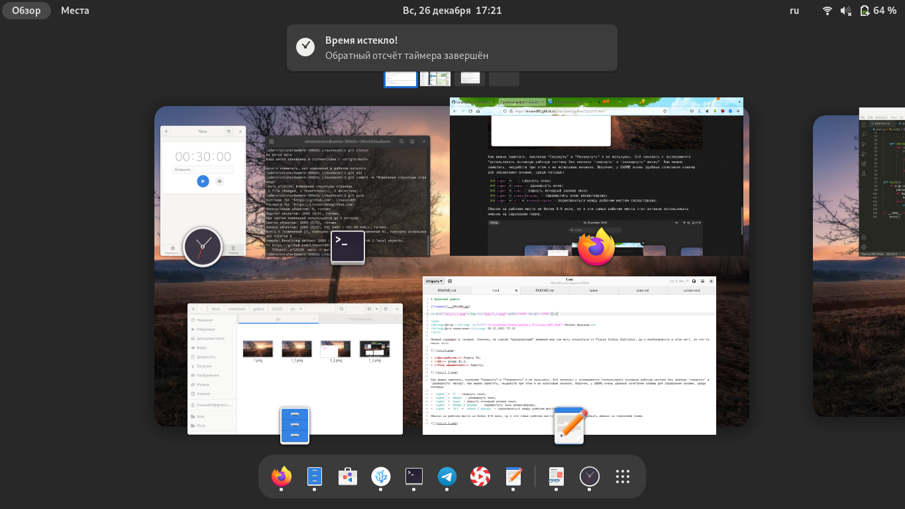

# Приятный дефолт

[Галерея](../README.md)

<pre>
<strong>Автор:</strong> <a href="/LinuxSovet/Group/authors.d/Linuxoid85.html">Михаил Краснов</a>
<strong>Дата написания:</strong> 26.12.2021 17:10
</pre>

Первый скриншот в галерее. Конечно, не совсем "изкоробочный" внешний вид (не могу отказаться от Places Status Indicator, да и необходимости в этом нет), но что-то около того.

* **Дистрибутив:** Fedora 35;
* **DE:** gnome 41.2;
* **Тема оформления:** Adwaita;

Как можно заметить, кнопками "Свернуть" и "Развернуть" я не пользуюсь. Всё началось с эксперимента "использовать основную рабочую систему без кнопкок 'свернуть' и 'развернуть' месяц". Как можно заметить, неудобств при этом я не испытываю никаких. Впрочем, у GNOME очень удобные сочетания клавиш для управления окнами, среди которых:

- `super` + `h` - свернуть окно;
- `super` + `вверх` - развернуть окно;
- `super` + `вниз` - вернуть исходный размер окна;
- `super` + `влево`/`вправо` - переместить окно влево/вправо;
- `super` + `alt` + `влево`/`вправо` - переключиться между рабочим местом слева/справа.

Обычно на рабочем месте не более 4-6 окон, ну и эти самые рабочие места стал активно использовать именно на сороковом гноме.

