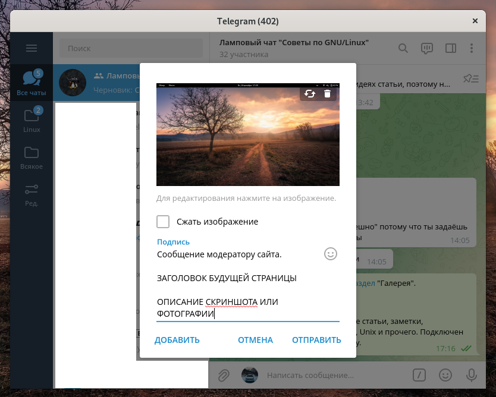
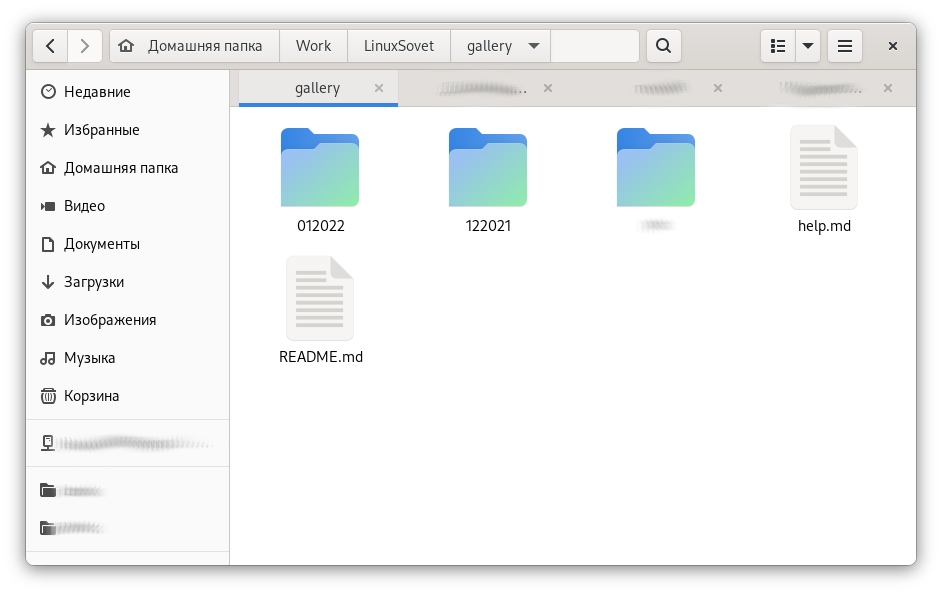

# Инструкция по добавлению своего скриншота или фотографии

[Галерея](README.md)

<pre>
<strong>Автор:</strong> <a href='/LinuxSovet/Group/authors.d/Linuxoid85.html'>Михаил Краснов</a>
<strong>Дата написания:</strong> Sun Dec 26 18:14:07 2021
</pre>

26 декабря 2021 года на сайт был добавлен раздел "Галерея". Рассказываем, как добавить туда свои скриншоты или фотографии.

## Первый способ. Отправка скриншота в чат

У нас уже больше года работает чат в Telegram ([ссылка](t.me/linuxsovet_chat)). Поэтому любой пользователь может отправить туда свои фотографии. Формат сообщения таков:

```
Сообщение модератору сайта.

ЗАГОЛОВОК БУДУЩЕЙ СТРАНИЦЫ

ОПИСАНИЕ СКРИНШОТА ИЛИ ФОТОГРАФИИ
```

В сообщении должны быть прикреплены фотографии в НЕСЖАТОМ виде. Для этого убедитесь, что галочка "Сжать изображение" снята (как на фото ниже).



## Второй способ. Отправка Pool Request на GitHub.

Сайт располагается [здесь](https://github.com/Linuxoid85/LinuxSovet). Сделайте форк этого репозитория и вносите в него изменения, после чего отправьте запрос на слияние (pool request) в исходный репозиторий.

### Структура директорий

* `/gallery` - здесь располагаются директории со страницами галереи.
* `/gallery/цифры` - здесь располагаются сами страницы. `цифры` имеют вид `[месяц][год]`, например `012022` - январь 2022 года.



Страница должна иметь порядковый номер от одного. Например, если в нужной директории есть файл с номером `1.md`, то следующим должен быть `2.md` и т.д.

### Содержание страницы со скриншотом или фотографией

Все страницы на сайте в формате Markdown. Примерное строение такой страницы:

```markdown
# Заголовок

[Галерея](../README.md)

<a href="pic/путь_до_фотографии"></a>

<pre>
<strong>Автор:</strong> <a href="ссылка_на_автора(например, email)">Автор</a>
<strong>Дата написания:</strong> дд.мм.гггг чч:мм
</pre>

Фотографии, описания и прочее.
```

Удачи!
