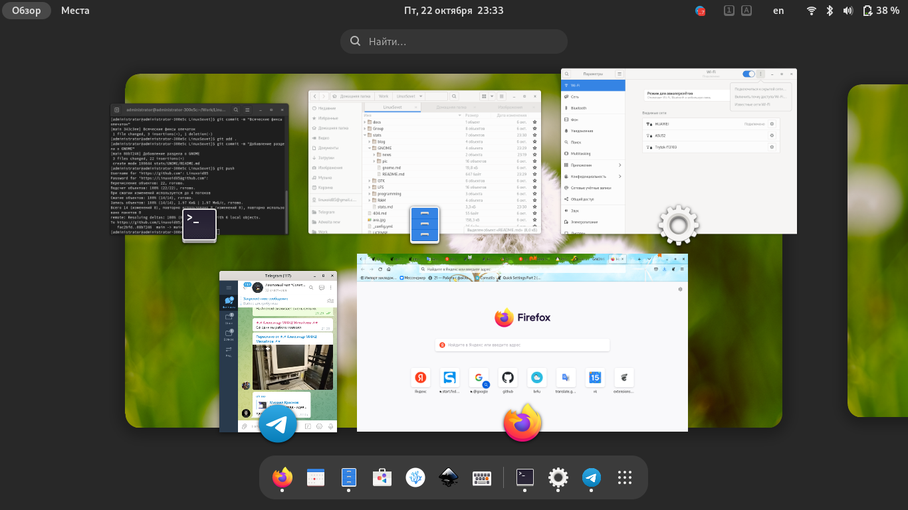

# GNOME

[Статьи](../stats.md)

На протяжении достаточно долгого времени я использую исключительно это рабочее окружение. И пока не планирую его менять на что-то другое. Раздел посвящён GNOME. Здесь публикуются всевозможные новости, заметки и прочее.

# Статьи

* [О рабочем окружении GNOME 40](gnome.md)

## Внешний вид

* [Расширения GNOME Shell](look/1/extensions.md)

# Новости

* [Раздел новостей](news/README.md)
* [Инсайды](news/insides/README.md)
	* [Статья 1](news/insides/quick-settings.md)
