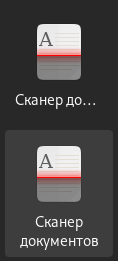
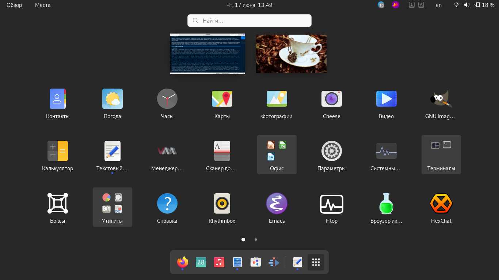
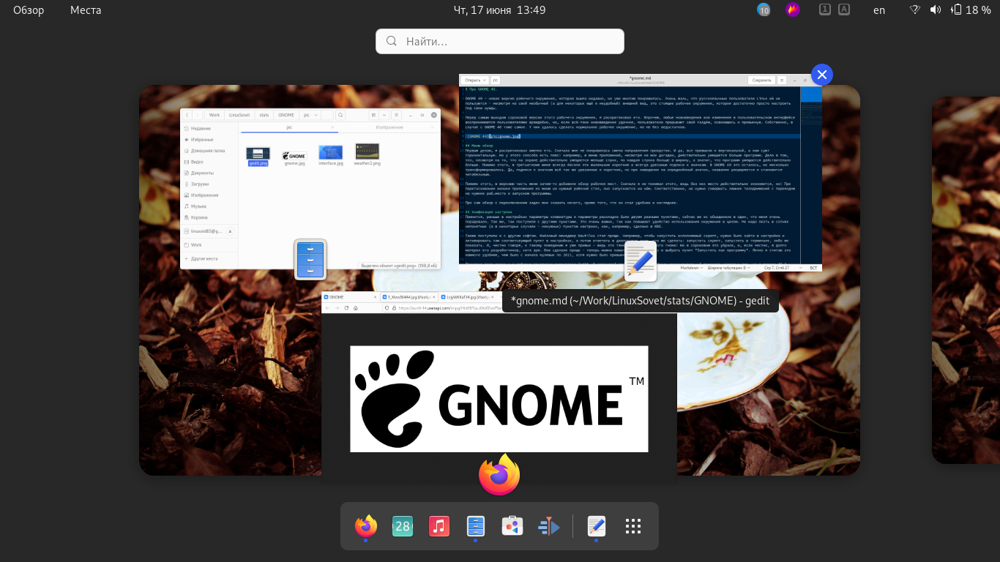
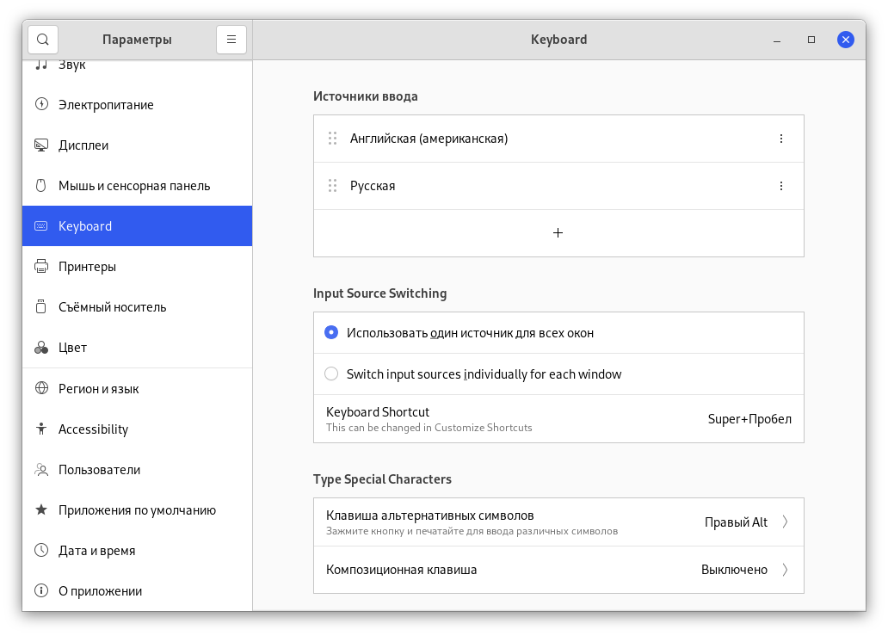
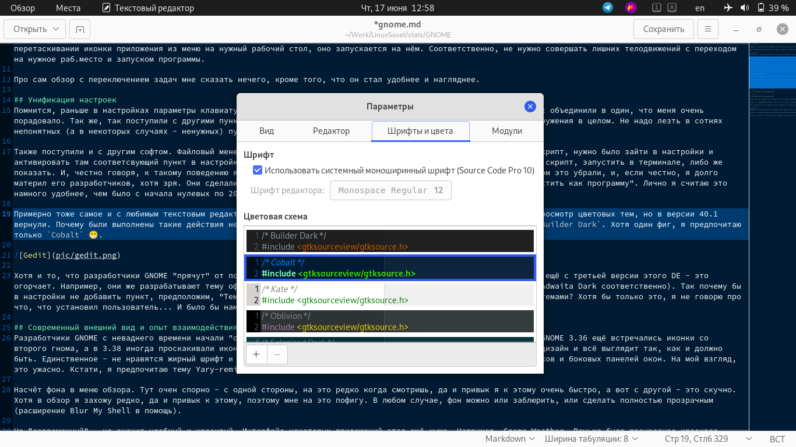
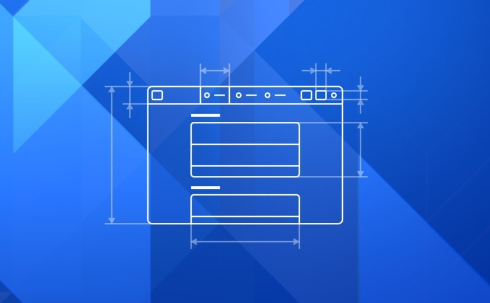
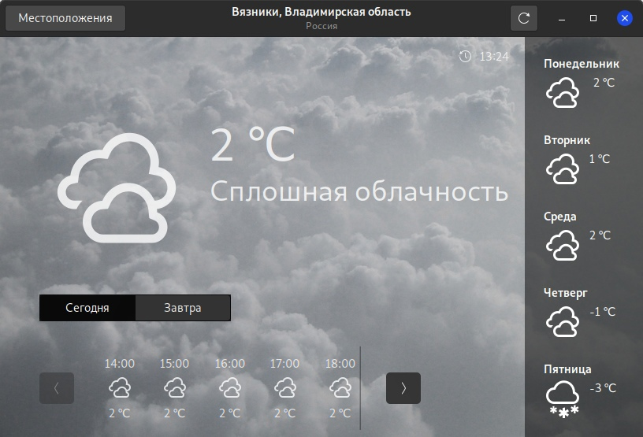
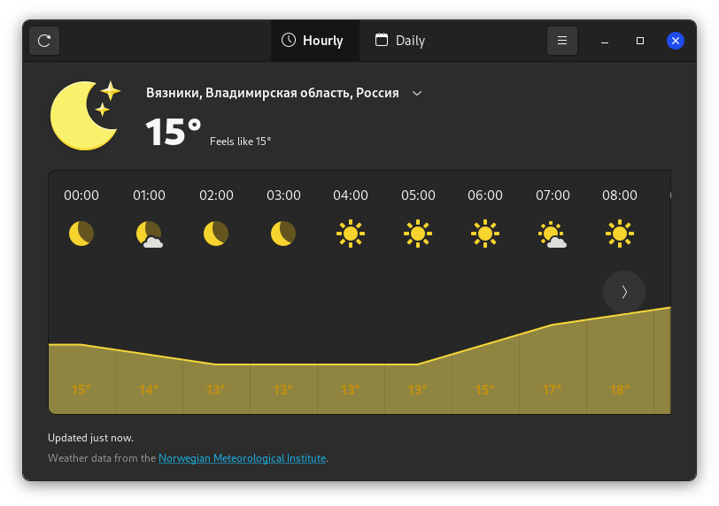
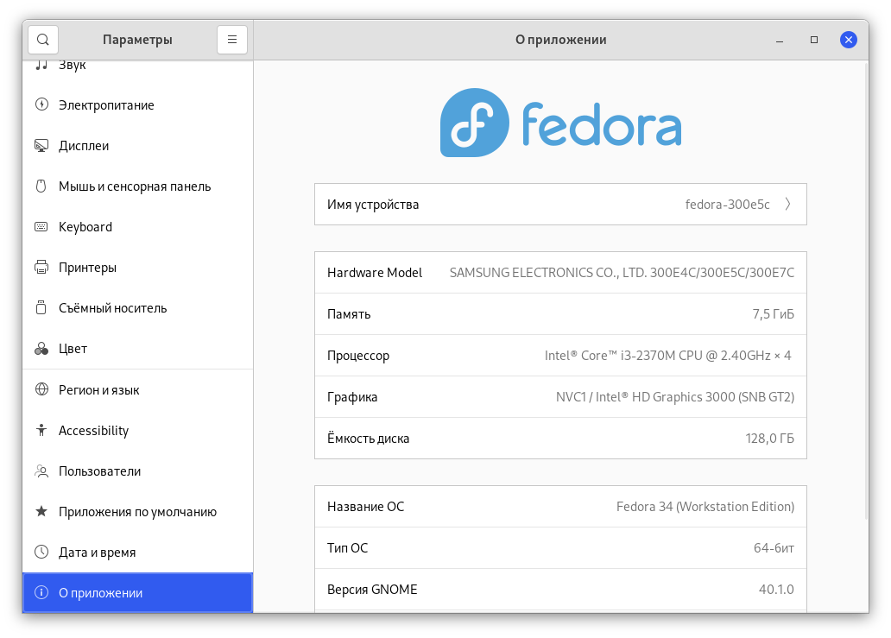
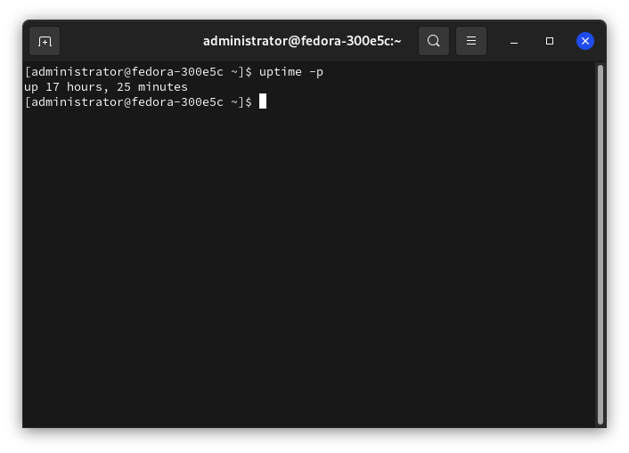

# Про GNOME 40.

GNOME 40 - новая версия рабочего окружения, которая вышла недавно, но уже многим понравилась. Очень жаль, что русскоязычные пользователи Linux ей не пользуются - несмотря на свой необычный (а для некоторых ещё и неудобный) внешний вид, это стоящее рабочее окружение, которое достаточно просто настроить под свои нужды.

Перед самым выходом сороковой версии этого рабочего окружения, я раскритиковал его. Впрочем, любые нововведения или изменения в пользовательском интерфейсе воспринимаются пользователями враждебно, но, если всё-таки нововведение удачное, пользователи прерывают свой галдёж, освоившись и привыкнув. Собственно, в случае с GNOME 40 тоже самое. У них удалось сделать нормальное рабочее окружение, но не без недостатков.

## Меню обзор
Первым делом, я раскритиковал именно его. Сначала мне не понравилась смена направления прокрутки. И да, все привыкли к вертикальной, а нам суют горизонтальную. Но у этого способа есть плюс: например, в меню приложений, несмотря на мои догадки, действительно умещается больше программ. Дело в том, что, несмотря на то, что на экране действительно умещается меньше строк, но каждая строка больше в ширину, а значит, что программ умещается действительно больше. Помимо этого, в третьегноме меня всегда бесили эти маленькие короткие и всегда урезаные подписи к значкам. В GNOME 40 это осталось, но несколько трансформировалось. Да, подписи к значкам всё такие же урезанные и короткие, но при наведении на определённый значок, название расширяется и становится читабельным.

*Вверху иконка до того, как на неё навели мышкой, внизу - после*

Помимо этого, в верхнюю часть меню зачем-то добавили обзор рабочих мест. Сначала я не понимал этого, ведь без них место действительно экономится, но! При перетаскивании иконки приложения из меню на нужный рабочий стол, оно запускается на нём. Соответственно, не нужно совершать лишних телодвижений с переходом на нужное раб.место и запуском программы.

Про сам обзор с переключением задач мне сказать нечего, кроме того, что он стал удобнее и нагляднее. Как и раньше, в обзоре находятся превью открытых окон. Но теперь это не обзор открытых задач, а обзор всех рабочих мест! Переключение между рабочими местами стало намного удобнее - не нужно лезть в боковое меню с ними, чтобы увидеть, какие программы располагаются на нём. Достаточно прокрутить влево или вправо и всё становится видно. Отображается непрерывная лента рабочих мест, на которых расположены превью открытых окон. В нижней части превью расположили иконку приложения (внизу посередине), а при наведении на окно оно немного увеличивается в размерах и внизу показывается его имя.

## Унификация настроек
Помнится, раньше в настройках параметры клавиатуры и параметры раскладки были двумя разными пунктами, сейчас же их объединили в один, что меня очень порадовало. Так же, так поступили с другими пунктами. Это очень важно, так как повышает удобство использования окружения в целом. Не надо лезть в сотнях непонятных (а в некоторых случаях - ненужных) пунктов настроек, как, например, сделано в KDE.

Также поступили и с другим софтом. Файловый менеджер Nautilus стал проще. Например, чтобы запустить исполняемый скрипт, нужно было зайти в настройки и активировать там соответсвующий пункт в настройках, а потом отвечать в диалоговом окне, что же сделать: запустить скрипт, запустить в терминале, либо же показать. И, честно говоря, к такому поведению я уже привык - ведь это тянется ещё со второго гнома! Но в сороковом это убрали, и, если честно, я долго материл его разработчиков, хотя зря. Они сделали проще - теперь можно нажать ПКМ по скрипту и выбрать пункт "Запустить как программу". Лично я считаю это намного удобнее, чем было с начала нулевых по 2021, хотя нужно было привыкнуть.

Примерно тоже самое и с любимым текстовым редактором Gedit. В сороковой версии почему-то убрали предварительный просмотр цветовых тем, но в версии 40.1 вернули. Почему были выполнены такие действия непонятно. Но они добавили две новых темы - это `Builder Light` и `Builder Dark`. Хотя один фиг, я предпочитаю только `Cobalt` 😁️.

Хотя и то, что разработчики GNOME "прячут" от пользователей банальные настройки смены темы оформления (к примеру) ещё с третьей версии этого DE - это огорчает. Например, они же разрабатывают тему оформления Adwaita в двух расцветках - светлой и тёмной (Adwaita и Adwaita Dark соответственно). Так почему бы в настройки не добавить пункт, предположим, "Тема оформления", где поместить переключалку между светлой и тёмной темами? Хотя бы только это, я не говорю про что, что установил пользователь... И было бы намного лучше. Но, видимо, им этого не понять.

## Современный внешний вид и опыт взаимодействия человека с рабочим окружением

*Изображение было взято [отсюда](https://blogs.gnome.org/tbernard/2021/03/22/drawing-mockups/)*

Разработчики GNOME с неваднего времени начали "осовременнивать" внешний вид окружения. То обновят тему иконок: в GNOME 3.36 ещё встречались иконки со второго гнома, а в 3.38 иногда проскакивали иконки с первых версий GNOME 3, но в сороковом произвели серьёзный редизайн и всё выглядит так, как и должно быть. Единственное - не нравятся жирный шрифт и жирные иконки в панели управления системой, жирные иконки заголовков и боковых панелей окон. На мой взгляд, это ужасно. Кстати, я предпочитаю тему Yary-remix (найдите её в [интернете](www.google.com)), там всё нормально)).

Насчёт фона в меню обзора. Тут очен спорно - с одной стороны, на это редко когда смотришь, да и привык я к этому очень быстро, а вот с другой - это скучно. Хотя в обзор я захожу редко, да и привык к этому, поэтому мне на это пофигу. В любом случае, фон можно или заблюрить, или сделать полностью прозрачным (расширение Blur My Shell в помощь).

Но "современный" - не значит удобный и красивый. Интерфейс некоторых приложений стал ещё хуже. Например, Gnome Weather. Раньше было прекрасное красивое приложение. А сейчас какое-то унылое говно.

**Было:**

**Стало:**

Старое было намного красивее. Тут и красивый фон, и более удобное представление информации. Хотя в современном исполнении приложение получилось более информативным. Хотя сравните приложения погоды, например, для Android. В них гармонично сочетаются информативность и красота. И удобство использования, не забываем. Именно на это нужно равняться GNOME'секам.

Помимо этого, GNOME Weather запускается лишь один раз - во второй и последующие он просто ничего не покажет. Вечная загрузка, да и только. Спасает то, что в ленте уведомлений (где находится календарь), пожно узреть прогноз погоды на несколько часов. Кстати, он преобразился с выходом GNOME 3.38, в сороковом изменений я не нашёл. Стал более информативным, по сравнению с тем, что было раньше.

Ну и расположение дока. Оно, конечно, логично и предсказуемо - если сменили направление прокрутки в "обзоре" на горизонтальную, то док должен быть именно снизу экрана и иметь горизонтальное расположение. Но это не очень удобно, так как нужно тянуться из верхнего левого угла экрана (где вход в "Обзор") почти в правый нижний, где вход в меню. Владельцам ноутбуков это не очень удобно. Хотя можно поступить проще: на любой вкус несколько сочетаний клавиш для входа в меню. Тут и два раза нажать на *Super*, и *Super+A*, и *Super+Alt+2 раза на стрелку вверх*...

## Надёжность
GNOME 40, на удивление, оказался очень надёжным. Никаких падений и отчётов. Кроме единоразового падения `gjs`, но это вызвало пару проблем с одним из расширений. И даже предварительные версии GNOME 40 порадовали своей стабильной работой.

Помимо этого, рабочее окружение работает достаточно быстро даже на оборудовании 2013 года. Хотя там железо довольно бодрое и на 2021 год, но всё равно я считаю это неплохим результатом. Если сравнивать с предыдущими версиями - была проведена отличная работа по чистке кода от неиспользуемых конструкций, багов и прочего говна, а так же проведена неплохая оптимизация. И GNOME с версии 3.36 только хорошеет в плане быстрой работы и малого потребления ОЗУ.

А сейчас у меня отпуск, и ноутбук на даче не выключается часами. Работает или от АКБ, или от зарядки (кстати, от АКБ на Fedora Linux не очень долго держится - каких-то два часа). Даже тогда, когда меня нет дома. Хотя когда я прихожу домой, то ноут активно используется. И опять же - падений рабочего окружения я не заметил, чего не скажешь о KDE. Помню, они кукарекали всё, мол, мы такие молодцы и спёрли у GNOME 3.30 адаптивную прозрачность панелей. Я этого не заметил. А настройки как были непонятным и запутанным куском говна, так и остались. А проблемы стабильности и надёжности их мало интересуют, видимо.

