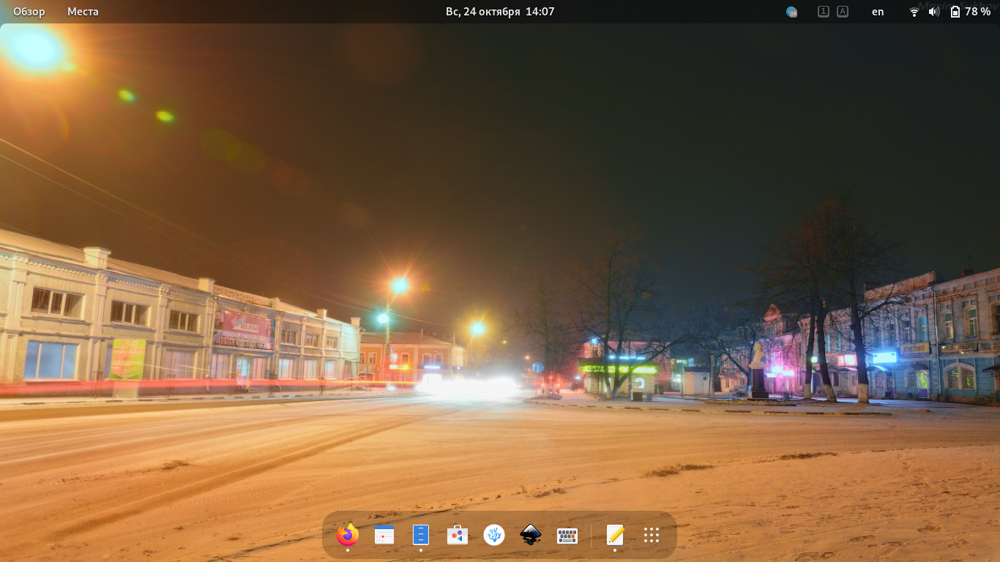
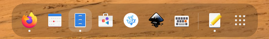
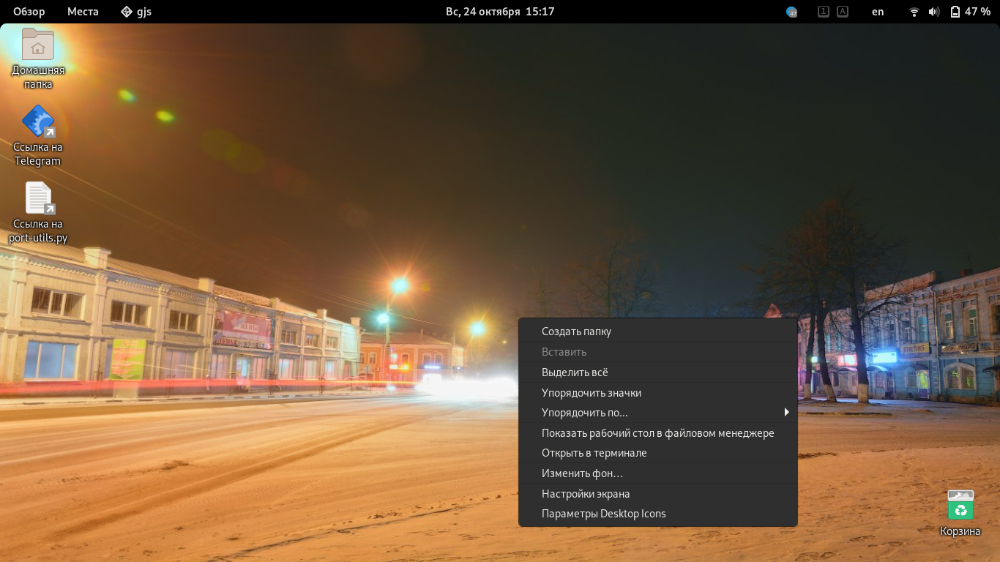
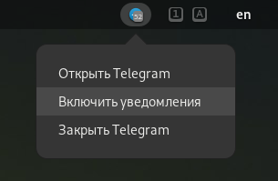
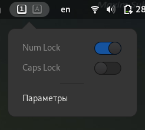
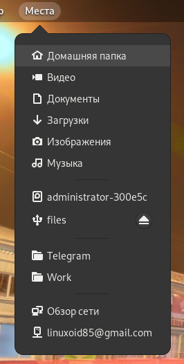
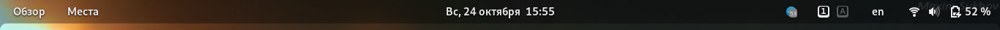
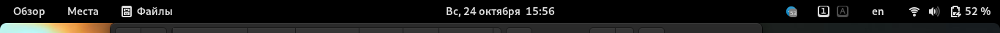

# Расширения GNOME Shell

[Статьи](../../../stats.md) > [GNOME](../../README.md)

<pre>
<strong>Автор:</strong> <a href="/LinuxSovet/Group/authors.d/Linuxoid85.html">Михаил Краснов</a>
<strong>Дата написания:</strong> 24.10.2021 14:04
</pre>

В начале этого года я писал статью о расширениях для рабочего окружения GNOME Shell, которые я рекомендую к использованию ([тык](https://vk.com/@linuxsovet-rasshireniya-gnome-shell)). Спустя некоторое время после написания статьи я понял, что в ней несколько недостатков, поэтому встречайте дополненный и актуализированный список лучших по мнению редакции расширений 😉️.

</img>

<em>GNOME 41 на Fedora 35. Обои - фотография ночных Вязников</em>

## Dash to Dock

В рабочем окружении GNOME удобная док-панель спрятана в меню "Обзор". Всё связано с философией GNOME - быть максимально минималистичным и незаметным DE. Но такое не всем понравится. Расширение Dash to dock исправляет это. Что самое интересное - так же он поддаётся неплохой кастомизации.

### Совместимость

| Версия GNOME | Совместимость |
|--------------|---------------|
| 3.2-41       | Полная        |
| 42.beta      | Частичная (только при отключенной проверке совместимости расширений с GNOME) - не работает очень много функций |
<!-- | 41           | Частичная - не работает ПКМ по иконке. Для установки необходимо воспользоваться специальным патчем | -->

### Установка

Для установки на GNOME 3.4-41 зайдите [сюда](https://extensions.gnome.org/extension/307/dash-to-dock/) и установите.

## Dash to panel

Раз уж упомянул Dash To Dock, то грех не упомянуть ещё одно расширение - Dash To Panel. Оно убирает верхнюю панель и вместо неё делает панель как в Windows 7-10 или какой-то KDE.

### Совместимость

| Версия GNOME | Совместимость |
|--------------|---------------|
| 3.18-3.38    | Полная        |
| 40, 41       | Полная        |

### Установка

Зайдите [сюда](https://extensions.gnome.org/extension/1160/dash-to-panel/) для установки.

## Clipboard indicator

В Trinity и KDE мне очень нравилось управление буфером обмена, а в GNOME этого нет, но зато есть Clipboard Indicator. Помимо удобной работы с буфером обмена, это расширение может посылать уведомления на рабочий стол о том, что скопировано.

### Совместимость

| Версия GNOME | Совместимость |
|--------------|---------------|
| 3.10-40      | Полная        |
| 41           | Отсутствует   |

### Установка

Зайдите [сюда](https://extensions.gnome.org/extension/779/clipboard-indicator/) для установки.

Расширение на [GitHub](https://github.com/Tudmotu/gnome-shell-extension-clipboard-indicator)

## Desktop Icons

К сожалению, в GNOME нет возможности расположения иконок на рабочем столе. Можно с ними согласиться - ведь так красиво и аккуратно. И мне такой подход нравится. Но опять же - не всем оно будет подходящим. Расширение Desktop Icons (ng) возвращает иконки раб.стола на законное место.

### Совместимость

| Версия GNOME | Совместимость |
|--------------|---------------|
| 3.30-40, 41 | Полная    |

### Установка

Зайдите [сюда](https://extensions.gnome.org/extension/2087/desktop-icons-ng-ding/) для установки.

Расширение на [GitLab](https://gitlab.com/rastersoft/desktop-icons-ng)

## GRUB Reboot

Людям не всегда хочется выбирать в грабу нужную версию для запуска. Намного проще выбрать нужную ОС прямо в меню перезагрузки.

### Совместимость

| Версия GNOME | Совместимость |
|--------------|---------------|
| 3.14-3.22    | Полная        |
| 3.30         | Возможно полная |

### Установка

Зайдите [сюда](https://extensions.gnome.org/extension/893/grub-reboot/) для установки.

Расширение на [GitHub](https://github.com/patriziobruno/grubreboot-gnome-shell-extension)

## AppIndicator and KStatusNotifierItem Support

Это расширение добавляет системный трей и поддержку KStatusNotifierItem.

### Совместимость

| Версия GNOME | Совместимость |
|--------------|---------------|
| 3.6-41       | Полная        |

### Установка

Зайдите [сюда](https://extensions.gnome.org/extension/615/appindicator-support/) для установки.

Расширение на [GitHub](https://github.com/ubuntu/gnome-shell-extension-appindicator)

## Tray Icons (reloaded)

Для возвращения системного трея на привычное место так же существует и это расширение. Оно обладает некоторыми настройками, и, что самое интересное, проброс трея из Wine. Т.е., программы, запущенные в Wine, и использующие системный трей, так же будут отображены в нём.

### Совместимость

| Версия GNOME | Совместимость |
|--------------|---------------|
| 3.36-41      | Полная        |

### Установка

Зайдите [сюда](https://extensions.gnome.org/extension/2890/tray-icons-reloaded/) для установки.

Расширение на [GitHub](https://github.com/MartinPL/Tray-Icons-Reloaded)

## Lock Keys

У меня в ноутбуке нет индикаторов состояния Num и Caps Lock, что иногда выводит из себя. Это расширение добавляет индикаторы на панель GNOME.

### Совместимость

| Версия GNOME | Совместимость |
|--------------|---------------|
| 3.2-41       | Полная        |

### Установка

Зайдите [сюда](https://extensions.gnome.org/extension/36/lock-keys/) для установки.

Расширение на [GitHub](https://github.com/kazysmaster/gnome-shell-extension-lockkeys)

## Places Status Indicator

Хотите быстрого доступа к директориям "Видео", "Музыка", "Документы", etc., избранным директориям, а так же подключенных носителей информации - это расширение для вас! Это расширение является частью классического режима и официально поддерживается GNOME.

Входит в состав GNOME - системное расширение.

### Совместимость

| Версия GNOME | Совместимость |
|--------------|---------------|
| 3.2-41       | Полная        |

### Установка

Если это расширение не поставляетя вместе с GNOME, то зайдите [сюда](https://extensions.gnome.org/extension/8/places-status-indicator/) для установки.

Расширение на [GitLab](https://extensions.gnome.org/extension/8/places-status-indicator/)

## Transparent Top Bar

Мне очень нравится динамическая (адаптивная) прозрачность панели GNOME, но её недавно убрали. Оставили постоянную прозрачность (*примечание* - в зависимости от темы. Например, в Adwaita и Yaru{,remix} прозрачности нет, а в других - есть). Для возвращения предыдущего состояния ияпользуется это расширение.

У него нет настроек, оно возвращает ту адаптивную прозрачность, что была до 3.32 версии гнома.

Прозрачная панель:

После того, как к ней приложили окно (или развернули его):

### Совместимость

| Версия GNOME | Совместимость |
|--------------|---------------|
| 3.32-41      | Полная        |

### Установка

Зайдите на [эту](https://extensions.gnome.org/extension/1708/transparent-top-bar/) страницу для установки.

Расширение на [GitHub](https://github.com/zhanghai/gnome-shell-extension-transparent-top-bar)

## Выводы

В данной статье я описал несколько расширений, которые рекомендую вам. Они обязательбно сделают работу с GNOME более простой и удобной 😉️.

Удачи!
