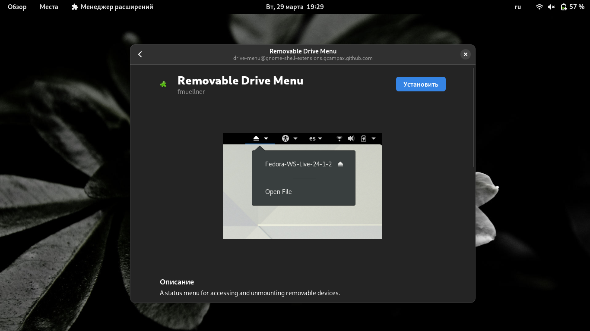
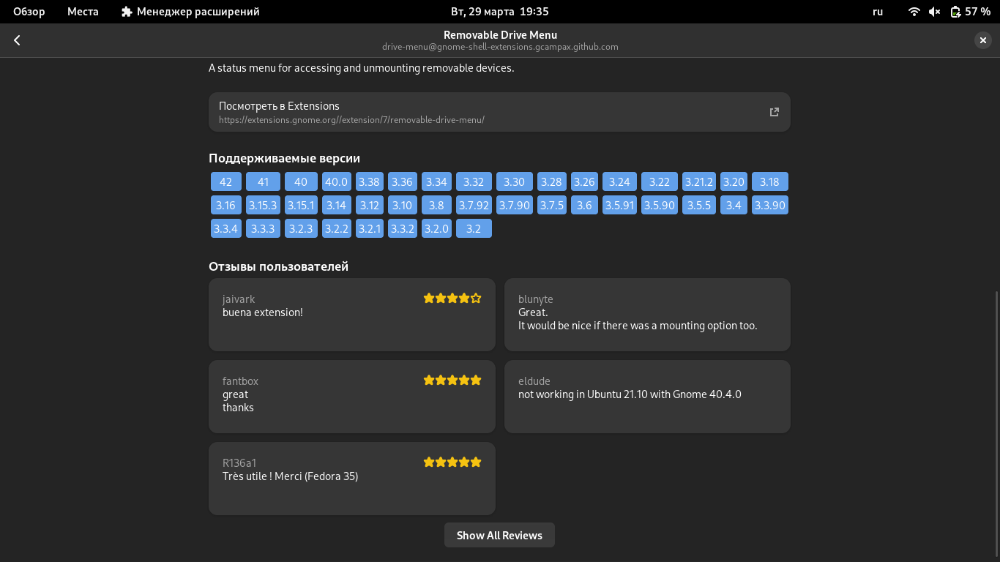
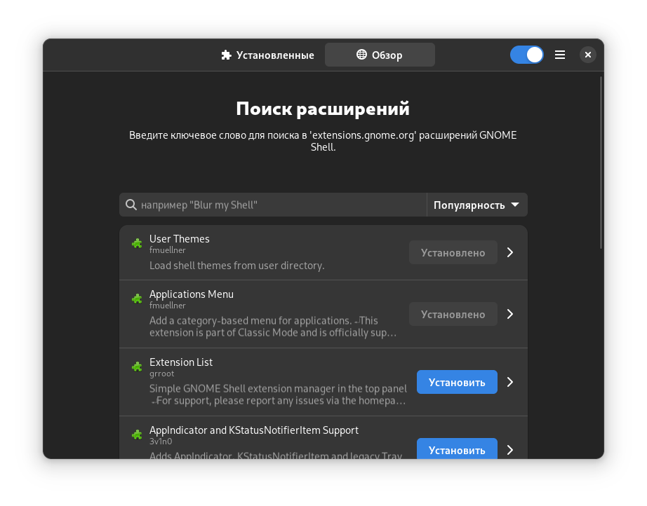

# Обновление "Менеджера расширений"

<pre>
<strong>Автор:</strong> <a href="/LinuxSovet/Group/authors.d/Linuxoid85.html">Михаил Краснов</a>
<strong>Дата написания:</strong> 29.03.2022 20:04
</pre>

## Что это такое?

*Менеджер расширений* - это приложение для GNOME, предназначенное для более удобного управления расширениями рабочего окружения GNOME (да здравствует капитан Очевидность). Конечно, у нас есть "Расширения" от самих разработчиков GNOME, которое входит в официальную поставку рабочего окружения GNOME Shell, но там нет кое-какой возвожности, о которой далее.

## Основные различия от "Расширений" из GNOME

Различия в интерфейсе указывать не буду. Пусть оба приложения используют GTK4 и libadwaita, у них есть небольшие изменения. Дело в другом - "Менеджер расширений" позволяет скачивать расширения из [extensions.gnome.org](https://extensions.gnome.org). Т.е. совершенно не нужно ставить расширение GNOME Shell Integration в браузер и с его помощью устанавливать нужное. Всё доступно в таком приложении.

## Список изменений

<!-- ЗАПОЛНИТЬ! -->
