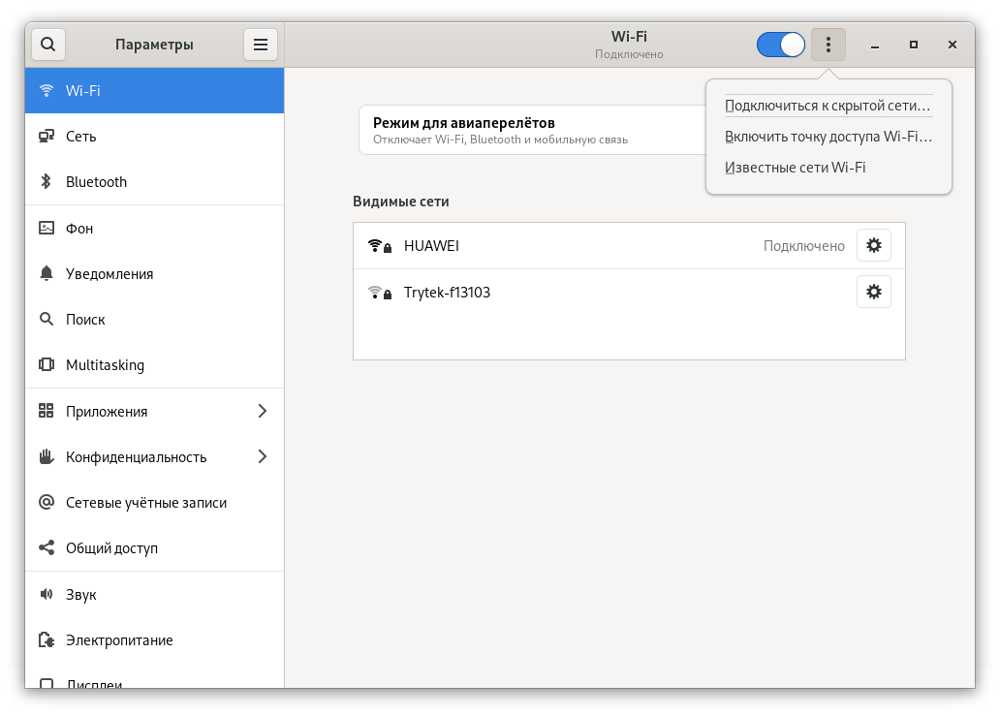
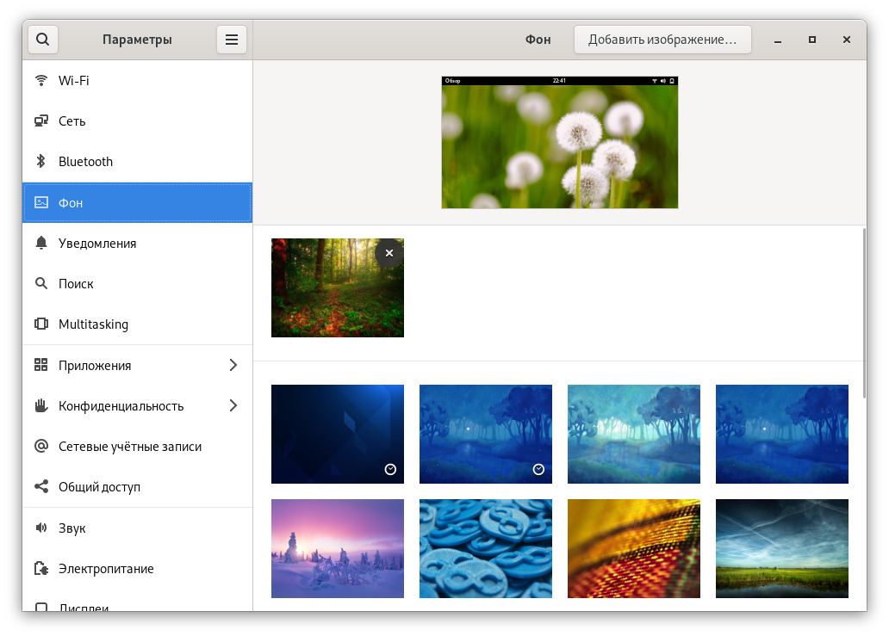
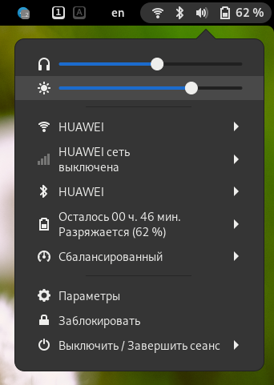
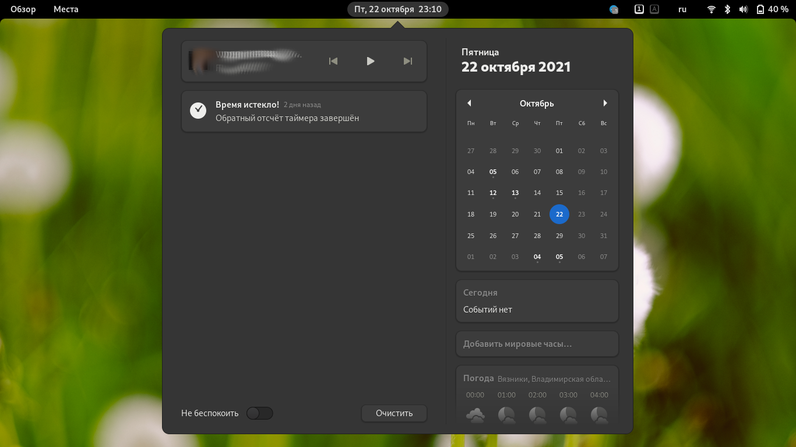

# Панель управления GNOME может преобразиться. Но это не точно.

[GNOME - новости](../README.md) > [Инсайды](README.md)

<pre>
Автор: Михаил Краснов
Дата написания: 22.10.2021 22:14
</pre>

Это первая статья в данном разделе. И начать я хотел про несколько неподтверждённых новостей. Может быть, изменения, которые я здесь описал, войдут в будущие релизы GNOME, а может быть и нет. Кто знает?

В новых версиях GNOME разработчики предлагают пользователям охрененно большую кучу дичайших багов, а так же несколько вагонов новых моднейших изменений, улучшений и нововведений. Так, 41 версия сего необычного DE представила нам пару новых багов, фикс старых, отличный редизайн и стабилизация работы GNOME Software (менеджер приложений), добавление рабочих мест на другие мониторы, включение и отключение активного левого верхнего угла (в котором находится меню "Обзор", и если в тот угол навести курсором, то откроется это меню). Что будет в следующих версиях (42, 43, 44, etc.)? Давайте разбираться.

## Предпочтение тёмного режима

Все мы знаем, что разработчики GNOME помимо темы Adwaita делают тёмную версию этой темы - *Adwaita dark*. Но, к большому сожалению, в GNOME Control Center невозможно поменять оформление, что кажется нелогичным. Конечно, я понимаю причину, по которой разработчики этого рабочего окружения не добавляют переключалку для всех установленных тем оформления, но хотя бы сделайте параметр для переключения между Adwaita и Adwaita dark!

### Принцип настройки GNOME

Тут надо понимать механизм параметров GNOME. Для настройки используется инструмент `dconf`. Это система настройки нижнегт уровня. Его основная цель - предоставить серверную часть GSettings на платформах, на которых еще нет систем хранения конфигурации. dconf - это простая система конфигурации на основе ключей. Ключи существуют в неструктурированной базе данных (но предполагается, что ключи, которые логически связаны друг с другом, группируются вместе).

Уведомление об изменении поддерживается.

Поддерживается стек из нескольких источников конфигурации. Обязательные ключи поддерживаются.

GSettings - удобный способ управлять настройками вашего приложения. Эти настройки хранятся в двоичной форме для быстрого извлечения, и ими можно управлять вне вашего приложения, а также с помощью специальных инструментов.

Эту систему можно рассматривать как базу данных, схема которой описана в XML-файле (обычно называемом .gschema.xml), который затем компилируется для повышения производительности во время выполнения.

GSettings на самом деле представляет собой интерфейс с несколькими возможными механизмами хранения. Типичным и рекомендуемым является dconf, но также можно использовать бэкэнд ключевого файла.

### Параметры

Описанный выше инструментарий используется ещё с GNOME 2. Настроек там куча - посмотрите сами. А `gnome-control-center` (параметры GNOME), `gnome-tweaks` (доп. настройки окружения) - это графические интерфейсы для gsettings. Поэтому некорректно говорить про то, что в GNOME нет настройки для смены темы оформления. Просто в gnome-control-center разработчики не добавили нужный пункт.

<em>gnome-control-center</em>

Переходя к теме новости. В GNOME 42, который выйдет в следующем году, появится общесистемное предпочтение тёмной темы оформления (та самая Adwaita Dark, которую я упоминал в начале статьи), похожее на то, что мы можем наблюдать в Windows, MacOS, iOS и пр. Значит, в параметрах должна быть соответствующая настройка, переключающая светлый и тёмный интерфейс. Уже что-то интригующее.

Идём далее. В настройках (gnome-control-center) действительно может быть добавлен соответствующий пункт. Смотрите [эту](https://blogs.gnome.org/alexm/2021/10/04/dark-style-preference/) статью и видео ниже для более полного понимания. Но меня смутило то, что оно находится не в параметрах внешнего вида, а в "Accessbillity" ("Доступность" - специальные возможности). Быть может, это временное решение только на момент сборки, а как выйдет хотя бы Alpha-версия GNOME 42, мы увидим что-то отдельное... Не знаю.

<iframe width="637" height="371" src="https://www.youtube.com/embed/urXch15ySGU" title="YouTube video player" frameborder="0" allow="accelerometer; autoplay; clipboard-write; encrypted-media; gyroscope; picture-in-picture" allowfullscreen></iframe>

Но я не сидел на месте. Месяц назад увидел интересный [концепт](https://gitlab.gnome.org/Teams/Design/settings-mockups/-/tree/master/appearance), в котором отчётливо видно то, о чём я писал - "правильный" интерфейс параметра изменения внешнего вида рабочего окружения.

[Увеличить фото](https://gitlab.gnome.org/Teams/Design/settings-mockups/-/raw/master/appearance/appearance.png)

Тут всего понемножку - изменили параметр "Фон" ("Wallpaper"). Сместили смену обоев ниже, а в освободившееся место расположили то, чего многие пользователи долго ждали. Это переключение между светлым и тёмным оформлением. Как мы видим, конвергенция имеет место быть, и этот параметр одинакого хорошо смотрится как на десктопе, так и на мобилках (окружение Phosh). Что ж, следим за новостью, может быть, в следующем году увидим это... А может быть, только через год, когда выйдет GNOME 43. Или никогда не увидим. Всё возможно.

Для сравнения - скриншот настроек обоев сейчас:

Так же нам обещают, что гном будет автоматически переключаться со светлого на тёмное оформление в зависимости от времени суток. Неплохая идея ;). На данный момент изменяются только обои.

> Но предупредили, что это будет работать не для всего ПО. Оно и понятно. Вангую - для Qt-приложений это работать не будет.

Прошу обратить ваше внимание на то, что это всего лишь концепт, и он может изменяться в любое время. Следите за обновлениями, если интересно!

## Предложение от пользователей и дизайнеров - изменение внешнего вида "панели управления"

Панелью управления я называю следующее меню:

Из него можно изменить яркость экрана, уровень звука, подключиться к WiFi, 3/4G, Bluetooth, etc., здесь переключаются режимы питания... Да даже ПК отсюда выключается. И тут пару месяцев назад предложили её аццкий редизайн. Редизайн такой, что волосы на пипиське дыбом встают. Пиписька, кстати, тоже. Дыбом.

Предложений куча. С одной стороны, предложения не очень понравились. Они выглядят свежо и бодро, но чего-то в них ещё нет. А, может, это просто привычка к старому внешнему виду менюшки...

[Увеличить фото](https://gitlab.gnome.org/Teams/Design/os-mockups/uploads/d4bb08742dfc07f254a27b8dde6c7023/quick-toggles.png)

Здесь мы видим, что вверху меню расположены активный пользователь, заряд АКБ и сколько осталось до разряда/заряда, кнопки для входа в параметры системы, блокирования экрана и выключения ПК. Чуть ниже - те самые быстрые настройки, о которых я упоминал в начале несколько раз. Что самое главное, они буквально "слизаны" с Android, насколько сильно похожи на быстрые настройки зелёного робота. Не могу сказать, хорошо это или плохо. С одной стороны редизайн годный, а с другой - ну зачем такое наглое копирование? Не к месту оно совсем.

Совсем внизу неплохо вписали уведомления. Это есть хорошо. Я считаю это удобным. Но есть одно серьёзное "НО". Это то, что уведомления уже есть в календаре:

Что сделали с этим весьма удобным календарём - не знаю. Может быть, его держат в заложниках?

Но народ, разгорячённый и возбуждённый сим предложением, повалил свои предложения. Упростили это уж черезчур сложное меню, сделав его цветастым и лаконичным. Вот что получилось в итоге:

[Увеличить фото](https://gitlab.gnome.org/Teams/Design/os-mockups/uploads/53f9af25a03e56dce3fe873de13be0aa/image.png)

Что поменялось? Вверху не поменялось ничего. Чуть ниже изменили быстрые настройки. Теперь они никого не копируют. Ну наконец-то что-то самобытное! Но что-то здесь не так... Видно, что на одних кнопках есть с боку стрелка вправо, означающая, что есть дополнительные опции. Так эта стрелка расположена на чуть более ярком фоне, чем вся кнопка. А есть кнопки без этой стрелки и, соотв., без дополнительных опций. Более яркого фона сбоку, соответственно, тоже нет. И это очень сильно бесит. Я бы сделал фон кнопок однотонным. Пусть цвета будут разными, но на стрелках фон не будет ни ярче, ни темнее. Это не будет мозолить глаза и раздражать пользователя.

И ещё один адский концепт:

[Увеличить фото](https://gitlab.gnome.org/Teams/Design/os-mockups/uploads/23ae6bbd14341d522d0ab8f5e7c66a91/quick-toggles.png)

Что здесь мы видим? То же меню, но уведомления отделены от него. И располагаются не только снизу, но и сбоку. Как вам? Мне не очень нравится то, что уведомления расположены как-то "криво" - посмотрите, что творится внизу. Плюс очень большие скругления. Хоть GNOME любит всё скруглять, но точно не до такой степени.

Нравится ли вам такой крутой редизайн? У меня очень двоякое мнение по этому поводу. А что по вашему мнению? Напишите об этом в комментариях 😉️.

## Заключение

На данный момент это все собранные мною новости. Если вы хотите ещё - то пишите об этом либо мне лично, либо в комментариях к записи в [Telegram](https://t.me/linuxsovet) или [ВК](https://vk.com/linuxsovet).

Удачи!
