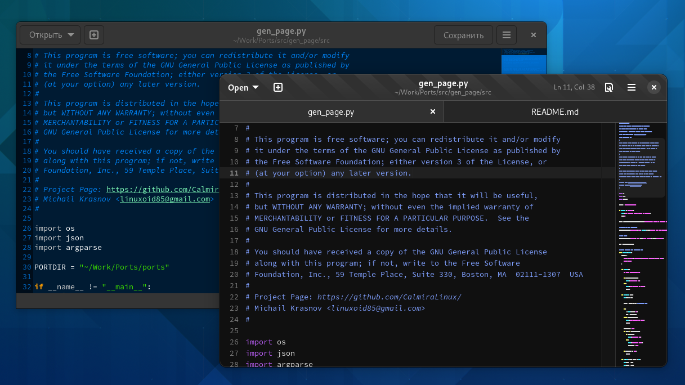
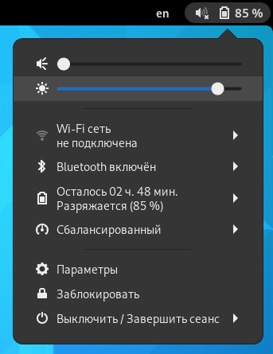

# Что нового в GNOME 42?

Пару дней назад был представлен релиз рабочего окружения GNOME 42. Релиз получился очень неплохим. Честно говоря, его я ждал, чего нельзя сказать о 41 версии. Тогда меня вполне устраивала 40 версия рабочего окружения, и никуда переходить не собирался, а 41 особо не впечатлила, хотя крупные изменения были и там.

## Изменение темы оформления

Ещё несколько месяцев назад была информация про обновление темы оформления Adwaita. Да, она подтвердилась. Я ожидал, что изменения войдут в 41 GNOME, но вошли они, увы, в 42.

Светлая тема:

Тёмная тема:

Помимо этого слегка обновили иконки. Папки теперь другого цвета. Не могу сказать, что это очень удачный цвет, но я хотя бы не путаю директории с архивами - раньше у них был одинаковый цвет, да и элементы иконки были очень похожи. Сейчас такого, к счастью, нет.

Обновлённая тема смотрится очень красиво, эффектно и, что самое главное, современно. Хотя первые концепты меня разочаровали, но окончательный результат более чем неплох.

## Замена приложений

* Текстовый редактор - всё как у взрослых.

Первым делом выкатили замену штатному гномовскому Gedit, который использовался в гноме почти с самых первых версий. И, честно говоря, я очень привык к нему. Очень хороший редактор с большим числом возможностей.

Новый редактор теперь называется просто и понятно - Text Editor (возможно, в русском переводе будет "Текстовый редактор"). У него почти одинаковые возможности с предыдущим, но, к сожалению, полностью отсутствуют какие-либо расширения.

В новом редакторе намного больше скруглений, редизайн некоторых элементов графического дизайна и прочие изменения. К счастью, он очень похож на старый Gedit - большинство элементов управления находится на привычных местах. Единственное - убрали кнопку "Сохранить", заместо неё поставили индикатор с количеством линий и кнопку быстрых настроек, которая заменяет нижнюю панель Gedit'a.

Заменили шрифт с `Source Code Pro Regular 10` на `Monospace Regular 10`.

Мне он кажется немного крупным, поэтому заменил на привычный Source Code.

Ах да, теперь там GTK4, Libadwaita и прочие гадости 😁️

Помимо этого, теперь удобно писать какой-либо простой код либо что-то прочее, когда вместо табов используются пробелы. В GNOME Text Editor теперь не надо по 4-8 раз жать на Backspace, чтобы удалить ненужный таб - теперь это всё работает так же, как и в случае с обычными табами. Смотрите видео:

Gedit:

(следите за курсором)

Text Editor:

(следите за курсором)

Так же Text Editor умеет изменять масштаб текста, чего не умеет Gedit. Мне такое не нужно, хотя кому-то может пригодиться.

## Добавление параметров

Если в третьей версии рабочего окружения разработчики могли урезать чего-либо (щютка), то 4Х версии развиваются стремительно. В 40 версии причесали GNOME Control Center (как и GNOME Tweaks, это GUI для gsettings, то самое приложение параметров). В 41 добавили параметры многозадачности и режимы питания. А в 42 разрабы добавили переключение цветовых схем. Доступна светлая и тёмная. Что примечательно, тёмная расцветка приложений предпочитается по умолчанию, но в любой момент можно её сменить на светлую либо в параметрах конкретного приложения, либо в GNOME Control Center. Я вангую по поводу того, что предпочтение тёмной расцветки вызовет дичайший ажиотаж и массовое бурление говн у тех, кто не любит (и очень давно не пользуется) GNOME.

Возможно, что в будущих версиях DE добавят ещё несколько дополнительных киллер-фич, по типу такого:

Здесь мы видим переключение цветовых схем по определённому расписанию и прочие параметры.

## Редизайн меню быстрых настроек

В [этой]() записи я писал о масштабном редизайне меню быстрых настроек. Если во время написания статьи были представлены только сырые макеты, то сейчас всё утверждено и вошло в 42 версию окружения.

Было:

Стало:

<!-- Заменить скриншот -->

Первые макеты обновлённого меню были очень похожи не-то на Android, не-то на Chrome OS, но сейчас это - вполне самобытное и не похожее на других меню. В этом мне и нравится GNOME - он не старается быть похожим на другие интерфейсы, а делает свой. И делает так, чтобы это было футуристично и, на удивление, удобно.

Теперь нет этих полноэкранных меню, как было раньше. Теперь они отображаются в самом меню.

