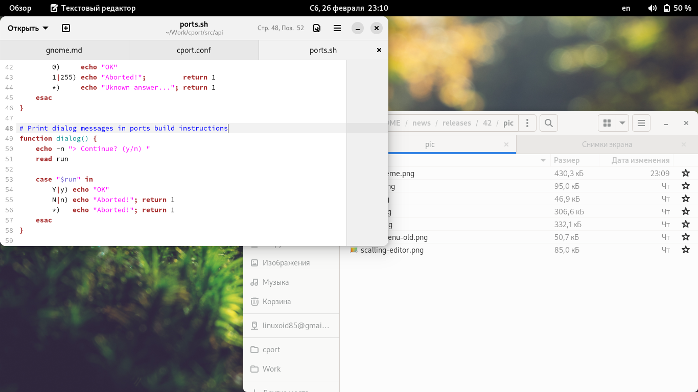
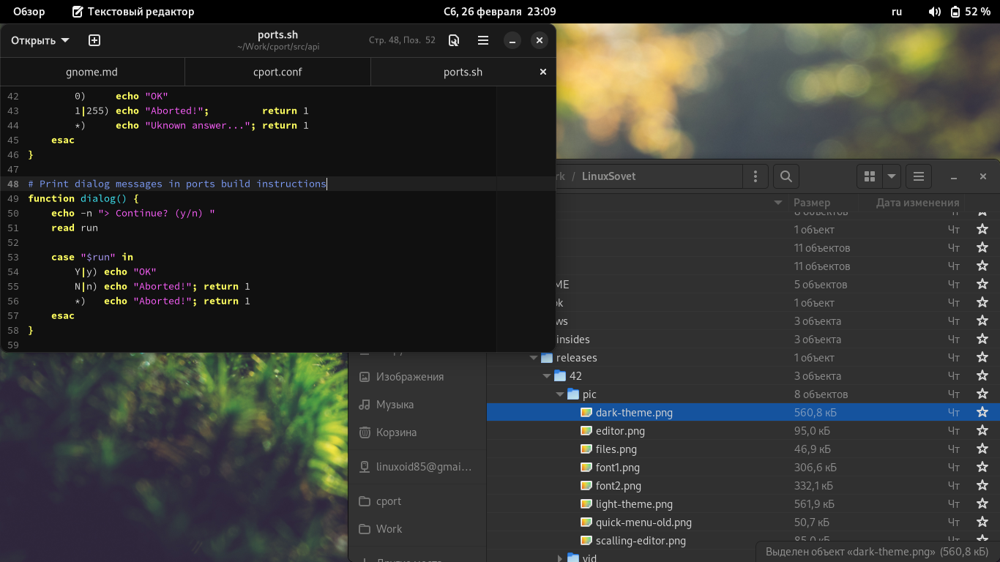
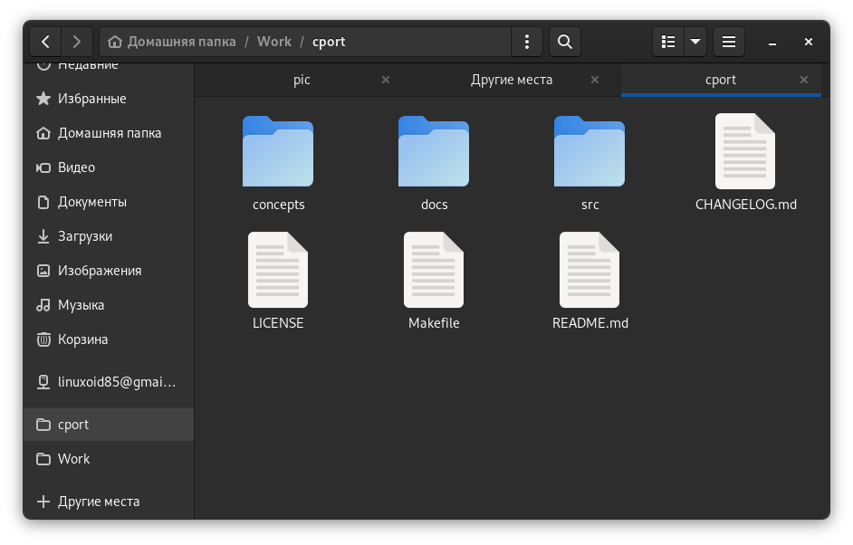
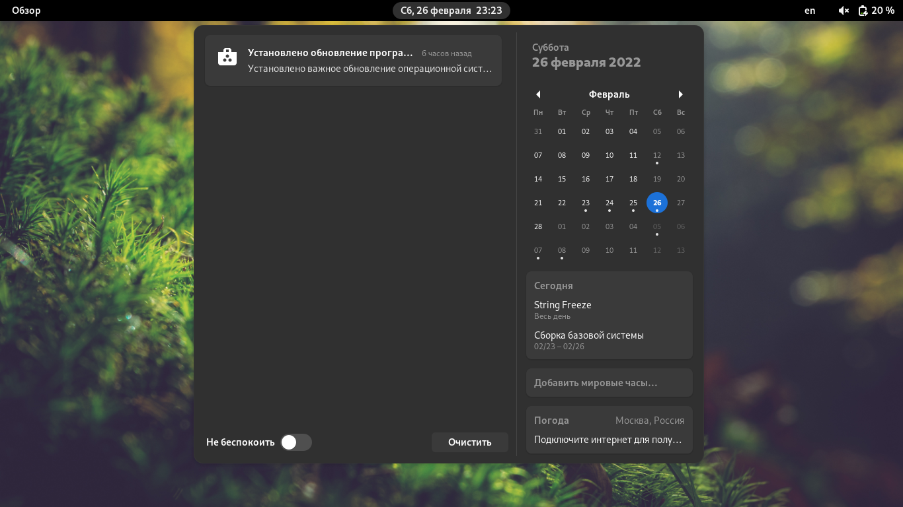
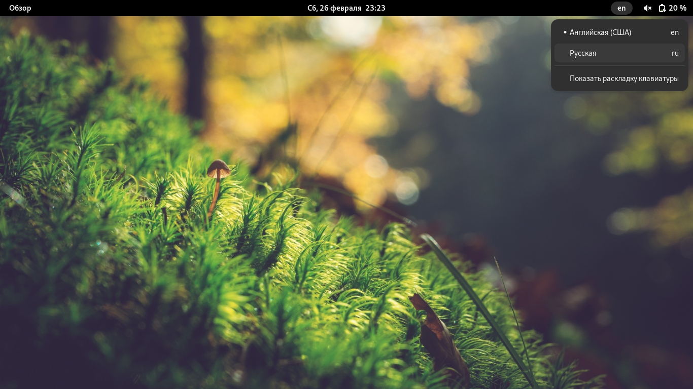
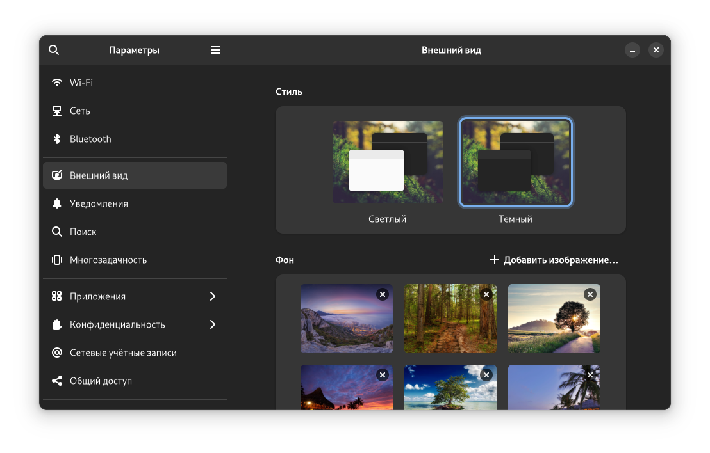
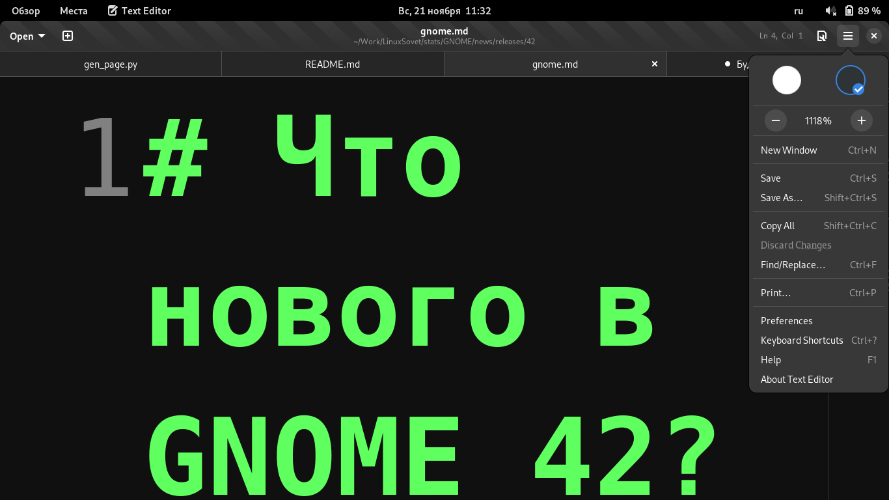

# Что нового в GNOME 42?

Пару дней назад был представлен релиз рабочего окружения GNOME 42. Релиз получился очень неплохим. Честно говоря, его я ждал, чего нельзя сказать о 41 версии. Тогда меня вполне устраивала 40 версия рабочего окружения, и никуда переходить не собирался, а 41 особо не впечатлила, хотя крупные изменения были и там.

## Изменение темы оформления

Ещё несколько месяцев назад была информация про обновление темы оформления Adwaita. Да, она подтвердилась. Я ожидал, что изменения войдут в 41 GNOME, но вошли они, увы, в 42.

Светлая тема:

Тёмная тема:

Помимо этого слегка обновили иконки. Папки теперь другого цвета. Не могу сказать, что это очень удачный цвет, но я хотя бы не путаю директории с архивами - раньше у них был одинаковый цвет, да и элементы иконки были очень похожи. Сейчас такого, к счастью, нет.

Обновили тему Shell:

Внешний вид приближён к теме LibAdwaita, кроме того, из верхней панели были удалены загругления.

Обновлённая тема смотрится очень красиво, эффектно и, что самое главное, современно. Хотя первые концепты меня разочаровали, но окончательный результат более чем неплох.

## Добавление новых параметров

Как можно заметить, в параметры добавили пункт "Внешний вид", который является переработанными "Обоями". Имеется переключалка стилей (тёмный и светлый). Кроме того, переделали смену обоев - стандартные обои GNOME теперь в двух расцветках - для светлой и тёмной темы, и при переключении стилей изменяются и обои.

Кроме того, переключение стилей работает и для Flatpak приложений. К сожалению, стили не меняются для старых приложений для GNOME. Кроме того, приложения, использующие GTK4 и LibAdwaita, и приложения, использующие GTK3, выглядят очень разнородно. У новых на GTK4 современная и плоская тема Adwaita (очень удачная, на мой взгляд), а у старых - соответственно, старая. Да, стили меняются для обоих типов приложений, но всё равно выглядит разнородно (программы с современным стилем начала 2020х и программы со старым стилем конца 2010-х). Но есть тема `adw-gtk3`, пытающаяся повторить стиль новой Adwaita, но сейчас она довольно кривая.

Видео о переключении стилей можно увидеть [здесь](vid/styles.webm)

## Замена приложений

* Текстовый редактор - всё как у взрослых.

Первым делом выкатили замену штатному гномовскому Gedit, который использовался в гноме почти с самых первых версий. И, честно говоря, я очень привык к нему. Очень хороший редактор с большим числом возможностей.

Новый редактор теперь называется просто и понятно - Text Editor (в русском переводе "Текстовый редактор"). У него почти одинаковые возможности с предыдущим, но, к сожалению, полностью отсутствуют какие-либо расширения.

В новом редакторе намного больше скруглений, редизайн некоторых элементов графического дизайна и прочие изменения. К счастью, он очень похож на старый Gedit - большинство элементов управления находится на привычных местах. Единственное - убрали кнопку "Сохранить", заместо неё поставили индикатор с количеством линий и кнопку быстрых настроек, которая заменяет нижнюю панель Gedit'a.

Ах да, теперь там GTK4, Libadwaita и прочие "гадости" 😁️

Помимо этого, теперь удобно писать какой-либо простой код либо что-то прочее, когда вместо табов используются пробелы. В GNOME Text Editor теперь не надо по 4-8 раз жать на Backspace, чтобы удалить ненужный таб - теперь это всё работает так же, как и в случае с обычными табами. Смотрите видео:

Gedit:

(следите за курсором)

[GEDIT](vid/gedit.mp4)

Text Editor:

(следите за курсором)

[TE](vid/editor.mp4)

Так же Text Editor умеет изменять масштаб текста, чего не умеет Gedit. Мне такое пригодилось всего один раз на одной из демонстраций. Думаю, больше не пригодится, но функция годная.

