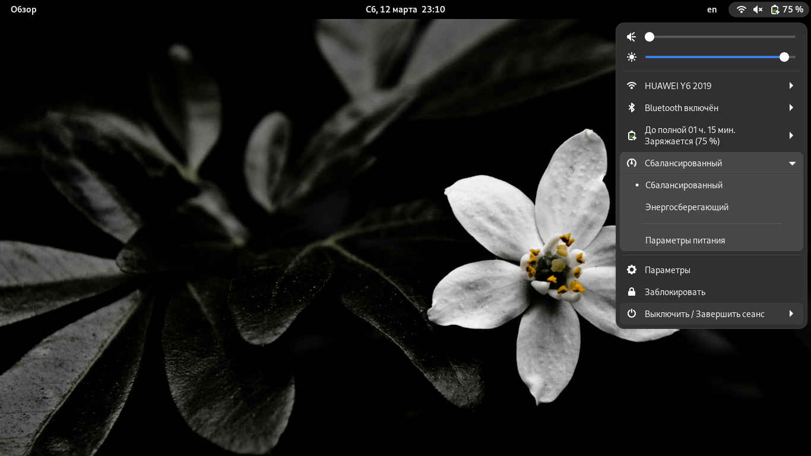

# Выход GNOME 42

Доброго времени суток! GNOME 42 вышел 23 марта 2022 года. В этой версии произошло довольно большое число изменений и улучшений, среди которых можно отметить портирование многих приложений с GTK3 на GTK4 и LibAdwaita, обновление темы Shell, добавление новых страниц параметров в GNOME Control Center и многое другое :)

> Хочу предупредить вас о том, что здесь более 30 фотографий, которые не были сжаты. Некоторые будут довольно тяжёлыми.

## Портирование части приложений на GTK4 и LibAdwaita

К сожалению, большинство приложений GNOME, которые входят в минимальную поставку этого рабочего окружения, всё ещё были на GTK3. Среди них можно отметить GNOME Control Center ("Параметры"), Gedit ("Текстовый редактор") и прочие. Gedit был заменён на новый текстовый редактор, а следующие приложения портированы на GTK4 и LibAdwaita:

- GNOME Control Center (Параметры);
- Baobab (Анализатор использования жёстких дисков);
- Погода;
- Часы;
- Калькулятор;
- Расширения (изначально использовали "голый" GTK4);
- Экскурсия;
- Шрифты;
- Символы;
- Календарь;
- Контакты;
- И другие!

LibAdwaita - новая библиотека GNOME, предназначенная для создания приложений с простым и современным внешним видом. В принципе, сказать более нечего.

Из-за портирования на эту библиотеку у многих приложений изменился внешний вид - он стал действительно современным и стильным.

К сожалению, не портированным даже на GTK4 оказался файловый менеджер Nautilus. Да, версия 42.alpha1 была на GTK4 и LibAdwaita, но она была очень нестабильной, да и было много регрессий (не работал darg&drop, копирование в буфер, некорректно отображались иконки файлов, некорректно работал просмотр в виде списка и пр.). Если их исправить - то разработчики просто бы не уложились в поставленные сроки, поэтому было принято решение "откатить" файловый менеджер обратно на GTK3. Зато хоть разработчики обновили т.н. pathbar (панель, где отображается путь до текущей рабочей директории).

Кроме того, в Nautilus обновили диалог переименования файлов:

Да, приложения на GTK3 выглядят устаревшими и явно выбиваются из системного стиля. И разработчики GNOME отказались портировать тему Adwaita с GTK4 на GTK3. С одной стороны это плохо - часть приложений GNOME всё ещё на GTK3, и они явно выбиваются из системного стиля. С другой стороны, это подстегнёт разработчиков этого ПО портировать его на GTK4 в кротчайшие сроки.

Обновили тему Shell в соответствии с новой LibAdwaita:

Пункт "Добавить в избранное" контекстного меню дока (Dash) переименовано в "Прикрепить к панели приложений". Это более понятно.

Кроме того, из панели убрали те закругления.

## Добавление настроек внешнего вида

Раньше в программе для изменения параметров гнома была страница "Обои". Теперь же её изменили - добавили настройку сменов стиля (светлый, тёмный), ну и переделали переключалку обоев. Кроме того, если в гноме предоставляются два варианта одних обоев (в светлой и тёмной расцветке), то при изменении стилей меняются и обои ([тыц1](vid/styles.webm), [тыц2](vid/styles2.webm))

Переключалка работает как для GTK3 приложений, предназначенных для GNOME 42 (для более старых версий, увы, не меняет), так и для GTK4 и GTK4 + LibAdwaita. Кроме того, это работает не только для обычных программ, но и для Flatpak, AppImage и, наверное, snap!

Не работает для старых версий GTK3 софта, предназначенного для более старых версий GNOME (например, GNOME Tweaks), Qt и прочего. С одной стороны, это плохо, так как все эти приложения выбиваются из общесистемного стиля, а с другой - это побудит разработчиков бросать устаревшие инструменты и переходить на использование современных (GTK4, LibAdwaita). Кроме того, это создаёт некую экосистему GNOME. Ну и несколько стандартизирует инструменты для создания графического ПО в Linux... В общем - палка о двух концах, например называетца.

## Мелкие обновления программного обеспечения

### 1. GNOME Weather

Теперь эта программа переведена на русский и портирована на GTK4 и LibAdwaita.

### 2. GNOME Software

Помимо портирования на GTK4 и LibAdwaita есть ещё ряд изменений:

- Обновили список изменений обновлённого приложения:

(теперь показывается логотип приложения, его описания, а ниже - список изменений обновления)

- Добавили сообщение в пункт "Обновление системы". В принципе, сказать более нечего.

- В поиске приложений в каждой карточке приложения отображается его оценка:

- Для просмотра комментариев теперь есть отдельная кнопка. По умолчанию отображается последний оставленный комментарий пользователя, при нажатии на него отображается отдельное окно с полным списком комментариев:

<!-- TODO - сделать эти скриншоты -->

### 3. GNOME Calendar

Календарь портировали на GTK4 и LibAdwaita, а также обновили просмотр всех месяцев года - теперь каждый месяц отображается на определённом фрейме, назовём его "карточкой". При нажатии на "карточку" определённого месяца, этот месяц откроется во вкладке "Месяц".

### 4. Adwaita Icon Theme

Обновили тему иконок Adwaita. Символьные иконки более элегантны, иконки папок перекрашены в синий цвет. Ранише они были коричневого, иконки архивов были с ними очень схожи. Теперь вы точно не перепутаете папку и архив, называетца :)

### 5. GNOME Boxes

Программу для виртуализации также обновили - в неё добавили новые параметры. Если раньше можно было изменить только самое базовое (ОЗУ, жёсткий диск, ЦП, да буквально и всё), то сейчас добавили несколько новых параметров:

### 6. GNOME Control Center (Параметры)

Помимо добавления параметров внешнего вида, изменили параметры приложений.

*Для обычных приложений*

Теперь посередине окна отображается логотип приложения и его названия, а далее - параметры (поиск, отображение уведомлений, запуск приложения или отображение дополнительной информации в GNOME Software)

*Для Flatpak*

### GNOME Shell

Обновили OSD (изменение звука, яркости, переключение между рабочими местами, включение/отключение тачпада ноутбука и прочее). Видео [тыц](vid/osd.webm).

## Замена устаревшего софта на современный и более простой

### 1. Текстовый редактор

Gedit - это текстовый редактор, поставляющийся с GNOME почти с самых первых версий. И он до сих пор на GTK3, да и сам по себе порядком устарел. Его заменили на более современный GNOME Text Editor. Он на GTK4 и LibAdwaita, соответствует GNOME HIG.

Этот текстовый редактор умеет сохранять рабочие сессии, поэтому при следующем запуске он восстановит все открытые документы и файлы. Кроме того он получил неплохую работу с цветовыми схемами - при смене цветовых схем меняется не только расцветка области редактирования текста, но и весь внешний вид текстового редактора (см. фото). Спасибо LibAdwaita за такое.

Ну и параметры у него другие:

### 2. Терминал

GNOME Terminal тоже порядком устарел, поэтому его также заменили. Новый терминал называетца Console (не напоминает ли вам название Konsole из KDE? Впрочем, у них совсем разные возможности). К сожалению, он до сих пор на GTK3...

Но у него есть маленькая фича - он умеет интегрироваться с Shell (проверено в BASH) и отображать в заголовке текущую рабочую директорию, а также, если какой-либо процесс выполняется от имени root, то заголовок терминала окрашивается в красный цвет:

### 3. GNOME Screenshoot

Программа для создания скриншотов теперь невостребованна - вместо неё в сам GNOME Shell встроен новый скриншотер с довольно продвинутыми возможностями:

- Обновлённый интерфейс;
- Более удобный выбор области захвата;
- Новая фича создания скриншота окна - теперь показывается список окон, скриншот которых требуется сделать;
- Кнопка для показа курсора;
- Запись видео (и в Wayland тоже!);
- Автоматическое копирование фото/видео в буфер обмена

