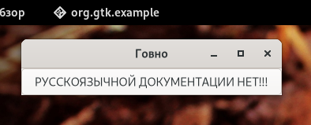

# Программирование с использованием GTK4

> Прошу заметить, что эта статья на данный момент не закончена. В ней многого нет.



В данной статье мне бы хотелось поговорить про пример работы с тулкитом GTK4. Несмотря на свои недостатки, это достаточно хорошая вещь для создания приложений. Помимо этого, GTK используют самые популярные рабочие окружения в Linux - GNOME, Cinnamon, Xfce и др. А это может говорить о *качестве* инструмента.

> Я не открываю Америку, а перевожу статьи от разработчиков GNOME. Оригинал можно найти [здесь](https://developer.gnome.org/gtk4/stable).


## Содержание
### Начало работы с GTK4.
* [Установка](prepare/install.md)
* [Первое приложение - создание пустого окна, объяснение принципа работы](prog/gtk1.md)
* [Пишем Hello, World!](prog/gtk2.md)
* [Упаковка](prog/gtk3.md)
* [Пользовательский рисунок](prog/gtk4.md)
* [Создание пользовательских интерфейсов](prog/gtk5.md)

## Часть 1. Введение.
### Что такое GTK и на каких ОС это работает?
GTK - это кроссплатформенная библиотека для создания графических пользовательских интерфейсов (GUI). Она работает не только на многих UNIX-подобных(/образных) платформах, таких как Linux, *BSD, OS X, но и на Windows. GTK распространяется под лицензией [GNU LGPL](https://ru.wikipedia.org/wiki/GNU_Lesser_General_Public_License).

Эта библиотека (тулкит) имеет объектно-ориентированную архитектуру на языке С, которая обеспечивает максимальную гибкость. Были написаны привязки для таких языков, как: C++, Objective-C, Guile/Scheme, Perl, Python, Ada95, Free Pascal и др.

В GTK всё построено на виджетах, то есть *компонентах графического интерфейса*. Например, `GtkButton` и `GtkTextView`.

### Библиотеки:
* **GLib** - библиотека утилит общего назначения, не предназначенных для GUI. GLib предоставляет множество полезных типов данных, макросы, преобразования типов, строковые и файловые утилиты, абстракцию основного цикла и т.д.
* **GObject** - библиотека, которая предоставляет систему и коллекцию основных типов, включая тип объекта, систему сигналов.
* **GIO** - простой в использовании API VFS, включающий абстракции для файлов, дисков, томов, потокового ввода-вывода, а так же сетевого программирования и обмена данными через DBus.
* **Cairo** - библиотека 2D-графики с поддержкой нескольких устройств вывода.
* **Pango** - библиотека для интернационализированной обработки текста. Он сосредоточен вокруг объекта `PangoLayout`, представляющего абзац текста. Pango представляет движок для `GtkTextView`, `GtkLabel`, `GtkEntry` и других виджетов, отображающих текст.
* **GdkPixbuf** - библиотека, позволяющая создавать объекты `GdkPixbuf` ("буфер пикселей") из данных изображения или файлов изображений. Используйте `GdkPixbuf` в сочетании с `GtkImage` для отображения картинок.
* **graphene** - предоставляет векторные и матричные типы данных и операций. `graphene` предоставляет оптимизированные реализации с использованием различных наборов инструкций SIMD, таких как SSE.
* **GDK** - уровень абстракции, который позволяет GTK поддерживать несколько оконных систем. К ним относятся Wayland, X11, Windows и OS X.
* **GSK** - библиотека для создания графа сцены из узлов рендеринга с использованием предназначенных для этого API. `GSK` предоставляет средства визуализации для OpenGL, Vulkan и Cairo.

## Немного о системе объектов GTK
Несмотря на то, что комплект инструментов GTK+ написан на чистом C, он поддерживает объекты и ООП благодаря библиотеке GObject. Эта библиотека поддерживает наследование объектов и полиморфизм с помощью макросов.

Образец наследования и полиморфизма на примере иерархии объектов `GtkWindow`, взятой из документации GTK+ API:
```
GObject
╰── GInitiallyUnowned
    ╰── GtkWidget
        ╰── GtkContainer
            ╰── GtkBin
                ╰── GtkWindow
```

Объект `GtkWindow` потомок `GtkBin`..., что означает, что любую функцию, которую программа вызывает с объектом `GtkBin`, можно вызвать и с объектом `GtkWindow`.

***
[Далее - установка GTK4](prepare/install.md)
