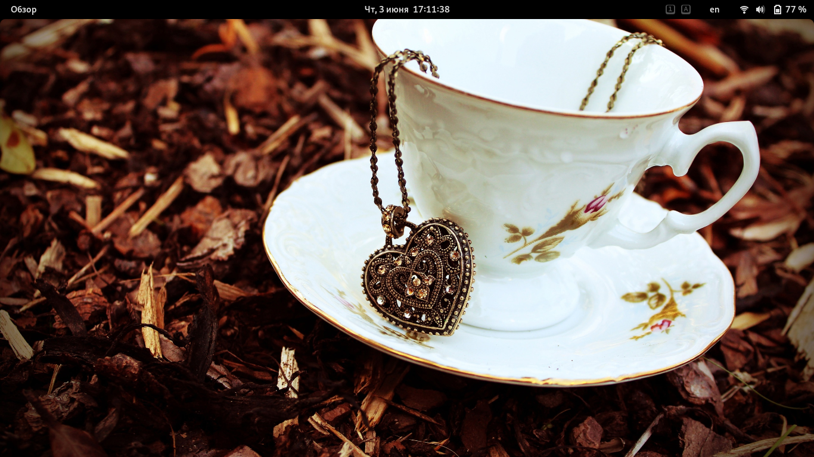
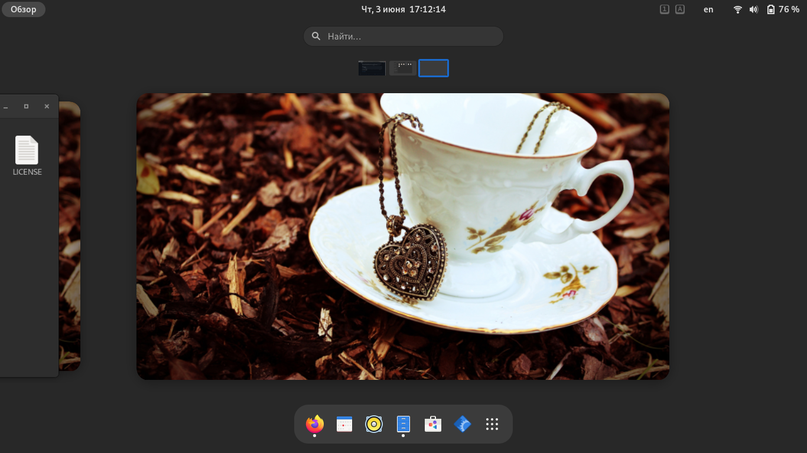
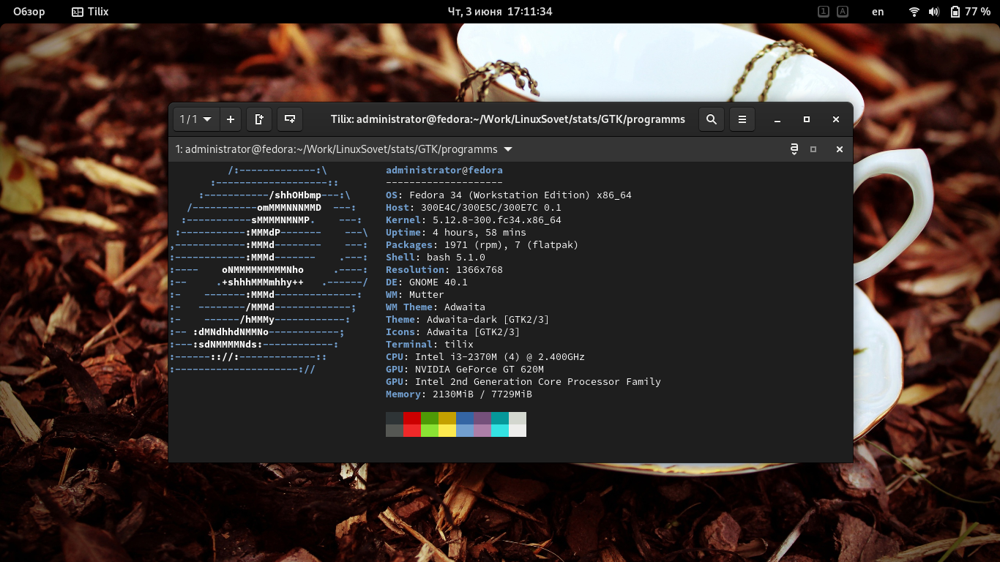
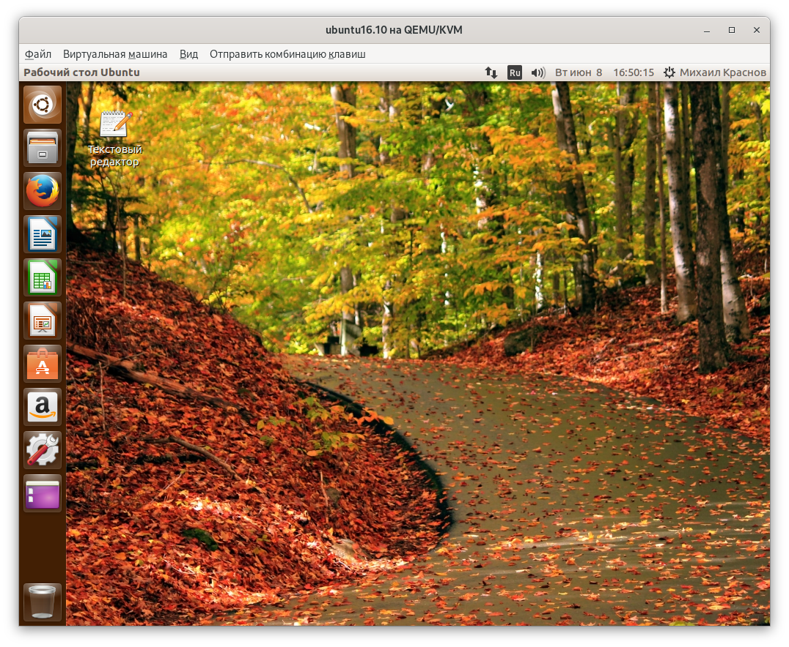
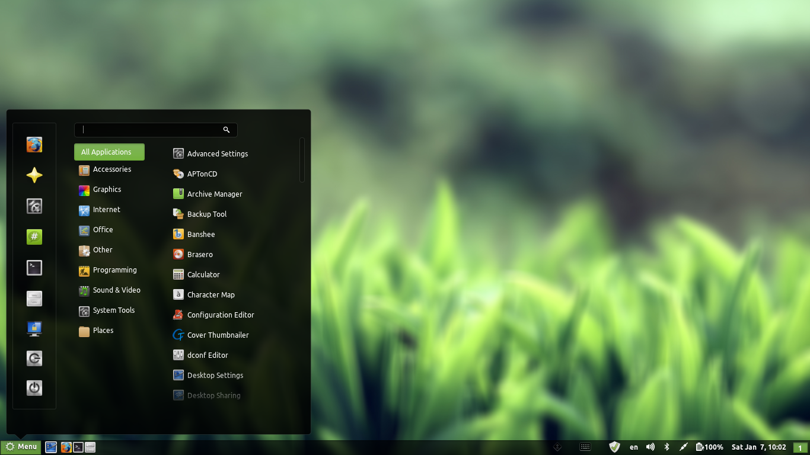
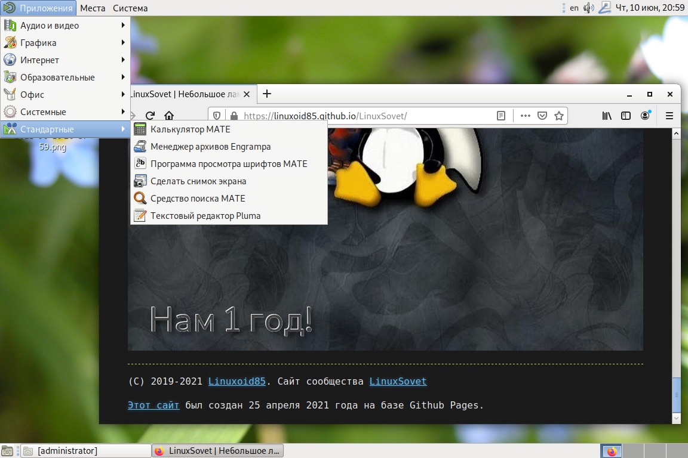
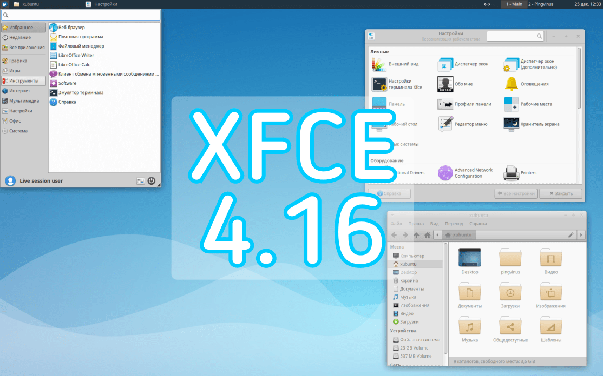

# Программирование с использованием GTK4

[Статьи](../stats.md)

**Автор:** [GNOME Developers](https://developer.gnome.org/) (Центр разработки GNOME)

**Перевёл на русский язык:** [Linuxoid85](https://www.vk.com/linuxoid85)

**Статус:** перевод на русский не закончен

***

> Прошу заметить, что эта статья на данный момент не закончена. В ней многого нет.


В данной статье мне бы хотелось поговорить про пример работы с тулкитом GTK4. Несмотря на свои недостатки, это достаточно хорошая вещь для создания приложений. Помимо этого, GTK используют самые популярные рабочие окружения в Linux - GNOME, Cinnamon, Xfce и др. А это может говорить о *качестве* инструмента.

> Я не открываю Америку, а перевожу статьи от разработчиков GNOME. Оригинал можно найти [здесь](https://developer.gnome.org/gtk4/stable).


## Содержание
### Начало работы с GTK4.
* [Установка](prepare/install.md)
* [Первое приложение - создание пустого окна, объяснение принципа работы](prog/gtk1.md)
* [Пишем Hello, World!](prog/gtk2.md)
* [Упаковка](prog/gtk3.md)
* [Пользовательский рисунок](prog/gtk4.md)
* [Создание пользовательских интерфейсов](prog/gtk5.md)
* [Создание приложений - часть 1](prog/gtk6.md)
* [Создание приложений - часть 2](prog/gtk7.md)
* [Примеры программ и кода](prog/programs.md)
* [Баги](prog/bugs.md)
* [Основные вопросы](prog/faq.md)

## Часть 1. Введение.
### Что такое GTK и на каких ОС это работает?
GTK - это кроссплатформенная библиотека для создания графических пользовательских интерфейсов (GUI). Она работает не только на многих UNIX-подобных(/образных) платформах, таких как Linux, *BSD, OS X, но и на Windows. GTK распространяется под лицензией [GNU LGPL](https://ru.wikipedia.org/wiki/GNU_Lesser_General_Public_License).

Эта библиотека (тулкит) имеет объектно-ориентированную архитектуру на языке С, которая обеспечивает максимальную гибкость. Были написаны привязки для таких языков, как: C++, Objective-C, Guile/Scheme, Perl, Python, Ada95, Free Pascal и др.

В GTK всё построено на виджетах, то есть *компонентах графического интерфейса*. Например, `GtkButton` и `GtkTextView`.

### Библиотеки:
* **GLib** - библиотека утилит общего назначения, не предназначенных для GUI. GLib предоставляет множество полезных типов данных, макросы, преобразования типов, строковые и файловые утилиты, абстракцию основного цикла и т.д.
* **GObject** - библиотека, которая предоставляет систему и коллекцию основных типов, включая тип объекта, систему сигналов.
* **GIO** - простой в использовании API VFS, включающий абстракции для файлов, дисков, томов, потокового ввода-вывода, а так же сетевого программирования и обмена данными через DBus.
* **Cairo** - библиотека 2D-графики с поддержкой нескольких устройств вывода.
* **Pango** - библиотека для интернационализированной обработки текста. Он сосредоточен вокруг объекта `PangoLayout`, представляющего абзац текста. Pango представляет движок для `GtkTextView`, `GtkLabel`, `GtkEntry` и других виджетов, отображающих текст.
* **GdkPixbuf** - библиотека, позволяющая создавать объекты `GdkPixbuf` ("буфер пикселей") из данных изображения или файлов изображений. Используйте `GdkPixbuf` в сочетании с `GtkImage` для отображения картинок.
* **graphene** - предоставляет векторные и матричные типы данных и операций. `graphene` предоставляет оптимизированные реализации с использованием различных наборов инструкций SIMD, таких как SSE.
* **GDK** - уровень абстракции, который позволяет GTK поддерживать несколько оконных систем. К ним относятся Wayland, X11, Windows и OS X.
* **GSK** - библиотека для создания графа сцены из узлов рендеринга с использованием предназначенных для этого API. `GSK` предоставляет средства визуализации для OpenGL, Vulkan и Cairo.

## Немного о системе объектов GTK
Несмотря на то, что комплект инструментов GTK+ написан на чистом C, он поддерживает объекты и ООП благодаря библиотеке GObject. Эта библиотека поддерживает наследование объектов и полиморфизм с помощью макросов.

Образец наследования и полиморфизма на примере иерархии объектов `GtkWindow`, взятой из документации GTK+ API:
```
GObject
╰── GInitiallyUnowned
    ╰── GtkWidget
        ╰── GtkContainer
            ╰── GtkBin
                ╰── GtkWindow
```

Объект `GtkWindow` потомок `GtkBin`..., что означает, что любую функцию, которую программа вызывает с объектом `GtkBin`, можно вызвать и с объектом `GtkWindow`.

## Знакомство с GNOME 40 и другими рабочими окружениями, использующими GTK.

### GNOME Shell
GNOME - рабочее окружение для операционных систем семейства Linux. Несмотря на критику, это рабочее окружение достаточно удобное и простое. В отличии от других DE, GNOME не пытается копировать Windows, а делает свой UI, не похожий на все остальные. Наработками GNOME воспользовалась даже Apple! В заголовках некоторых программ для MacOS можно заметить кнопки и другие элементы - это появилось в GNOME Shell 3.


*Рис. 1. Рабочий стол. Иконок по-умолчанию нет, но можно вернуть, использовав [это](https://extensions.gnome.org/extension/2087/desktop-icons-ng-ding/) расширение.*

*Рис.2. Обзор активности. В этом меню располагается док со списокм закреплённых и открытых окон, рабочие места, на которых располагаются превью открытых окон*

*Рис.3. Открыт терминал Tilix. Так же это очень хороший пример возможностей оконного менеджера Mutter. В заголовках окон могут располагаться кнопки и другие элементы. Во-первых, выглядит просто и экономично. На небольших экранах очень хорошо экономится место, из-за чего в самом окне можно расположить больше элементов управления. Во-вторых, это очень удобно, хотя в своё время вызвало немало споров.*

Это рабочее окружение использует достаточно большое число дистрибутивов по умолчанию: Debian, RedHat, CentOS, Fedora, Ubuntu, OpenSuse и др.

### Unity

На основе GNOME в своё время было сделано другое DE - Unity. Но увы - популярности оно не снискало. Множество причин - тогда пользователи были привыкшими к внешнему виду в стиле Windows (ньюфаги) или NextStep (совсем олды). И внешний вид Unity в своём стиле, отдалённо напоминающим MacOS не всем пришёлся по нраву. Хотя я, смотря на это DE, понимаю, какую красоту и шедевр мы упустили.



Главное достоинство Unity - её внешний вид, не похожий на всё остальное. Её разработчики, как и разработчики GNOME, сделали действительно самобытный интерфейс. Только GNOME предоставляет минималистичный внешний вид: даже кнопок "Свернуть" и "Развернуть окно" по умолчанию нет (нужно включать в настройках), а Unity - законченный интерфейс с продвинутыми эффектами, удобным переключением задач и принципом построения внешнего вида "не как в винде".

Лично [я](https://www.vk.com/linuxoid85) считаю, что в Linux должен быть свой интерфейс, который не копирует Windows/MacOS, а только заимствует у них какие-то детали внешнего вида, но в то же время быть удобным и простым. У GNOME Shell и Unity это получилось. У Xfce, Cinnamon, KDE и пр. - пока нет.

### Cinnamon

Cinnamon основан на GNOME 3. Он предоставляет виндузятнегам и прочим далёким от нормальной жизни слоям населения привычный для них внешний вид в стиле Windows. Даже "десклеты" есль (можно сравнить с "виджетами" KDE или гаджетами Windows Vista).

Это рабочее окружение было сделано разработчиками дистрибутива Linux Mint, поэтому такой интерфейс рабочего окружения вполне предсказуем - разработчики этого дистрибутива делают его максимально простым и понятным, что получается довольно неплохо, особенно в случае с LMDE.



### Mate

Mate - это форк GNOME 2. Дело в том, что первые версии GNOME 3 очень многим не понравились, все хотели вернуться на GNOME 2. Даже Линус Торвальдс в своё время раскритиковал GNOME 3, назвав его "головой, засунутой в задний проход".

Mate же - почти тот же самый GNOME 2. В последних версиях был выполнен переход на GTK3.



### Xfce

Xfce - (не)легковесное рабочее окружение, не основанное ни на GNOME, ни на других DE, однако, использующее GTK3. Позиционируется как легковесное DE, но очень давно (с версии 4.14) таковым не является. А 4.16 разочаровала - кушает много, так же в нём реализовали технологию CSD, что означает, что в некоторых приложениях Xfce завезли `GtkHeaderBar`. Это хорошо, однако в рабочем окружении с очень устаревшим внешним видом это выглядит очень странно, а в некоторых случаях ещё и некрасиво.


*Изображение было взято с сайта [Pingvinus](https://pingvinus.ru/news/3315)*

> Есть ещё другие рабочие окружения, но в этой статье рассказано только о самых популярных.

***

[Далее - установка GTK4](prepare/install.md)
