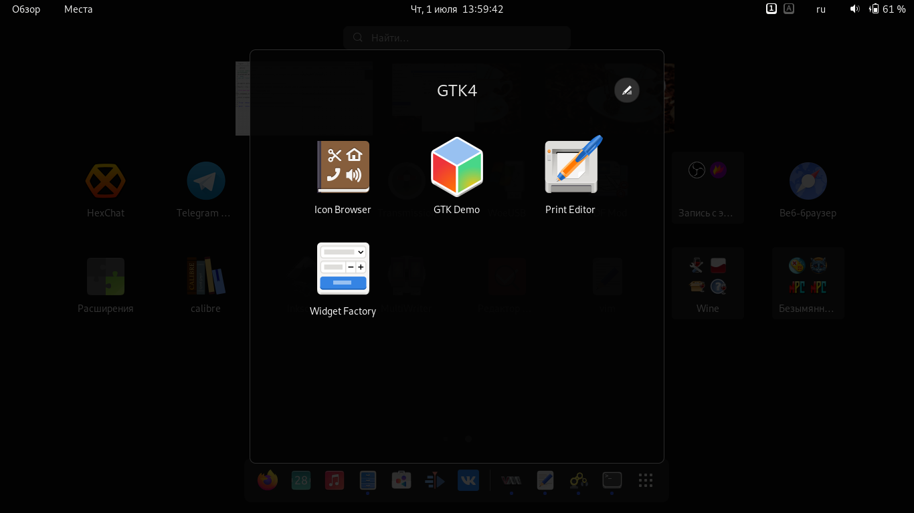

# Начало работы с GTK4.
## Установка.
Я использую дистрибутив Fedora 34 Workstation, там мне нужно было установить только один пакет `gtk4-devel`:
```bash
sudo dnf install gtk4-devel
```

На других дистрибутивах процесс установки может различаться.

Вместе с этим пакетом установится программа GTK Demo (см. скриншот ниже), а так же немного дополнительного ПО.




А, например, на Debian пакет `gtk3-demo` не устанавливается. Четвёртого GTK там пока нет, но есть третий. Третий ставить не советую, так как эта инструкция может быть несовместима (или совместима, но частично) с GTK3.

После установки приступим к написанию кода.

***
[Назад - введение](https://linuxoid85.github.io/LinuxSovet/stats/GTK/)

[Далее - написание первого приложения](https://linuxoid85.github.io/LinuxSovet/stats/GTK/prog/gtk1.html)
