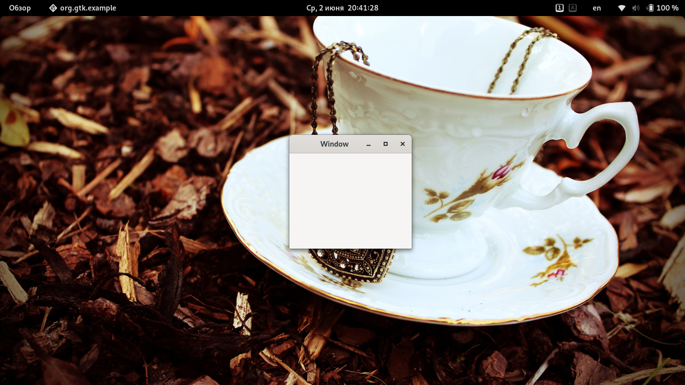

# Создание окна
Для начала напишем очень простое приложение. К сожалению, это будет проще классического "Hello word!", ибо начнём совсем с нуля.

Программа, приведённая ниже, создаст пустое окно 200х200 пикс. Создайте файл `example-0.c`, в любом текстовом редакторе введите следующее:
```c
#include <gtk/gtk.h>

static void activate (GtkApplication* app,
          gpointer        user_data)
{
  GtkWidget *window;

  window = gtk_application_window_new (app);
  gtk_window_set_title (GTK_WINDOW (window), "Window");
  gtk_window_set_default_size (GTK_WINDOW (window), 200, 200);
  gtk_widget_show (window);
}

int main (int    argc,
      char **argv)
{
  GtkApplication *app;
  int status;

  app = gtk_application_new ("org.gtk.example", G_APPLICATION_FLAGS_NONE);
  g_signal_connect (app, "activate", G_CALLBACK (activate), NULL);
  status = g_application_run (G_APPLICATION (app), argc, argv);
  g_object_unref (app);

  return status;
}
```

И скомпилируйте программу, используя gcc:
```bash
gcc `pkg-config --cflags gtk4` -o example-0 example-0.c `pkg-config --libs gtk4`
```

Запуск, соответственно, такой:
```bash
./example-0
```



> Все приложения GTK включают в себя заголовочный файл `gtk/gtk.h`, в котором содержатся функции, типы и макросы, необходимые для каждой GTK программы.

Даже если GTK устанавливает несколько файлов заголовков, только заголовок верхнего уровня `gtk/gtk.h` может быть напрямую включен сторонним кодом. Компилятор прекратит работу с ошибкой, если напрямую включен любой другой заголовок.

В приложении GTK цель функции `main()` - создать объект ``GtkApplication`` и запустить его. В этом примере указатель ``GtkApplication`` с именем app объявляется и затем инициализируется с помощью `gtk_application_new()`.

При создании `GtkApplication` вам необходимо выбрать идентификатор приложения (имя) и передать его в `gtk_application_new()` в кач-ве параметра. В нашем примере используется `org.gtk.example`. Чтобы выбрать идентификатор для вашей программы, прочтите [это](https://wiki.gnome.org/HowDoI/ChooseApplicationID) руководство. `gtk_application_new()` принимает `GApplicationFlags` в кач-ве входных данных для вашего приложения, если есть особые потребности.

Затем сигнал активации подключается к функции `activate()`, расположенной над `main()`. Сигнал активации будет выдан, когда ваше приложение будет запущено с помощью `g_application_run()` в строке ниже. Вызов `g_application_run()` также принимает в качестве аргументов аргументы командной строки (счетчик argc и массив строк argv). Ваше приложение может переопределить обработку командной строки, например, для открытия файлов, переданных в командной строке.

В `g_application_run()` отправляется сигнал активации, и затем мы переходим к функции `activate()` приложения. Здесь создаётся окно GTK, чтобы окно показывалось при запуске приложения. Вызов `gtk_application_window_new()` создаст новый `GtkWindow` и сохранит его внутри указателя окна. В зависимости от платформы окно будет иметь рамку, строку заголовка и элементы управления окном.

Заголовок окна устанавливается с помощью `gtk_window_set_title()`. Эта функция принимает на вход указатель `GtkWindow *` и строку. Поскольку наш указатель окна является указателем `GtkWidget`, нам нужно привести его к `GtkWindow *`. Но вместо преобразования окна через `(GtkWindow *)` окно можно преобразовать с помощью макроса `GTK_WINDOW()`. `GTK_WINDOW()` проверит, является ли указатель экземпляром класса `GtkWindow` перед преобразованием, и выдаст предупреждение, если проверка не удалась. Более подробную информацию об этом соглашении можно найти [здесь](https://developer.gnome.org/gobject/stable/gtype-conventions.html).

Размер окна устанавливается с помощью `gtk_window_set_default_size()`, а затем отображается с помощью `gtk_widget_show()`.

Когда вы закрываете окно, например, нажатием X, вызов `g_application_run()` возвращает номер, который сохраняется внутри целочисленной переменной с именем `status`. После этого объект `GtkApplication` освобождается из памяти с помощью `g_object_unref()`. Наконец, возвращается целое число статуса, и приложение закрывается.

Пока программа работает, GTK принимает события. Обычно это события ввода, вызванные взаимодействием пользователя с вашей программой, а также такие вещи, как сообщения от оконного менеджера или других приложений. GTK обрабатывает их, и в результате ваши виджеты могут посылать сигналы. Подключение обработчиков этих сигналов - это то, как вы обычно заставляете свою программу что-то делать в ответ на ввод пользователя.

***
[Назад - установка GTK4]()
--**--
[Далее - написание "Hello, world!"](gtk2.md)
