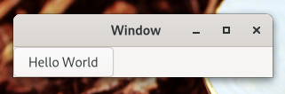

# Hello, world!



Создайте новый файл с именем `example-1.c` и запишите в него следующее:
```c
#include <gtk/gtk.h>

static void
print_hello (GtkWidget *widget,
             gpointer   data)
{
  g_print ("Hello World\n");
}

static void
activate (GtkApplication *app,
          gpointer        user_data)
{
  GtkWidget *window;
  GtkWidget *button;
  GtkWidget *box;

  window = gtk_application_window_new (app);
  gtk_window_set_title (GTK_WINDOW (window), "Window");
  gtk_window_set_default_size (GTK_WINDOW (window), 200, 200);

  box = gtk_box_new (GTK_ORIENTATION_HORIZONTAL, 0);
  gtk_window_set_child (GTK_WINDOW (window), box);

  button = gtk_button_new_with_label ("Hello World");
  g_signal_connect (button, "clicked", G_CALLBACK (print_hello), NULL);
  g_signal_connect_swapped (button, "clicked", G_CALLBACK (gtk_window_destroy), window);
  gtk_box_append (GTK_BOX (box), button);

  gtk_widget_show (window);
}

int
main (int    argc,
      char **argv)
{
  GtkApplication *app;
  int status;

  app = gtk_application_new ("org.gtk.example", G_APPLICATION_FLAGS_NONE);
  g_signal_connect (app, "activate", G_CALLBACK (activate), NULL);
  status = g_application_run (G_APPLICATION (app), argc, argv);
  g_object_unref (app);

  return status;
}
```

Компиляция:
```bash
gcc `pkg-config --cflags gtk4` -o example-1 example-1.c `pkg-config --libs gtk4`
```

Как видно выше, `example-1.c` основывается на `example-0.c`, добавляя в наше окно кнопку с меткой «Hello World». Для этого объявлены два новых указателя: `GtkWidget`, `button` и `box`. Переменная `box` создается для хранения `GtkBox`, который позволяет GTK управлять размером и расположением кнопок.

`GtkBox` создается с помощью `gtk_box_new()`, которая принимает в качестве параметра перечисление `GtkOrientation`. Кнопки, которые будет содержать это поле, могут быть расположены горизонтально или вертикально. В данном случае это не имеет значения, поскольку мы имеем дело только с одной кнопкой. После инициализации бокса только что созданным `GtkBox` код добавляет виджет бокса к виджету окна с помощью `gtk_window_set_child()`.

Затем аналогичным образом инициализируется переменная кнопки. Вызывается `gtk_button_new_with_label()`, который возвращает `GtkButton`, который будет сохранен в кнопке. После этого в наш ящик добавляется кнопка.

Используя `g_signal_connect()`, кнопка подключается к функции в нашем приложении, называемой `print_hello()`, так что при нажатии кнопки GTK будет вызывать эту функцию. Поскольку функция `print_hello()` не использует никаких данных в качестве входных, ей передается NULL. `print_hello()` вызывает `g_print()` со строкой «Hello World», которая напечатает Hello World в терминале, если приложение GTK было запущено с него.

После подключения `print_hello()` к состоянию «нажата» кнопка подключается другой сигнал с помощью `g_signal_connect_swapped()`. Эта функция похожа на `g_signal_connect()`, но разница заключается в том, как обрабатывается функция обратного вызова. `g_signal_connect_swapped()` позволяет указать, что функция обратного вызова должна принимать в качестве параметра, позволяя передавать его как данные. В этом случае вызывается функция `gtk_window_destroy()`, и ей передается указатель окна. Это приводит к тому, что при нажатии кнопки все окно GTK уничтожается. Напротив, если бы обычный `g_signal_connect()` использовался для соединения «щелчка» сигнала с `gtk_window_destroy()`, тогда функция вызывалась бы по кнопке (что не сработало бы, поскольку функция ожидает GtkWindow в качестве аргумента).

Более подробную информацию о создании кнопок можно найти [здесь](https://wiki.gnome.org/HowDoI/Buttons).

Остальной код в `example-1.c` идентичен `example-0.c`. В следующем разделе будет подробно описано, как добавить несколько GtkWidgets в ваше приложение GTK.

[Назад - пишем первое приложение (создание окна)](gtk1.md)

[Далее - упаковка](gtk3.md)
