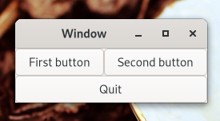

# Упаковка



При создании приложения вы захотите поместить в окно более одного виджета. При этом становится важным контролировать расположение и размер каждого виджета. Вот тут-то и появляется упаковка.

GTK поставляется с большим разнообразием контейнеров макетов, целью которых является управление макетом добавляемых к ним дочерних виджетов.

В следующем примере показано, как контейнер `GtkGrid` позволяет расположить несколько кнопок.

Создайте файл с именем `example-2.c` и запишите в него следующее содержимое:
```c
#include <gtk/gtk.h>

static void
print_hello (GtkWidget *widget,
             gpointer   data)
{
  g_print ("Hello World\n");
}

static void
activate (GtkApplication *app,
          gpointer        user_data)
{
  GtkWidget *window;
  GtkWidget *grid;
  GtkWidget *button;

  /* create a new window, and set its title */
  window = gtk_application_window_new (app);
  gtk_window_set_title (GTK_WINDOW (window), "Window");

  /* Here we construct the container that is going pack our buttons */
  grid = gtk_grid_new();

  /* Pack the container in the window */
  gtk_window_set_child (GTK_WINDOW (window), grid);

  button = gtk_button_new_with_label ("First Button");
  g_signal_connect (button, "clicked", G_CALLBACK (print_hello), NULL);

  /* Place the first button in the grid cell (0, 0), and make it fill
   * just 1 cell horizontally and vertically (ie no spanning)
   */
  gtk_grid_attach (GTK_GRID (grid), button, 0, 0, 1, 1);

  button = gtk_button_new_with_label ("Second Button");
  g_signal_connect (button, "clicked", G_CALLBACK (print_hello), NULL);

  /* Place the second button in the grid cell (1, 0), and make it fill
   * just 1 cell horizontally and vertically (ie no spanning)
   */
  gtk_grid_attach (GTK_GRID (grid), button, 1, 0, 1, 1);

  button = gtk_button_new_with_label ("Quit");
  g_signal_connect_swapped (button, "clicked", G_CALLBACK (gtk_window_destroy), window);

  /* Place the Quit button in the grid cell (0, 1), and make it
   * span 2 columns.
   */
  gtk_grid_attach (GTK_GRID (grid), button, 0, 1, 2, 1);

  gtk_widget_show (window);

}

int
main (int    argc,
      char **argv)
{
  GtkApplication *app;
  int status;

  app = gtk_application_new ("org.gtk.example", G_APPLICATION_FLAGS_NONE);
  g_signal_connect (app, "activate", G_CALLBACK (activate), NULL);
  status = g_application_run (G_APPLICATION (app), argc, argv);
  g_object_unref (app);

  return status;
}
```

Компиляция:
```bash
gcc `pkg-config --cflags gtk4` -o example-2 example-2.c `pkg-config --libs gtk4`
```
