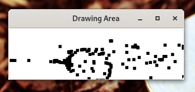

# Пользовательский рисунок



Многие виджеты, например кнопки, рисуют все сами. Вы просто указываете им метку, которую хотите видеть, и они выясняют, какой шрифт использовать, рисуют контур кнопки, прямоугольник фокуса и т.д. Иногда необходимо сделать какой-то собственный рисунок. В этом случае `GtkDrawingArea` может быть правильным виджетом для использования. Он предлагает холст, на котором вы можете рисовать, подключившись к сигналу `::draw`.

Содержимое виджета часто необходимо частично или полностью перерисовать, например когда другое окно перемещается и открывает часть виджета, или когда окно, содержащее его, изменяется. Также можно явно вызвать перерисовку части или всего виджета, вызвав `gtk_widget_queue_draw()` или ее варианты. GTK заботится о большинстве деталей, предоставляя готовый к использованию контекст cairo для обработчика сигнала `:: draw`.

В следующем примере показан обработчик сигнала `::draw`. Это немного сложнее, чем в предыдущих примерах, поскольку также демонстрируется обработка входных событий с помощью контроллеров событий.

Создайте файл `example-4.c` и запишите в него следующее:
```c
#include <gtk/gtk.h>

/* Surface to store current scribbles */
static cairo_surface_t *surface = NULL;

static void
clear_surface (void)
{
  cairo_t *cr;

  cr = cairo_create (surface);

  cairo_set_source_rgb (cr, 1, 1, 1);
  cairo_paint (cr);

  cairo_destroy (cr);
}

/* Create a new surface of the appropriate size to store our scribbles */
static void
resize_cb (GtkWidget *widget,
           int        width,
           int        height,
           gpointer   data)
{
  if (surface)
    {
      cairo_surface_destroy (surface);
      surface = NULL;
    }

  if (gtk_native_get_surface (gtk_widget_get_native (widget)))
    {
      surface = gdk_surface_create_similar_surface (gtk_native_get_surface (gtk_widget_get_native (widget)),
                                                   CAIRO_CONTENT_COLOR,
                                                   gtk_widget_get_width (widget),
                                                   gtk_widget_get_height (widget));

      /* Initialize the surface to white */
      clear_surface();
    }
}

/* Redraw the screen from the surface. Note that the draw
 * callback receives a ready-to-be-used cairo_t that is already
 * clipped to only draw the exposed areas of the widget
 */
static void
draw_cb (GtkDrawingArea *drawing_area,
         cairo_t        *cr,
         int             width,
         int             height,
         gpointer        data)
{
  cairo_set_source_surface (cr, surface, 0, 0);
  cairo_paint (cr);
}

/* Draw a rectangle on the surface at the given position */
static void
draw_brush (GtkWidget *widget,
            double     x,
            double     y)
{
  cairo_t *cr;

  /* Paint to the surface, where we store our state */
  cr = cairo_create (surface);

  cairo_rectangle (cr, x - 3, y - 3, 6, 6);
  cairo_fill (cr);

  cairo_destroy (cr);

  /* Now invalidate the drawing area. */
  gtk_widget_queue_draw (widget);
}

static double start_x;
static double start_y;

static void
drag_begin (GtkGestureDrag *gesture,
            double          x,
            double          y,
            GtkWidget      *area)
{
  start_x = x;
  start_y = y;

  draw_brush (area, x, y);
}

static void
drag_update (GtkGestureDrag *gesture,
             double          x,
             double          y,
             GtkWidget      *area)
{
  draw_brush (area, start_x + x, start_y + y);
}

static void
drag_end (GtkGestureDrag *gesture,
          double          x,
          double          y,
          GtkWidget      *area)
{
  draw_brush (area, start_x + x, start_y + y);
}

static void
pressed (GtkGestureClick *gesture,
         int              n_press,
         double           x,
         double           y,
         GtkWidget       *area)
{
  clear_surface();
  gtk_widget_queue_draw (area);
}

static void
close_window (void)
{
  if (surface)
    cairo_surface_destroy (surface);
}

static void
activate (GtkApplication *app,
          gpointer        user_data)
{
  GtkWidget *window;
  GtkWidget *frame;
  GtkWidget *drawing_area;
  GtkGesture *drag;
  GtkGesture *press;

  window = gtk_application_window_new (app);
  gtk_window_set_title (GTK_WINDOW (window), "Drawing Area");

  g_signal_connect (window, "destroy", G_CALLBACK (close_window), NULL);

  frame = gtk_frame_new (NULL);
  gtk_window_set_child (GTK_WINDOW (window), frame);

  drawing_area = gtk_drawing_area_new();
  /* set a minimum size */
  gtk_widget_set_size_request (drawing_area, 100, 100);

  gtk_frame_set_child (GTK_FRAME (frame), drawing_area);

  gtk_drawing_area_set_draw_func (GTK_DRAWING_AREA (drawing_area), draw_cb, NULL, NULL);

  g_signal_connect_after (drawing_area, "resize", G_CALLBACK (resize_cb), NULL);

  drag = gtk_gesture_drag_new();
  gtk_gesture_single_set_button (GTK_GESTURE_SINGLE (drag), GDK_BUTTON_PRIMARY);
  gtk_widget_add_controller (drawing_area, GTK_EVENT_CONTROLLER (drag));
  g_signal_connect (drag, "drag-begin", G_CALLBACK (drag_begin), drawing_area);
  g_signal_connect (drag, "drag-update", G_CALLBACK (drag_update), drawing_area);
  g_signal_connect (drag, "drag-end", G_CALLBACK (drag_end), drawing_area);

  press = gtk_gesture_click_new();
  gtk_gesture_single_set_button (GTK_GESTURE_SINGLE (press), GDK_BUTTON_SECONDARY);
  gtk_widget_add_controller (drawing_area, GTK_EVENT_CONTROLLER (press));

  g_signal_connect (press, "pressed", G_CALLBACK (pressed), drawing_area);

  gtk_widget_show (window);
}

int
main (int    argc,
      char **argv)
{
  GtkApplication *app;
  int status;

  app = gtk_application_new ("org.gtk.example", G_APPLICATION_FLAGS_NONE);
  g_signal_connect (app, "activate", G_CALLBACK (activate), NULL);
  status = g_application_run (G_APPLICATION (app), argc, argv);
  g_object_unref (app);

  return status;
}
```

Компиляция:
```bash
gcc `pkg-config --cflags gtk4` -o example-4 example-4.c `pkg-config --libs gtk4`
```

***
[Назад - упаковка](gtk3.md)
--**--
[Далее - создание пользовательских интерфейсов](gtk5.md)
