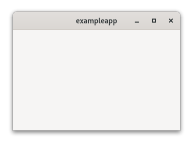
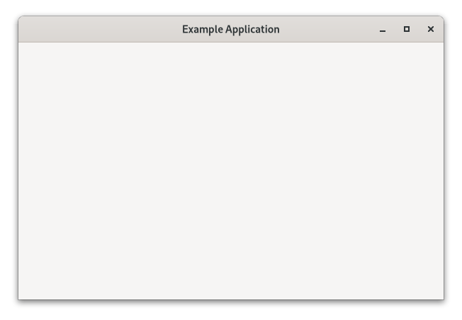
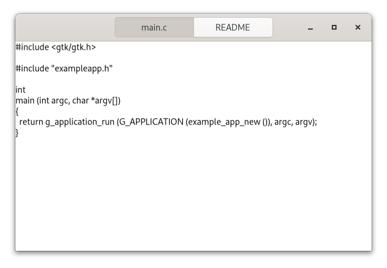

# Создание приложений - часть 1. Тривиальное приложение, открытие файлов, etc.

Простейшая программа состоит из нескольких файлов. Один из них - двоичный, а другой - файл рабочего стола. Первый устанавливается в каталог `/usr/bin` (в некоторых случаях, в `usr/local/bin` или `/opt/*`.

## Внешний вид.
Файл рабочего стола необходим для "интеграции" программы в рабочее окружение (GNOME, Xfce, Cinnamon, KDE и др.). Этот файл устанавливается в директорию `/usr/share/applications`. Так же есть иконка приложения. Устанавливается в `/usr/share/icons/hicolor/48x48/apps`, где будет найдена независимо от темы оформления.

## Настройка с помощью `gsettings`.
Если программа использует GSettings, оно установит свою схему в `/usr/share/glib-2.0/schemas`, чтобы такие инструменты, как dconf-editor смогли её найти.

## Другие ресурсы.
Другие файлы (например, файлы пользовательского интерфейса `GtkBuilder`) лучше загружать из ресурсов, хранящихся в самом двоичном файле приложения. Это устраняет необходимость в большинстве файлов.

Если такой подход вам не нравится, то устанавливайте такие файлы в `/usr/share` и `/usr/share/$PROGRAM`. Где `$PROGRAM` - директория, название которой - имя приложения.

---

GTK включает поддержку приложений, основанных на `GApplication`. В этом руководстве мы напишем простое приложение (с нуля), со временем добавляя всё больше и больше функций. В процессе написания познакомимся с `GtkApplication`, шаблонах, ресурсах, меню приложений, настройках, `GtkHeaderBar`, `GtkStack`, `GtkSearchBar`, `GtkListBox` и многом другом.

> Исходные коды вы можете скачать в конце этого мануала.

## Тривиальное приложение
При использовании `GtkApplication` функция `main()` может быть очень простой. Мы просто вызываем `g_application_run()` и даём ему экземпляр класса программы.

```c
#include <gtk/gtk.h>

#include "exampleapp.h"

int
main (int argc, char *argv[])
{
  return g_application_run (G_APPLICATION (example_app_new()), argc, argv);
}
```

Для обработки этих двух случаев мы переопределяем функцию `activate() vfunc`, которая вызывается при запуске приложения без аргументов командной строки, и `vfunc open()`, которая вызывается с аргументами командной строки.

> Чтобы узнать больше о точках входа `GApplication`, обратитесь к документации GIO [здесь](https://developer.gnome.org/gio/stable/GApplication.html)

```c
#include <gtk/gtk.h>

#include "exampleapp.h"
#include "exampleappwin.h"

struct _ExampleApp
{
  GtkApplication parent;
};

G_DEFINE_TYPE(ExampleApp, example_app, GTK_TYPE_APPLICATION);

static void
example_app_init (ExampleApp *app)
{
}

static void
example_app_activate (GApplication *app)
{
  ExampleAppWindow *win;

  win = example_app_window_new (EXAMPLE_APP (app));
  gtk_window_present (GTK_WINDOW (win));
}

static void
example_app_open (GApplication  *app,
                  GFile        **files,
                  int            n_files,
                  const char    *hint)
{
  GList *windows;
  ExampleAppWindow *win;
  int i;

  windows = gtk_application_get_windows (GTK_APPLICATION (app));
  if (windows)
    win = EXAMPLE_APP_WINDOW (windows->data);
  else
    win = example_app_window_new (EXAMPLE_APP (app));

  for (i = 0; i < n_files; i++)
    example_app_window_open (win, files[i]);

  gtk_window_present (GTK_WINDOW (win));
}

static void
example_app_class_init (ExampleAppClass *class)
{
  G_APPLICATION_CLASS (class)->activate = example_app_activate;
  G_APPLICATION_CLASS (class)->open = example_app_open;
}

ExampleApp *
example_app_new (void)
{
  return g_object_new (EXAMPLE_APP_TYPE,
                       "application-id", "org.gtk.exampleapp",
                       "flags", G_APPLICATION_HANDLES_OPEN,
                       NULL);
}
```

Другой важный класс, который является частью поддержки приложений в GTK, - это `GtkApplicationWindow`. Обычно он так же делится на подклассы, но наш подкласс *пока* ничего не делает, поэтому мы просто получим пустое окно.

```c
#include <gtk/gtk.h>

#include "exampleapp.h"
#include "exampleappwin.h"

struct _ExampleAppWindow
{
  GtkApplicationWindow parent;
};

G_DEFINE_TYPE(ExampleAppWindow, example_app_window, GTK_TYPE_APPLICATION_WINDOW);

static void
example_app_window_init (ExampleAppWindow *app)
{
}

static void
example_app_window_class_init (ExampleAppWindowClass *class)
{
}

ExampleAppWindow *
example_app_window_new (ExampleApp *app)
{
  return g_object_new (EXAMPLE_APP_WINDOW_TYPE, "application", app, NULL);
}

void
example_app_window_open (ExampleAppWindow *win,
                         GFile            *file)
{
}
```

В рамках первоначальной настройки программы так же создадим значок и файл на рабочем столе. Файл `~/.local/share/applications/exampleapp.desktop`:
```
[Desktop Entry]
Type=Application
Name=Example
Icon=exampleapp
StartupNotify=true
Exec=`bindir@/exampleapp
```

> **Примечание**. Обратите внимание на то, что `bindir@` нужно заменить на полный путь к скомпилированному бинарнику, ибо без этого файл рабочего стола использовать невозможно.

> **Примечание 2**. Вам необходимо сделать файл `~/.local/share/applications/exampleapp.desktop` исполняемым, чтобы рабочее окружение GNOME 40 определило его и добавило в меню приложений. Сделать это можно как в файловом менеджере Nautilus, так и в терминале:
```bash
chmod +x ~/local/share/applications/exampleapp.desktop
```

На данный момент, мы достигли этого:



На данный момент сие не выглядит впечатляющим, но основные результаты достигли. Программа имеет семантику единственного экземпляра и принимает файлы в качестве аргументов командной строки.

## Заполнение окна
На этом этапе мы используем шаблон `GtkBuilder`, чтобы связать файл пользовательского интерфейса `GtkBuilder` с классом нашего приложения.

Наш простой файл пользовательского интерфейса даёт окну заголовок и помещает `GtkStack` в качестве основного содержимого:
```xml
<?xml version="1.0" encoding="UTF-8"?>
<interface>
  <template class="ExampleAppWindow" parent="GtkApplicationWindow">
    <property name="title" translatable="yes">Example Application</property>
    <property name="default-width">600</property>
    <property name="default-height">400</property>
    <child>
      <object class="GtkBox" id="content_box">
        <property name="orientation">vertical</property>
        <child>
          <object class="GtkStack" id="stack"/>
        </child>
      </object>
    </child>
  </template>
</interface>
```

Чтобы повторно использовать этот файл в программе, мы повторно посещаем подкласс `GtkApplication` и вызываем `gtk_widget_class_set_template_from_resource()` из функции инициализации класса, чтобы установить файл пользовательского интерфейса в качестве шаблона для него. Мы так же добавляем вызов `gtk_widget_init_template()` в функцию инициализации экземпляра, чтобы создать экземпляр шаблона для каждого экземпляра нашего класса.

```c
...

static void
example_app_window_init (ExampleAppWindow *win)
{
  gtk_widget_init_template (GTK_WIDGET (win));
}

static void
example_app_window_class_init (ExampleAppWindowClass *class)
{
  gtk_widget_class_set_template_from_resource (GTK_WIDGET_CLASS (class),
                                               "/org/gtk/exampleapp/window.ui");
}

 ...
```
Полный исходник доступен [здесь](https://gitlab.gnome.org/GNOME/gtk/blob/master/examples/application2/exampleappwin.c)

Вы могли заметить, что мы использовали вариант `_from_resource()` функции, устанавливающей шаблон. Теперь нужно использовать [функциональность ресурсов GLib](https://developer.gnome.org/gio/stable/GResource.html), чтобы включить файл ui в бинарник. Обычно это делается путём перечисления всех ресурсов в файле `.gresource.xml`:
```xml
<?xml version="1.0" encoding="UTF-8"?>
<gresources>
  <gresource prefix="/org/gtk/exampleapp">
    <file preprocess="xml-stripblanks">window.ui</file>
  </gresource>
</gresources>
```

Этот файл необходимо преобразовать в исходник С, который будет скомпилирован и связан с приложением вместе с другими исходниками. Воспользуйтесь утилитой `glib-compile-resources`^
```bash
glib-compile-resources exampleapp.gresource.xml --target=resources.c --generate-source
```

> Модуль системы сборки `meson` представляет для этой задачи метод `gnome.compile_resources()`. Подробнее о нём читать [здесь](https://mesonbuild.com/Gnome-module.html#gnomecompile_resources)

Наше приложение теперь выглядит так:



## Открытие файлов
В этом пункте мы "научим" программу отображать содержимое всех файлов, заданных в командной строке. Для этого добавим член в структуру подкласса окна программы и сохраним там ссылку на `GtkStack`. Первый член структуры должен быть родительским типом, производным от класса. Здесь `ExampleAppWindow` является производным от `GtkApplicationWindow`. Функция `gtk_widget_class_bind_template_child()` упорядочивает вещи так, чтобы после создания экземпляра шаблона член стека структуры указывал на одноименный виджет из шаблона.

```c
...

struct _ExampleAppWindow
{
  GtkApplicationWindow parent;

  GtkWidget *stack;
};

G_DEFINE_TYPE (ExampleAppWindow, example_app_window, GTK_TYPE_APPLICATION_WINDOW)

...

static void
example_app_window_class_init (ExampleAppWindowClass *class)
{
  gtk_widget_class_set_template_from_resource (GTK_WIDGET_CLASS (class),
                                               "/org/gtk/exampleapp/window.ui");
  gtk_widget_class_bind_template_child (GTK_WIDGET_CLASS (class), ExampleAppWindow, stack);
}

...
```

Полный исходник доступен [здесь](https://gitlab.gnome.org/GNOME/gtk/blob/master/examples/application3/exampleappwin.c)

Теперь мы повторно обращаемся к функции `example_app_window_open()`, которая вызывается для каждого аргумента командной строки, и создаем `GtkTextView`, который затем добавляем как страницу в стек:

```c
...

void
example_app_window_open (ExampleAppWindow *win,
                         GFile            *file)
{
  char *basename;
  GtkWidget *scrolled, *view;
  char *contents;
  gsize length;

  basename = g_file_get_basename (file);

  scrolled = gtk_scrolled_window_new();
  gtk_widget_set_hexpand (scrolled, TRUE);
  gtk_widget_set_vexpand (scrolled, TRUE);
  view = gtk_text_view_new();
  gtk_text_view_set_editable (GTK_TEXT_VIEW (view), FALSE);
  gtk_text_view_set_cursor_visible (GTK_TEXT_VIEW (view), FALSE);
  gtk_scrolled_window_set_child (GTK_SCROLLED_WINDOW (scrolled), view);
  gtk_stack_add_titled (GTK_STACK (win->stack), scrolled, basename, basename);

  if (g_file_load_contents (file, NULL, &contents, &length, NULL, NULL))
    {
      GtkTextBuffer *buffer;

      buffer = gtk_text_view_get_buffer (GTK_TEXT_VIEW (view));
      gtk_text_buffer_set_text (buffer, contents, length);
      g_free (contents);
    }

  g_free (basename);
}

...
```

Полный исходник доступен [здесь](https://gitlab.gnome.org/GNOME/gtk/blob/master/examples/application3/exampleappwin.c)

Наконец, мы добавляем `GtkStackSwitcher` в область заголовка в файле пользовательского интерфейса и приказываем ему отображать информацию о нашем стеке.

Переключатель стека получает всю информацию, необходимую для отображения вкладок, из стека, которому он принадлежит. Здесь мы передаем метку, которая будет отображаться для каждого файла в качестве последнего аргумента функции `gtk_stack_add_titled()`.

Теперь, наше приложение выглядит так:



***
[Назад - создание пользовательских интерфейсов](gtk5.md)
--**--
[Далее - создание приложений - часть 2. Меню](gtk7.md)
