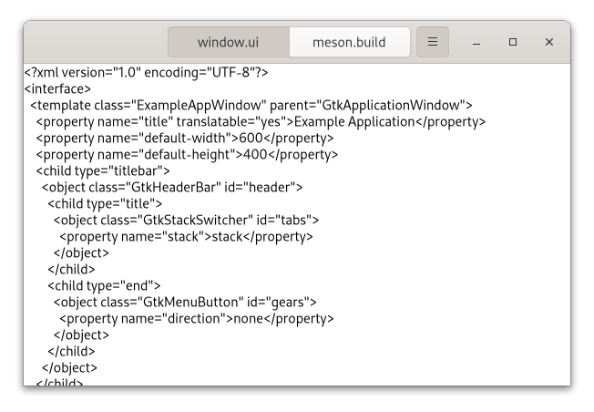
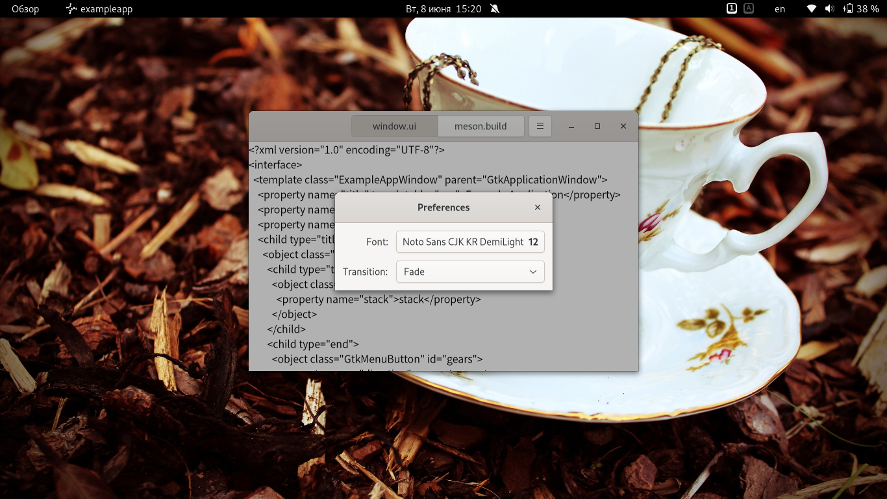
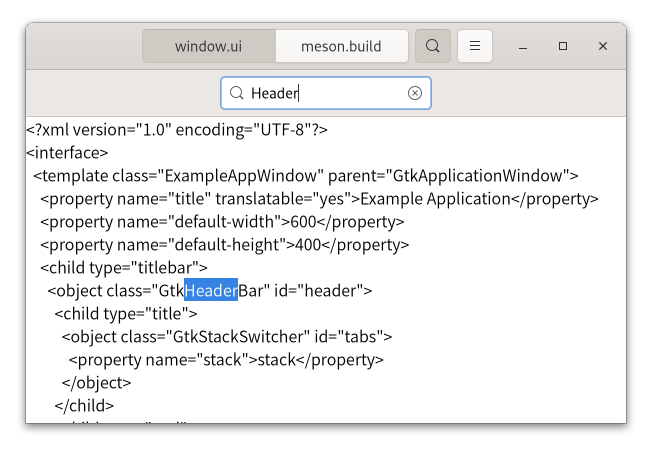
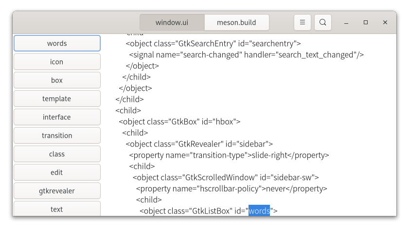
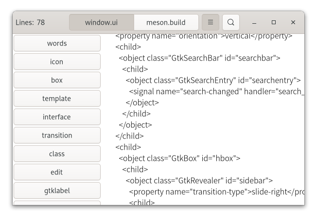

# Создание приложений - часть 2. Продолжение написания программы - создание меню.

## Создание меню
Меню отображается в правой части заголовка окна (оно же "гамбургер", "три точки", "три блина"). Оно предназначено для сборка редко используемых действий.

> **Примечание**

> Разработчики рабочего окружения GNOME любят прятать туда всё, что попадётся им на глаза. 😁️

Как и в случае с шаблоном окна, мы указываем меню в файле пользовательского интерфейса и добавляем его в бинарник.

```xml
<?xml version="1.0" encoding="UTF-8"?>
<interface>
  <menu id="menu">
    <section>
      <item>
        <attribute name="label" translatable="yes">_Настройки</attribute>
        <attribute name="action">app.preferences</attribute>
      </item>
    </section>
    <section>
      <item>
        <attribute name="label" translatable="yes">_Выход</attribute>
        <attribute name="action">app.quit</attribute>
      </item>
    </section>
  </menu>
</interface>
```

Чтобы меню загрузилось, нужно загрузить файл пользовательского интерфейса (`*.ui`) и связать полученную модель меню с кнопкой, которую добавили в заголовок окна. Посколько меню работают путём активации `GActions`, мы так же должны добавить подходящий набор действий в приложение.

Добавление действий лучше выполнять в `vfunc startup()`, который гарантированно будет вызываться один раз для каждого экземпляра основного приложения:

```c
...

static void
preferences_activated (GSimpleAction *action,
                       GVariant      *parameter,
                       gpointer       app)
{
}

static void
quit_activated (GSimpleAction *action,
                GVariant      *parameter,
                gpointer       app)
{
  g_application_quit (G_APPLICATION (app));
}

static GActionEntry app_entries[] =
{
  { "preferences", preferences_activated, NULL, NULL, NULL },
  { "quit", quit_activated, NULL, NULL, NULL }
};

static void
example_app_startup (GApplication *app)
{
  GtkBuilder *builder;
  GMenuModel *app_menu;
  const char *quit_accels[2] = { "&lt;Ctrl&gt;Q", NULL };

  G_APPLICATION_CLASS (example_app_parent_class)->startup (app);

  g_action_map_add_action_entries (G_ACTION_MAP (app),
                                   app_entries, G_N_ELEMENTS (app_entries),
                                   app);
  gtk_application_set_accels_for_action (GTK_APPLICATION (app),
                                         "app.quit",
                                         quit_accels);
}

static void
example_app_class_init (ExampleAppClass *class)
{
  G_APPLICATION_CLASS (class)->startup = example_app_startup;
  ...
}

...
```

Полный исходник доступен [здесь](https://gitlab.gnome.org/GNOME/gtk/blob/master/examples/application4/exampleapp.c)

Пункт меню настроек пока ничего не делает, но "Выход" полностью функционален. Обратите внимание на то, что его так же можно активировать сочетанием *Ctrl+Q*. Ярлык был добавлен с помощью `gtk_application_set_accels_for_action()`.

Меню приложений выглядит так:



## Диалог параметров

В каждом приложении есть какие-либо параметры, которые следует запоминать от одного запуска к другому. Например, для нашей программы мы можем захотеть изменить шрифт, используемый для отображения файлов.

Мы собираемся использовать `GSettings` для хранения параметров. `GSettings` требует схему с описаниями настроек:

```xml
<?xml version="1.0" encoding="UTF-8"?>
<schemalist>
  <schema path="/org/gtk/exampleapp/" id="org.gtk.exampleapp">
    <key name="font" type="s">
      <default>'Monospace 12'</default>
      <summary>Font</summary>
      <description>The font to be used for content.</description>
    </key>
    <key name="transition" type="s">
      <choices>
        <choice value='none'/>
        <choice value='crossfade'/>
        <choice value='slide-left-right'/>
      </choices>
      <default>'none'</default>
      <summary>Transition</summary>
      <description>The transition to use when switching tabs.</description>
    </key>
  </schema>
</schemalist>
```

Прежде чем мы сможем использовать эту схему в программе, нужно скомпилировать её в двоичную форму, которую ожидает GSettings. `GIO` предоставляет макросы для этого в проектах на основе `autotools`, а модуль `gnome` системы сборки meson предоставляет для этой задачи метод `gnome.compile_schemas()`.

Затем нам нужно связать наши настройки с виджетами, которыми они должны управлять. Один из удобных способов сделать это - использовать функцию привязки GSettings для привязки ключей настроек к свойствам объекта, как мы делаем здесь для настройки перехода.

```c
...

static void
example_app_window_init (ExampleAppWindow *win)
{
  gtk_widget_init_template (GTK_WIDGET (win));
  win->settings = g_settings_new ("org.gtk.exampleapp");

  g_settings_bind (win->settings, "transition",
                   win->stack, "transition-type",
                   G_SETTINGS_BIND_DEFAULT);
}

...
```

Полный исходник доступен [здесь](https://gitlab.gnome.org/GNOME/gtk/blob/master/examples/application5/exampleappwin.c)

Код для подключения настройки шрифта немного сложнее, поскольку нет простого свойства объекта, которому он соответствует, поэтому мы не собираемся здесь вдаваться в подробности.

На этом этапе приложение уже отреагирует, если вы измените одну из настроек, например с помощью инструмента командной строки `gsettings`. Конечно, мы ожидаем, что приложение предоставит для них диалоговое окно предпочтений. Итак, давайте сделаем это сейчас. Наше диалоговое окно настроек будет подклассом `GtkDialog`, и мы будем использовать те же методы, которые мы уже видели: шаблоны, частные структуры, привязки настроек.

Начнем с шаблона:

```xml
<?xml version="1.0" encoding="UTF-8"?>
<interface>
  <template class="ExampleAppPrefs" parent="GtkDialog">
    <property name="title" translatable="yes">Preferences</property>
    <property name="resizable">0</property>
    <property name="modal">1</property>
    <child internal-child="content_area">
      <object class="GtkBox" id="content_area">
        <child>
          <object class="GtkGrid" id="grid">
            <property name="margin-start">12</property>
            <property name="margin-end">12</property>
            <property name="margin-top">12</property>
            <property name="margin-bottom">12</property>
            <property name="row-spacing">12</property>
            <property name="column-spacing">12</property>
            <child>
              <object class="GtkLabel" id="fontlabel">
                <property name="label">_Font:</property>
                <property name="use-underline">1</property>
                <property name="mnemonic-widget">font</property>
                <property name="xalign">1</property>
                <layout>
                  <property name="column">0</property>
                  <property name="row">0</property>
                </layout>
              </object>
            </child>
            <child>
              <object class="GtkFontButton" id="font">
                <layout>
                  <property name="column">1</property>
                  <property name="row">0</property>
                </layout>
              </object>
            </child>
            <child>
              <object class="GtkLabel" id="transitionlabel">
                <property name="label">_Transition:</property>
                <property name="use-underline">1</property>
                <property name="mnemonic-widget">transition</property>
                <property name="xalign">1</property>
                <layout>
                  <property name="column">0</property>
                  <property name="row">1</property>
                </layout>
              </object>
            </child>
            <child>
              <object class="GtkComboBoxText" id="transition">
                <items>
                  <item translatable="yes" id="none">None</item>
                  <item translatable="yes" id="crossfade">Fade</item>
                  <item translatable="yes" id="slide-left-right">Slide</item>
                </items>
                <layout>
                  <property name="column">1</property>
                  <property name="row">1</property>
                </layout>
              </object>
            </child>
          </object>
        </child>
      </object>
    </child>
  </template>
</interface>
```

Далее идёт подкласс диалога:

```c
#include <gtk/gtk.h>

#include "exampleapp.h"
#include "exampleappwin.h"
#include "exampleappprefs.h"

struct _ExampleAppPrefs
{
  GtkDialog parent;

  GSettings *settings;
  GtkWidget *font;
  GtkWidget *transition;
};

G_DEFINE_TYPE (ExampleAppPrefs, example_app_prefs, GTK_TYPE_DIALOG)

static void
example_app_prefs_init (ExampleAppPrefs *prefs)
{
  gtk_widget_init_template (GTK_WIDGET (prefs));
  prefs->settings = g_settings_new ("org.gtk.exampleapp");

  g_settings_bind (prefs->settings, "font",
                   prefs->font, "font",
                   G_SETTINGS_BIND_DEFAULT);
  g_settings_bind (prefs->settings, "transition",
                   prefs->transition, "active-id",
                   G_SETTINGS_BIND_DEFAULT);
}

static void
example_app_prefs_dispose (GObject *object)
{
  ExampleAppPrefs *prefs;

  prefs = EXAMPLE_APP_PREFS (object);

  g_clear_object (&prefs->settings);

  G_OBJECT_CLASS (example_app_prefs_parent_class)->dispose (object);
}

static void
example_app_prefs_class_init (ExampleAppPrefsClass *class)
{
  G_OBJECT_CLASS (class)->dispose = example_app_prefs_dispose;

  gtk_widget_class_set_template_from_resource (GTK_WIDGET_CLASS (class),
                                               "/org/gtk/exampleapp/prefs.ui");
  gtk_widget_class_bind_template_child (GTK_WIDGET_CLASS (class), ExampleAppPrefs, font);
  gtk_widget_class_bind_template_child (GTK_WIDGET_CLASS (class), ExampleAppPrefs, transition);
}

ExampleAppPrefs *
example_app_prefs_new (ExampleAppWindow *win)
{
  return g_object_new (EXAMPLE_APP_PREFS_TYPE, "transient-for", win, "use-header-bar", TRUE, NULL);
}
```

Вернёмся к функции `preferences_activated()` в классе приложения и заставим её открыть новый диалог параметров:

```c
...

static void
preferences_activated (GSimpleAction *action,
                       GVariant      *parameter,
                       gpointer       app)
{
  ExampleAppPrefs *prefs;
  GtkWindow *win;

  win = gtk_application_get_active_window (GTK_APPLICATION (app));
  prefs = example_app_prefs_new (EXAMPLE_APP_WINDOW (win));
  gtk_window_present (GTK_WINDOW (prefs));
}

...
```

Полный исходник доступен [здесь](https://gitlab.gnome.org/GNOME/gtk/blob/master/examples/application6/exampleapp.c)

После чего, программа может отображать диалоговое окно с настройками. На данный момент, доступны только настройки шрифтов.



## Панель поиска

В программе неплохо было иметь поиск. GTK поддерживает это с помощью `GtkSearchEntry` и `GtkSearchBar`.

> **Примечание.**

> *Панель поиска* - это виджет, который может выдвигаться сверху, чтобы предоставить поисковую запись (панель).

Мы добавляем кнопку-переключатель на панель заголовка, которую можно использовать для выдвижения панели под заголовком окна.

```xml
<?xml version="1.0" encoding="UTF-8"?>
<interface>
  <template class="ExampleAppWindow" parent="GtkApplicationWindow">
    <property name="title" translatable="yes">Example Application</property>
    <property name="default-width">600</property>
    <property name="default-height">400</property>
    <child type="titlebar">
      <object class="GtkHeaderBar" id="header">
        <child type="title">
          <object class="GtkStackSwitcher" id="tabs">
            <property name="stack">stack</property>
          </object>
        </child>
        <child type="end">
          <object class="GtkMenuButton" id="gears">
            <property name="direction">none</property>
          </object>
        </child>
        <child type="end">
          <object class="GtkToggleButton" id="search">
            <property name="sensitive">0</property>
            <property name="icon-name">edit-find-symbolic</property>
          </object>
        </child>
      </object>
    </child>
    <child>
      <object class="GtkBox" id="content_box">
        <property name="orientation">vertical</property>
        <child>
          <object class="GtkSearchBar" id="searchbar">
            <child>
              <object class="GtkSearchEntry" id="searchentry">
                <signal name="search-changed" handler="search_text_changed"/>
              </object>
            </child>
          </object>
        </child>
        <child>
          <object class="GtkStack" id="stack">
            <signal name="notify::visible-child" handler="visible_child_changed"/>
          </object>
        </child>
      </object>
    </child>
  </template>
</interface>
```

> **Предупреждение.**

> Для реализации поиска требуется довольно обширное изменение кода, которое мы рассматривать **не будем**. Центральным элементом реализации поиска является обработчик сигналов, который отслеживает изменения текста в поисковой записи.

```c
...

static void
search_text_changed (GtkEntry         *entry,
                     ExampleAppWindow *win)
{
  const char *text;
  GtkWidget *tab;
  GtkWidget *view;
  GtkTextBuffer *buffer;
  GtkTextIter start, match_start, match_end;

  text = gtk_editable_get_text (GTK_EDITABLE (entry));

  if (text[0] == '\0')
    return;

  tab = gtk_stack_get_visible_child (GTK_STACK (win->stack));
  view = gtk_scrolled_window_get_child (GTK_SCROLLED_WINDOW (tab));
  buffer = gtk_text_view_get_buffer (GTK_TEXT_VIEW (view));

  /* Very simple-minded search implementation */
  gtk_text_buffer_get_start_iter (buffer, &start);
  if (gtk_text_iter_forward_search (&start, text, GTK_TEXT_SEARCH_CASE_INSENSITIVE,
                                    &match_start, &match_end, NULL))
    {
      gtk_text_buffer_select_range (buffer, &match_start, &match_end);
      gtk_text_view_scroll_to_iter (GTK_TEXT_VIEW (view), &match_start,
                                    0.0, FALSE, 0.0, 0.0);
    }
}

static void
example_app_window_init (ExampleAppWindow *win)
{

...

  gtk_widget_class_bind_template_callback (GTK_WIDGET_CLASS (class), search_text_changed);

...

}

...
```

Полный исходник доступен [здесь](https://gitlab.gnome.org/GNOME/gtk/blob/master/examples/application7/exampleappwin.c).

Теперь, программа выглядит так:



## Добавление сайдбара

> *Сайдбар* - боковая панель (прим. переводчика).

В качестве ещё одной "фичи" добавим панель, демонстрирующую `GtkMenuButton`, `GtkRevealer` и `GtkListBox`.

```xml
<?xml version="1.0" encoding="UTF-8"?>
<interface>
  <template class="ExampleAppWindow" parent="GtkApplicationWindow">
    <property name="title" translatable="yes">Example Application</property>
    <property name="default-width">600</property>
    <property name="default-height">400</property>
    <child type="titlebar">
      <object class="GtkHeaderBar" id="header">
        <child type="title">
          <object class="GtkStackSwitcher" id="tabs">
            <property name="stack">stack</property>
          </object>
        </child>
        <child type="end">
          <object class="GtkToggleButton" id="search">
            <property name="sensitive">0</property>
            <property name="icon-name">edit-find-symbolic</property>
          </object>
        </child>
        <child type="end">
          <object class="GtkMenuButton" id="gears">
            <property name="direction">none</property>
          </object>
        </child>
      </object>
    </child>
    <child>
      <object class="GtkBox" id="content_box">
        <property name="orientation">vertical</property>
        <child>
          <object class="GtkSearchBar" id="searchbar">
            <child>
              <object class="GtkSearchEntry" id="searchentry">
                <signal name="search-changed" handler="search_text_changed"/>
              </object>
            </child>
          </object>
        </child>
        <child>
          <object class="GtkBox" id="hbox">
            <child>
              <object class="GtkRevealer" id="sidebar">
                <property name="transition-type">slide-right</property>
                <child>
                  <object class="GtkScrolledWindow" id="sidebar-sw">
                    <property name="hscrollbar-policy">never</property>
                    <child>
                      <object class="GtkListBox" id="words">
                        <property name="selection-mode">none</property>
                      </object>
                    </child>
                  </object>
                </child>
              </object>
            </child>
            <child>
              <object class="GtkStack" id="stack">
                <signal name="notify::visible-child" handler="visible_child_changed"/>
              </object>
            </child>
          </object>
        </child>
      </object>
    </child>
  </template>
</interface>
```

Код для заполнения боковой панели слишком сложен, чтобы вдаваться в подробности (панель будет заполнена кнопками для слов, найденных в каждом файле). Но мы посмотрим на код, чтобы добавить в меню флажок для новой функции.

```xml
<?xml version="1.0" encoding="UTF-8"?>
<interface>
  <menu id="menu">
    <section>
      <item>
        <attribute name="label" translatable="yes">_Words</attribute>
        <attribute name="action">win.show-words</attribute>
      </item>
      <item>
        <attribute name="label" translatable="yes">_Preferences</attribute>
        <attribute name="action">app.preferences</attribute>
      </item>
    </section>
    <section>
      <item>
        <attribute name="label" translatable="yes">_Quit</attribute>
        <attribute name="action">app.quit</attribute>
      </item>
    </section>
  </menu>
</interface>
```

Чтобы связать элемент меню с настройкой `show-words`, мы используем `GAction`, соответствующий данному ключу `GSettings`.

```c
...

static void
example_app_window_init (ExampleAppWindow *win)
{

...

  builder = gtk_builder_new_from_resource ("/org/gtk/exampleapp/gears-menu.ui");
  menu = G_MENU_MODEL (gtk_builder_get_object (builder, "menu"));
  gtk_menu_button_set_menu_model (GTK_MENU_BUTTON (priv->gears), menu);
  g_object_unref (builder);

  action = g_settings_create_action (priv->settings, "show-words");
  g_action_map_add_action (G_ACTION_MAP (win), action);
  g_object_unref (action);
}

...
```

Полный исходник доступен [здесь](https://gitlab.gnome.org/GNOME/gtk/blob/master/examples/application8/exampleappwin.c)

Тепермь программа выглядит так:



## Характеристики

Виджеты и другие объекты обладают множеством полезных свойств.

Здесь мы покажем некоторые способы их использования новыми и гибкими способами, заключая их в действия с помощью `GPropertyAction` или связывая их с помощью `GBinding`.

Чтобы настроить это, мы добавляем две метки к строке заголовка в шаблоне окна, с именами `lines_label` и `lines`, и привязываем их к элементам структуры в частной структуре, как мы это уже несколько раз видели.

```xml
<?xml version="1.0" encoding="UTF-8"?>
<interface>
  <menu id="menu">
    <section>
      <item>
        <attribute name="label" translatable="yes">_Words</attribute>
        <attribute name="action">win.show-words</attribute>
      </item>
      <item>
        <attribute name="label" translatable="yes">_Lines</attribute>
        <attribute name="action">win.show-lines</attribute>
      </item>
      <item>
        <attribute name="label" translatable="yes">_Preferences</attribute>
        <attribute name="action">app.preferences</attribute>
      </item>
    </section>
    <section>
      <item>
        <attribute name="label" translatable="yes">_Quit</attribute>
        <attribute name="action">app.quit</attribute>
      </item>
    </section>
  </menu>
</interface>
```

Чтобы заставить этот пункт меню что-то делать, мы создаем действие свойства для свойства метки `lines` и добавляем его к действиям окна. Результатом этого является то, что видимость метки переключается каждый раз, когда активируется действие.

Поскольку мы хотим, чтобы обе метки появлялись и исчезали вместе, мы привязываем свойство `visible` виджета `lines_label` к тому же свойству виджета `lines`:

```c
...

static void
example_app_window_init (ExampleAppWindow *win)
{
  ...

  action = (GAction*) g_property_action_new ("show-lines", win->lines, "visible");
  g_action_map_add_action (G_ACTION_MAP (win), action);
  g_object_unref (action);

  g_object_bind_property (win->lines, "visible",
                          win->lines_label, "visible",
                          G_BINDING_DEFAULT);
}

...
```

Полный исходник доступен [здесь](https://gitlab.gnome.org/GNOME/gtk/blob/master/examples/application9/exampleappwin.c)

Нам так же нужна функция, которая подсчитывает строки текущей активности вкладки и обновляет метку `lines`.

> **Смотрите также:**

> [Пример](https://gitlab.gnome.org/GNOME/gtk/blob/master/examples/application9/exampleappwin.c), если вас интересуют подробности.

Это приводит программу к следующему виду:



***
[Назад - создание приложений. Часть 1](gtk6.md)
--**-- [Далее - примеры исходников, используемых в инструкции](programs.md)
