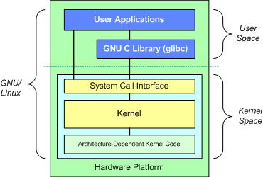

# Строение GNU/Linux. Часть 1.

*Статью написал Linuxoid85 для сообщества LinuxSovet. 26.04.2021 16:55*

[Вторая часть статьи](LinuxStr2/LinuxStr2.md) | 
[Третья часть статьи](LinuxStr3/LinuxStr3.md)

Лично я считаю, что любой уважающий себя линуксоид должен сделать следующее:
* уметь читать документацию (например, маны), уметь гуглить нужную информацию в интернете и состоять в каком-либо Linux-сообществе. А лучше, в нескольких.
* знать, как устроен Linux
* хотя бы раз собрать свой дистрибутив по LFS и пользоваться им.

*...а так же родить детей, посадить дерево, et cetera...*

Дистрибутив по LFS собрать нельзя, не умея читать документацию, искать нужную информацию в интернете и не зная строение Linux. Именно о строении и пойдёт речь в этой статье.

Статья объёмная, поэтому читать вдумчиво.

Строение Linux, ИМХО, лучше всего рассматривать на чём-то попроще. На том, что не перегружено лишними пакетами, соблюдает FHS и LSB, идеально подходит для изучения. Выбор пал как раз на LFS. У меня есть дистрибутив, собранный по этой книге, называется Calmira GNU/Linux. Крутится на старом ноуте, на котором и писал эту статью.

## Термины
Для начала, думаю, неплохо было бы начать именно с терминов, дабы потом не возвращаться к этому.

* `FHS` (`Filesystem Hierarchy Standart`) - документ, который определяет схему директорий в UNIX-системах. FHS разработан, чтобы предоставить общую схему для упрощения независимой от дистрибутива разработки `программного обезпечения` (далее - `ПО`). Другими словами, это стандарт, унифицирующий местонахождение файлов и каталогов с общим назначением в файловой системе UNIX. Таблицу директорий и другую информацию вы сможете лицезреть в следующей части статьи.
* `LSB` (`Linux Standart Base`) - совместный проект дистрибутивов Linux при организации Linux Foundation, целью которого является стандартизация их внутренней инфраструктуры. Цель LSB - разработать и продвигать набор стандартов, который увеличит совместимость различных дистрибутивов Linux и даст возможность запускать приложения на любой совместимой системе; помимо этого, LSB помогает сконцентрировать усилия в привлечении разработчиков к написанию и портированию ПО. LSB сертифицирует стандартные библиотеки, пару утилит, структуру иерархии `файловой системы` (далее - `ФС`), уровни запуска, et cereta.
* `конфиг` - сленговое. Означает "конфигурационный файл"
* `юзер` - сленговое. Означает "пользователь"
* `ФС` - сокращение от "файловая система"

## Filesystem Hierarhy Standart
В данном разделе речь пойдёт про иерархию ФС Linux. Может быть применимо и к другим UNIX-Like системам и дистрибутивам, главное, чтобы они соответствовали стандарту `FHS`. Всякие Gobo Linux не рассматриваем.

### Дерево файловой системы по FHS
```
/	корень
|--- /bin	основные утилиты, необходимые как в однопользовательском режиме, так и при обычной работе
|--- /boot	загрузочные файлы (собственно, файлы загрузчика, ядро, et cetera)
|--- /dev	файлы устройств (например, /dev/sda, /dev/sdb, et cereta)
|--- /etc	конфигурационные файлы системы
|    |--- /etc/opt	конфиги для /opt/*
|    |--- /etc/X11	конфиги X Window
|    |--- ...
|--- /home	содержит домашние каталоги пользователей, где юзеры хранят свои файлы, настройки системы, специфичные для каждого пользователя и т.п.
|--- /lib	основные библиотеки, необходимые для работы ПО из /bin и /sbin
|--- /media	точки монтирования сменных носителей
|--- /mnt	временно монтируемые ФС
|--- /opt	дополнительное ПО. Например, именно туда устанавливается легендарное рабочее окружение TDE.
|--- /proc	виртуальная ФС, предоставляющая информацию о состоянии ядра ОС и запущенных процессах в виде файлов
|--- /root	домашний каталог пользователя root
|--- /sbin	основные системные программы для настройки и администрирования системы (init, ifconfig, mkfs, et cereta)
|--- /srv	данные для сервисов, предоставляемых системой
|--- /sys	содержит информацию об устройствах, драйверах и пр.
|--- /tmp	временные файлы, некоторые из них удаляются перед выключением системы
|--- /usr	вторичная иерархия для данных пользователя. Содержит большинство пользовательских приложений и утилит, используемых в многопользовательском режиме
|    |--- /usr/bin	дополнительное ПО для всех пользователей
|    |--- /usr/include	стандартные заголовочные файлы
|    |--- /usr/lib	библиотеки для программ из /usr/bin и /usr/sbin
|    |--- /usr/local	третичная иерархия для данных, специфичных для данного хоста, содержит директории bin, lib, share, et cetera
|    |--- /usr/share	архитектурно-независимые файлы
|    |--- /usr/sbin	дополнительные системные программы (см. также: /sbin)
|    |--- /usr/src	исходные тексты ПО
|--- /var	изменяемые файлы, такие как кеш приложений и ПМ, логи и прочее
|    |--- /var/log	логи ядра, операционной системы и ПО
```

## Независимые классификации в FHS
Спецификация FHS основывается на идее существования двух независимых классификаций файлов: разделяемых и неразделяемых, а так же изменяемые и статичные. Разделяемые данные могут распространяться на несколько хостов; неразделяемые специфичны для конкретного хоста (например, конфиги). Соответственно, изменяемые файлы изменяются, а статичные - нет (за исключением установки и обслуживания системы).

Резюме. 4 возможные комбинации + нужные директории.

| --         | Разделяемые    |   Неразделяемые |
|:-----------|:---------------|:----------------|
| статичные  | `/usr`, `/opt` | `/etc`, `/boot` |
| изменяемые | `/var/main`    | `/var/run`      |

## Само строение ОС
### Процесс загрузки
В данной статье я пропущу загрузку ПК, BIOS, UEFI и прочее, ибо это не тема этой статьи. А начну с `загрузчика`, коих много. Но самый распространённый - `GRUB2`.

Задача загрузчика - инициализировать ядро Linux (в нашем случае). В помощь ядру загрузчик обычно использует начальный образ загрузки - `initrd` или `initfarms`, представляющий собой архив с образом файловой системы, разворачивающейся в ОЗУ в начале загрузки. В `initrd`/`initfarms` находятся нужные драйверы, скрипты и прочее, что необходимо для инициальзации оборудования и прочих целей.

***
После начального образа загружается ядро. Находится в `/boot`, в своём названии имеет `vmlinuz`:
* `vm` - поддержка виртуальной памяти
* `linu`
* `z` - указатель того, что файл с ядром сжат (формат сжатия обычно `zlib`. Не всегда используется именно это сжатие, иногда можно встретить `LZMA` или `BZIP2`, поэтому некоторые ядра называют просто `zImage`).

Ядро Linux является `монолитным`.

**Плюсы монолитного ядра**
* Более прямой доступ к аппаратным средствам
* Проще обмен данными между процессами
* Процессы реагируют быстрее

**Минусы монолитного ядра**
* Большой размер
* Занимает много оперативной памяти
* Менее безопасно

Монолитное ядро больше и несколько сложнее других видов ядер. Ну и вспомните спор Таненбаума и Торвальдса. Но у Linux есть достоинство - это модули ядра. Подключать нужные модули можно буквально на лету. Вы можете запускать процессы сервера, подключать виртуализацию, а также полностью заменить ядро без перезагрузки. Например, команда
```
modprobe qemu-nbd
```
Подключит соответствующий модуль `qemu-nbd`.


GNU/Linux состоит из четырёх основных частей:
* `Ядро Linux` — основная интересующая нас часть; ядро создаёт абстрактный слой и является «посредником» между первыми двумя частями и hardware-частью компьютера;
Hardware controllers (контроллеры оборудования) — подсистема, охватывающая все возможные физические устройства, такие как CPU, устройства памяти, жёсткие диски, сетевые карты — все они являются частью этой подсистемы.
* `O/S services` (службы операционной системы) — службы, которые обычно считаются частью операционной системы. Например, оконные менеджеры. Ну и программный интерфейс ядра (компиляторы и прочее)
* `User applications` (пользовательские приложения) — набор пользовательских приложений, который в разных дистрибутивах Linux может быть разным. Например, в LFS самый минимум. Редактор и ещё пару программ. Но эту проблему решает BLFS, в котором предложено огромное число софта.



Каждая подсистема может взаимодействовать только с двумя соседними, расположенными непосредственно «выше» и «ниже» её уровня. Кроме того, зависимости между этими подсистемами направлены сверху — вниз: слои расположенные выше — зависят от частей ниже, но части, расположенные ниже — не зависят от частей выше их.

Ядро Linux состоит из пяти основных подсистем:

* `Process Scheduler` (`SCHED`) — планировщик процессов, отвечает за контроль над доступом процессов к CPU. Планировщик обеспечивает такое поведения ядра, при котором все процессы имеют справедливый доступ к центральному процессору.
* `Memory Manager` (`MM`) — менеджер памяти, обеспечивает различным процессам безопасный доступ к основной памяти системы. Кроме того, MM обеспечивает работу виртуальной памяти, которая позволяет процессам использовать больше памяти, чем реально доступно в системе. Выделенная, но неиспользуемая память вытесняется на файловую систему, и при необходимости — возвращается из неё обратно в память (swapping).
* `Virtual File System` (`VFS`) — виртуальная файловая система, создаёт абстрактный слой, скрывая детали оборудования, предоставляя общий файловый интерфейс для всех устройств. Кроме того, VFS поддерживает несколько форматов файловых систем, которые совместимы с другими операционными системами.
* `Network Interface` (`NET`) — сетевые интерфейсы, обеспечивает работу с различными сетевыми стандартами и сетевым оборудованием.
* `Inter-Process Communication` (`IPC`) — межпроцессная подсистема, поддерживающая несколько механизмов для process-to-process связей в единой Linux-системе.


Символом ядра Linux является Tux, отличающийся от «обычных» пингвинов жёлтым цветом клюва и лап. Однако, в кач-ве символа Linux 2.6.29 был принят Tuz (тасманский дьявол), изображение которого ранее служило талисманом конференции linux.conf.au 2009. В следующих версиях ядра используется предыдущий пингвин Tux. Его можно наблюдать и поныне.


*Tux*


*Tuz*


***
После ядра стартует `init` - подсистема инициализации в UNIX-ах, которая запускает все остальные процессы. Имеет `PID`=1. Раньше, де-факто стандартным инитом в GNU/Linux был SysVInit. Однако, в самом начале 10-ых были попытки заменить sysvinit на другую систему инициализации. Например, в Ubuntu первое время использовался `upstart` от CanoniCAL, а в Gentoo Linux используется OpenRC. Так же, был создан `systemd`, на который в данный момент перешло большинство дистрибутивов Linux.

**Достоинства `systemd`**
* *агрессивная параллелизация* и прочее, что позволяет существенно ускорить загрузку ОС
* запуск сервисов по расписанию (вместо `cron`)
* смена корня (вместо `chroot`)
* простой и лаконичный синтаксис служб

**Недостатки `systemd`**
* Не *Unix Way*. systemd - монолитная и сложная система, заменяющая собой не только инит, но и планировщик, менеджер сети, утилиту по смене корня системы, просмотрщик логов и пр.
* systemd требуется несколько больше ресурсов, чем его менее прожорливым товарищам, из-за чего на старом железе лучше использовать дистрибутив с другой системой инициализации, например, классическим `sysvinit`.

И теперь про `sysvinit`.

**Достоинства `sysvinit`**
* Устоявшаяся и хорошо понятная система
* Простая натсройка
* Стабильная и надёжная работа

**Недостатки `sysvinit`**
* Неудобная (а для некоторых ещё и сложная) работа с сервисами
* Последовательная обработка задач загрузки, что может в некоторых случаях замедлить скорость старта ОС

***
После инита загружается `командная оболочка`, коих дофига и много:
* `bourne shell` (sh) - "тот самый"
* `bourne again shell` (bash) - ставшая классической в Linux оболочка, которая используется во многих дистрибутивах по умолчанию. В LFS (в частности, в моей Calmira Linux), `/bin/sh` является символической ссылкой на `/bin/bash`.
* `BusyBox` - представляет собой целое пользовательское окружение, в том числе, командную оболочку (вызов: `busybox sh`). Достоинство: малый размер и небольшие требования к аппаратуре.
* et cetera

Коммандная оболочка прописана в стандарте POSIX и необходима для работы системы.
В LFS список оболочек содержится в файле `/etc/shells`.

***
Далее идёт графика. О ней можно говорить очень много, ибо тема довольно объёмная, но я опишу всё вкратце.

Состоит из следующих компонентов:
* `Display Server` - дисплейный сервер
* `Display Manager` - дисплейный менеджер
* `Desktop Manager` (DE) - рабочее окружение

Рабочее окружение (DE) можно разделить на следующее:
* `WM` (Window Manager) - программа, которая управляет отображением окон в системе GUI (Graphic User Interface) - графическом интерфейсе пользователя.
* Средство запуска ПО
* Панель, на которой располагаются апплеты/виджеты:
	* ср-во запуска приложений
	* апплет переключения между открытыми окнами
	* апплет системного трея
	* другие апплеты/виджеты по усмотрению пользователя
* Файловый менеджер, задача которого - не только работа с файлами, но и управление иконками на рабочем столе
* Менеджер обоев рабочего стола
* Приложения по умолчанию (эмулятор терминала, файловый менеджер (см. по списку выше), настройки системы и рабочего окружения, et cereta)
* et cetera

Хочу заострить ваше внимание на том, что оконный менеджер, панель и некоторые другие компоненты можно использовать и отдельно от рабочего окружения.

***
Теперь описание компонентов графики.

### Display server
Дисплейный сервер - программа, отвечающая за координацию ввода и вывода своих клиентов с ОС, а так же между оборудованием и ОС. Именно благодаря Display Server вы используете Linux в графическом режиме, а не в TTY. Когда говорят "дисплейный сервер", нередко имеют ввиду `Xorg`, `Wayland`, `Mir` и прочие.

### Display Manager
Первая программа, которая запускается при старте графики. Его основные задачи:
* запросить аутентификационные данные нужного пользователя (имя, пароль или отпечаток пальца).
* выбрать, какую среду рабочего стола запустить

### Window Manager
Я не случайно начал именно с WM. Во-первых, про DE было сказано выше, а во-вторых, оконный менеджер можно использовать отдельно от рабочего окружения.
Что такое `WM` было так же сказано выше. Можно выделить три вида оконных менеджеров:
* `Стековые` (`плавающие`) следуют классической метафоре, которая на данный момент самая удобная и популярная. Классическое расположение окон, которые могут накладываться и перекрывать друг друга.
* `Фреймовые` WM располагают окна в виде `фреймов` (`плиток`), эти фреймы не способны перекрывать друг друга, подобное поведение встречается в графическом интерфейсе *Windows* 1.x. Наиболее удобно использовать такие оконные менеджеры посредством клавиатуры, хотя поддержка мыши во многих из них так же присутствует.
* `Динамические` (например, i3wm) - динамически переключаются между двумя режимами, описанными выше (`стековый` и `фреймовый` режимы)

Вторая часть доступна [здесь](LinuxStr2/LinuxStr2.md)
