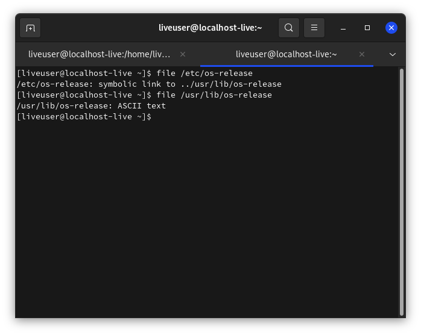
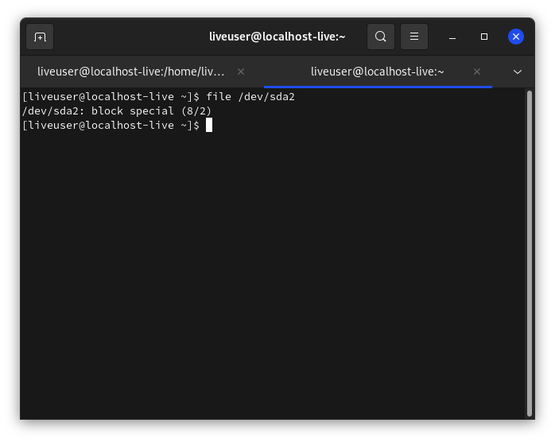
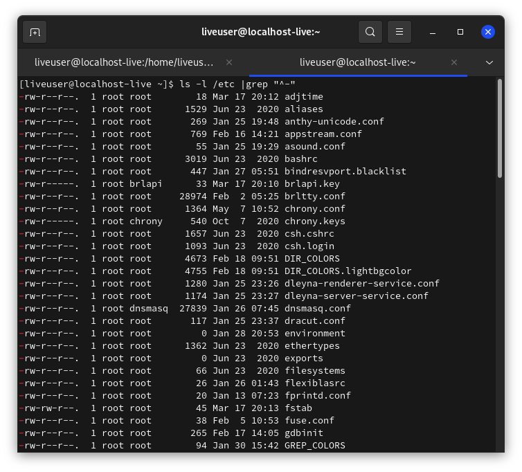

# Строение Linux - часть 2. Принцип "всё есть файл", виды файлов.

В первой части статьи речь была об общем строении системы. Так сказать, галопом по европам. А в следующих частях строение Linux будет описано подробнее. Каждая статья описывает только одну тему. Надеюсь, цикл "Строение Linux" будет полезен как начинающим пользователям, так и более продвинутым.

Для начала стоит написать о концепции "всё есть файл". Эта концепция была перенята разработчиками Linux из Unix. Это было сделано для предоставления простого доступа ко всем возможностям ОС не разрабатывая отдельных костылей. Т.е., преимущество такого принципа в том, что не надо реализовывать отдельный API для каждого устр-ва, в результате чего с ним (с файлом) могут работать все стандартные программы и API-интерфейсы. В Linux есть `корневая ФС` (корневая файловая система), куда монтируются раздел жёсткого диска, где установлена система, другие разделы, флешки, диски, псевдо-ФС и пр. Посмотрите на файл `/etc/os-release`:
```
file /etc/os-release
```




Самое яркое представление этого принципа - устройства. Просмотрите содержимое каталога /dev:
```
ls /dev
```

В этот каталог монтируются все устройства: флеш-карты, мыши, клавиатуры, микрофоны, жёсткие диски и пр.

А теперь просмотрите информацию о каком-нибудь файле в `/dev`:
```
file /dev/sda2
```



В этом файле находятся двоичные данные, поэтому открыть его в каком-то текстовом редакторе бесмыссленно.

Однако, самое главное достоинство Linux в том, что и в обычном файле можно создать файловую систему заместо содержимого файла. Например, тот же файл подкачки `/swapfile`. Это файл, но с ФС `swap`.

Все конфиги, находящиеся в директориях `/etc`, `~/.local`, `~/.config` - тоже файлы.

## Типы файлов
Есть 3 типа файлов:
* **Обыкновенные**, которые используются для хранения информации
* **Специальные** (для туннелей и устройств)
* **Директории** (их ещё называют *папками* или *каталогами*)

***
С обычными файлами пользователь работает чаще всего. Это документы, текстовые файлы, музыка, видео и пр.

Для того, чтобы просмотреть эти файлы, выполнить:
```
ls -l /etc |grep "^-"
```

### Объяснение команды
* `ls` просматривает каталог, а ключ `-l` добавляет отображение прав на файл. `/etc` замените на нужную директорию
* `grep "^-" - так как "обычные" файлы обозначаются чертой (в первой колонке вывода `ls`, где отображаются права на файл), то эта команда выведет только эти файлы по маске `^-`.

***
По поводу специальных файлов. Они обеспечивают обмен информации с ядром, работу с устр-вами и пр. Собственно, делятся ещё на несколько видов:
* **Символьные файлы** - любые специальные системные, например `/dev/null`, или периферийные устр-ва (последовательные/параллельные порты). Такие файлы идентифицированы символом `c`.
* **Блочные**  - периферийные устр-ва, но в отличии от предыдущего типа, содержание блочных файлов буферизируется. Эти файлы идентифицированы символом `b`.


* **Символические ссылки** (симлинки) - указывают на другие файлы по их имени, указывают и на другие файлы, в т.ч. каталоги. Обозначены символом `l`. В выводе команды `ls -l /путь/до/директории |grep "^l" можно увидеть, на какой файл ссылкаются симлинки - в последней колонке название имеет следующий вид:
`НАЗВАНИЕ ФАЙЛА` -> `НА ЧТО ССЫЛАЕТСЯ`


* **Туннели** (каналы/именованные каналы) - очень похожи на туннели из `Shell`, но разница в том, что именованные каналы имеют название. Они очень редки. Обозначены символом `p`.
