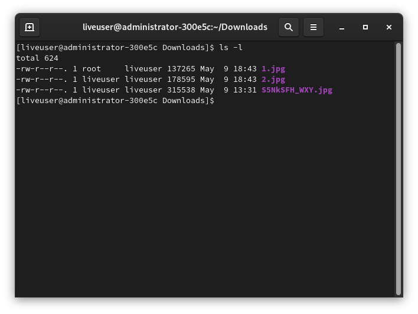
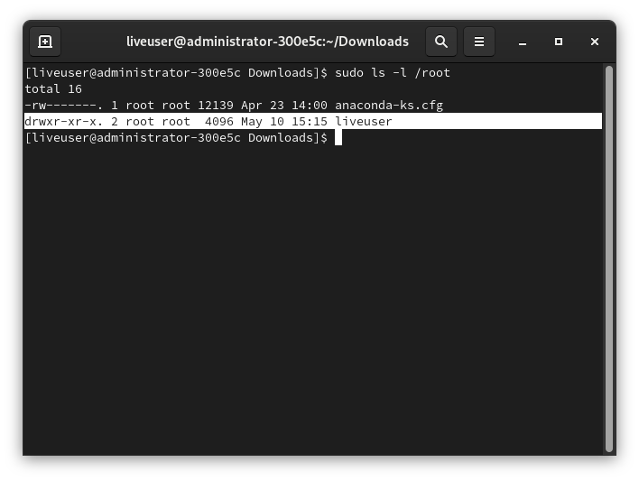
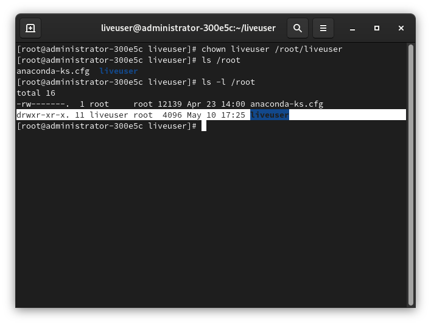
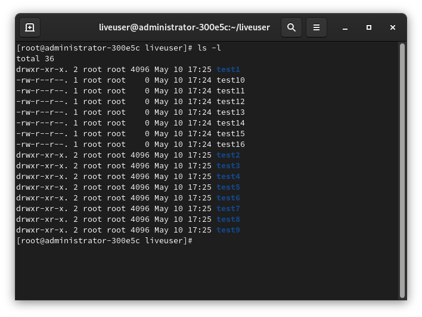
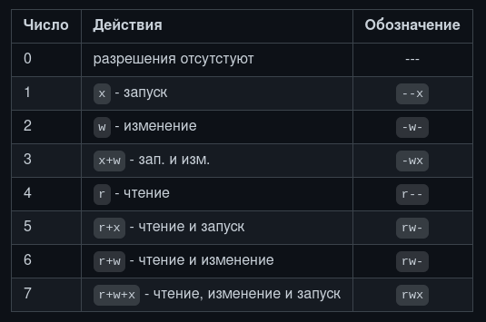
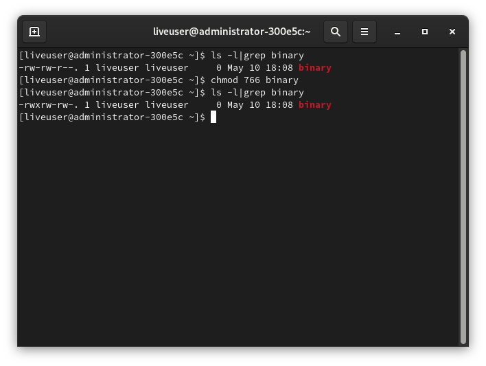
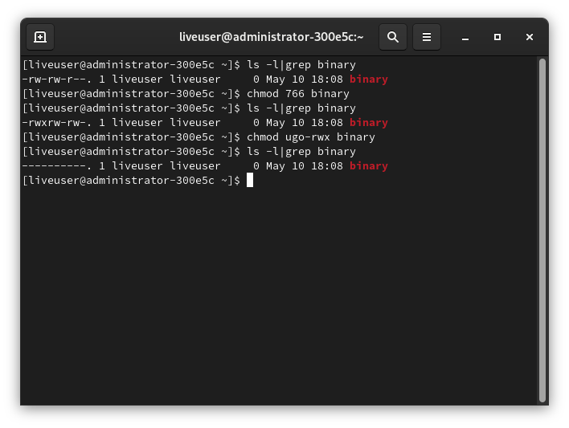

# Строение Linux - часть 3. Права доступа.

Во второй части речь была про концепцию "всё есть файл" и типы файлов, поэтому в этой части статьи неплохо было бы рассказать про права доступа к этим файлам.

## История
В отличии от DOS и подобных систем, Unix проектировался как многопользовательская ОС. Поэтому в Unix должна быть хорошая система управления доступа к файлам. У каждого пользователя свой файл и только он имеет доступ к этому файлу. А Linux - *Unix-подобное* ядро, поэтому и управление доступом было взято именно из Unix.

## Немного теории
Чтобы получить доступ к определённому файлу в Linux, используются разрешения, которые назначаются трём объектам: *файлы*, *группе* и другому объекту (т.е. всем остальным). Но перед этим нужно знать про владельца файла (директории не упоминаю специально, так как это тоже файл - концепция "Всё есть файл" в UNIX-подобных/образных).

В Linux у каждого файла есть два владельца: пользователь и группа. Они устанавливаются при создании файла. Каждый файл имеет три категории пользователей, для которых можно устанавливать различные сочетания прав доступа:
* **Владелец** - набор прав для владельца файла - пользователя, который создал его или сейчас установлен его владельцем. Обычно владелец имеет все права: `чтение`, `запись` и `исполнение`
* **Группа* - любая группа пользователей, существующая в ОС и привязанная к файлу
* **Остальные** - все пользователи (кроме владельца и юзеров, входящих в группу файла)

> Только пользователь *root* (он же суперпользователь) может работать со всеми файлами независимо от набора их полномочий.

Пользователь, создавший файл, становится его владельцем, так же как и первичная группа, в которую входит этот юзер. Чтобы определить, есть ли у вас, как у пользователя, права доступа к файлу, оболочка проверяет владение им. Принцип работы таков:
* Оболочка проверяет, являетесь ли вы владельцем файла, к которому запрашивается доступ. Если владельцем являетесь, то оболочка прекращает проверку и вы получаете разрешения. Если вы не являетесь владельцем, но входите в группу, у которой есть доступ к файлу, то вы получаете доступ к файлу с теми же разрешениями, что и у той группы.
* Если же вы не являетесь ни пользователем, ни владельцем группы, то вы получаете права других пользователей (`other`).

> Каждый пользователь может получить полный доступ к файлу в том случае, если доступ ему разрешён. Либо же, если он является владельцем файла.

Чтобы увидеть пользователя и группу-владельца файла, выполните:
```
ls -l
```

Чтобы просмотреть тоже самое, но для конкретного файла:
```
ls -l |grep 'FILE'
```

`FILE` замените на нужный файл.



## Изменение владельца файла
Иногда нужно изменить владельца файла. Например, я это часто делал при компиляции LFS. Особенно при выполнении некоторых тестов сборки пакетов, которые выполнять от имени `root` опасно, а от имени менее привилегированного пользователя очень даже кстати.

Для смены владельца используется `chown` - change owner. Синтаксис этой команды очень прост:
```
chown пользователь опции /путь/к/файлу
```

### Ключи и опции chown
* `-c` `--changes` - подробный вывод всех выполняемых операций
* `-v` `--verbose` - описание действий и вывод подробных данных о каждом обработанном файле
* `-R` `--recursive` - рекурсивная обработка всех подкаталогов
* `-f` `--silent` `--quiet` - минимум информации, выводимой на экран, даже сообщения об ошибках
* `--dereference` - изменять права для файла, к которому ведёт символическая ссылка вместо самой ссылки (*по умолчанию*)
* `--no-dereference` `-h` - изменять права симлинков, но оставить неизменными файлы, на которые указывают эти симлинки
* `-L` - переходить по всем симлинкам на каталоги
* `-H` - если передан симлинк на каталог, перейти по нему
* `-P` - не переходить по символическим ссылкам на каталоги (*по умолчанию*)

## Примеры использования chown


Допустим, есть два пользователя: `root` и `liveuser`. В директории `/root` создана поддиректория `/root/liveuser`. Там ещё несколько файлов, но не суть. Эта поддиректория принадлежит пользователю root, как и все файлы в ней. А надо сделать так, чтобы принадлежала пользователю `liveuser`. Выполнить в терминале:
```
sudo chown liveuser /root/liveuser
```

Если вы хотите видеть подробную информацию о проделанном действии, выполните:
```
sudo chown -v liveuser /root/liveuser
```



Но вы сменили владельца только для каталога `/root/liveuser`. А все подпапки и другие файлы, которые находятся в нём, так же принадлежат пользователю root. А в тех подкаталогах ещё какие-то каталоги находятся. Можно, конечно, для каждого файла/каталога изменить владельца персонально, но это муторно, а если файлом много, то не думаю, что кто-то будет с этим заморачиваться. Но проще же выполнить chown с ключом `-R`, дабы эта утилита рекурсивно обошла все подкаталоги и файлы, сменив их владельца:
```
sudo chown -R liveuser /root/liveuser/
```

Опять возвращаем всё в то состояние, которое было до экспериментов с `chown`:
```
sudo chovn -Rv root /root/liveuser
```

Если вы хотите поменять не только владельца, но и группу файла, то запишите имя юзера и имя группы через двоеточие:
```
sudo chown -v liveuser:liveuser /root/liveuser
```

Теперь измените группу и владельца на `liveuser` только для тех файлов, у которых владелец и группа `root` в каталоге `/root/liveuser/`:
```
sudo chown --from=root:root liveuser:liveuser ./
```

## Изменение группы файла
Для изменения группы файла используется команда `chgrp` (*change group*). В отличии от предыдущей описанной команды `chown`, для `chgrp` требуется только имя группы, имя пользователя не нужно.

Синтаксис этой команды очень прост:
```
chgrp опции имя_группы /путь/к/директории
```

> Вместо имени группы можно указать её GID (идентификатор группы)

### Ключи и опции chgrp
* `-c` `--changes` - подробно описывать действия для каждого файла, чья группа изменяется
* `-f` `--silent` `--quiet` - не выдавать сообщения об ошибке для файлов, чья группа не может быть изменена
* `-h` `--no-dereference` - работать с символьными ссылками, а не файлами, на которые они указывают. Данная опция доступна, только если используется `lchown`
* `-v` `--verbose` - подробно описывать действие или отсутствие для **каждого** файла
* `-R` - рекурсивно изменить группы для каталогов и их содержимого, а возникающие ошибки не прекратят работу программы
* `-L` (**используется вместе с `-R`**)- для каждого файла, указанного или пользователем, или встреченного при обходе дерева каталогов, если этот файл является симлинком на каталог, изменить группу самогО этого каталога и всех файлов в его иерархии
* `-h` - для каждого файла, являющегося символической ссылкой, изменить группу самой этой ссылки, а не объекта, на который она указывает, а если система не поддерживает группы для симлинков, то ничего не делать.
* `--` - завершение списка опций

## Примеры использования chgrp
Опять же, перед изменением группы-владельца файла, проверьте с помощью `ls` текущую группу:
```
ls -l |grep 'ИМЯ_ФАЙЛА'
```

Теперь добавьте нукую группу `mygroup`:
```
sudo groupadd mygroup
```

И сделайте группу `mygroup` владельцем директории `/root/liveuser`:
```
sudo chgrp mygroup /root/liveuser
```
Как и в случае с `chown`, группа стала владельцем только каталога `/root/liveuser`, но не файлов и подкаталогов этой директории. Чтобы изменить группу-владельца файла, можно, конечно, сделать вручную, а можно воспользоваться рекурсивным способом. За это отвечает ключ `-R`:
```
sudo chgrp mygroup /root/liveuser/
```

Однако, рекурсивный метод не назначает прав на симлинки, поэтому у них сохраняется прежняя группа. Чтобы установить новую группу и на символические ссылки, добавьте ключ `-h`:
```
sudo chgrp -Rh mygroup /root/liveuser
```

Для того, чтобы скопировать группу владельцев директории, воспользуйтесь ключом `--reference`:
```
sudo chgrp --reference /home/liveuser /root/liveuser
```

## Специальные права доступа к файлам
Для того, чтобы позволить *обычным* пользователям выполнять программы от имени суперпользователя, не зная его пароль, были созданы биты `SUID` и `SGIG`.
* Если установлен бит `SUID`, то при выполнении программы, ID пользователя меняется на ID владельца файла. *Фактически*, это позволяет обычным пользователям запускать программы от имени суперюзера.
* `SGID` работает аналогичным способом, но разница в том, что юзер считается членом группы, с которой связан этот файл, а не групп, которым он действительно принадлежит. Если флаг `SGID` установлен на каталог, все файлы, созданные в нём, будут связаны с группой каталога, а не пользователя. Такое поведение используется для организации общих папок.
* Бит `Sticky-bit` так же используется для создания общих директорий. Когда он установлен, пользователь может только создавать, читать и выполнять файлы, но не может удалять их, если они принадлежат другим пользователям.

## Права на файлы - условные обозначения.
Опять же, чтобы узнать права на каждый файл, выполните:
```
ls -l
```


В перовй колонке отображены права на файл. Вот условное обозначение каждого элемента:
* `---` - совсем нет прав
* `--x` - разрешено только выполнение файла как программы, но не изменение и чтение
* `-w-` - разрешена только запись и изменение файла
* `-wx` - разрешено изменение и выполнение, но если это каталог, ещё и просмотр его содержимого
* `r--` - права только на чтение
* `r-x` - только чтение и выполнение, но не запись
* `rw-` - чтение и запись, но не выполнение
* `rwx` - все права
* `--s` - установлен `SUID` или `SGID` бит, первый отобпажается в поле для владельца, второй для группы
* `--t` - установлен `Sticky-bit`, из-за чего пользователи не могут удалить этот файл.

## Примеры использования chmod
Для изменения прав на файл используется утилита `chmod`. Работа с ней такая же простая, как и с предыдущими утилитами. Вот её синтаксис:
```
chmod опции <категория><действие><флаг> файл
```

### Права доступа
В предыдущем разделе написал про права. Продублирую это и здесь, но покороче:
* `r` - чтение (*Read*)
* `w` - запись (*Write*)
* `x` - выполнение (*eXecute*)
* `s` - выполнение от имени *суперпользователя* (*Superuser*) - дополнительный

И категории пользователей:
* `u` - владелец файла (*User*)
* `g` - группа файла (*Group*)
* `o` - все остальные пользователи (*Other*)

В качестве действий могут использоваться знаки `+` (включить) и `-` (отключить). Вот несколько примеров:
* `u+x` - разрешить выполнение для владельца
* `ugo+x` - разрешить выполнение для всех
* `ug+w` - разрешить запись для владельца и группы
* `o-x` - запретить выполнение для остальных пользователей
* `ugo+rwx` - разрешить все права для всех пользователей

Действия так же можно записывать и с помощью цифр. Первая цифра используется для указания прав для пользователя, вторая для группы и третья для всех остальных.


Ну и примеры *цифровых* действий:
* `744` - разрешить всё для владельца, а остальным только чтение
* `755` - всё для владельца, остальным только чтение и запуск (исполнение)
* `764` - всё для владельца, чтение и запись для группы, только чтение для остальных
* `777` - всем разрешено всё

### Опции и ключи chmod
* `-c` - выводить информацию обо всех изменениях
* `-f` - не выводить сообщения об ошибках
* `-v` - выводить максимум сообщений о ходе работы chmod
* `-R` - рекурсивный метод
* `--reference` - взять маску прав из указанного файла
* `--preserve-root` - не выполнять рекурсивные операции для корня файловой системы

## Примеры работы с chmod
Разрешить выполнение определённого скрипта или бинарника пользователю (что лично мне надо чоень часто). Допустим, у нас есть некий ELF файл, который называется `binary`. И его надо сделать исполняемым. Для начала выполните `ls -l |grep binary`, дабы просмотреть его текущие права.
```
chmod u+x binary
```

Теперь запускаю его:
```
./binary
```

Тоже самое, но с помощью цифр:
```
chmod 766 binary
```

А теперь просмотрите, как изменились права на файл:
```
ls -l |grep file
```



А теперь отберите у `binary` все права:
```
chmod ugo-rwx binary
```



Файлы с правами 000 недоступны никаким пользователям, кроме суперпользователя и владельца. Вернем права обратно:
```
chmod 755 binary
```
