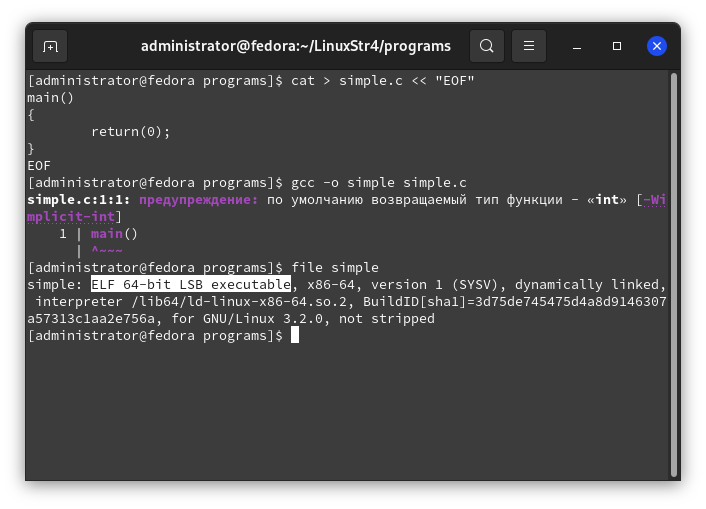
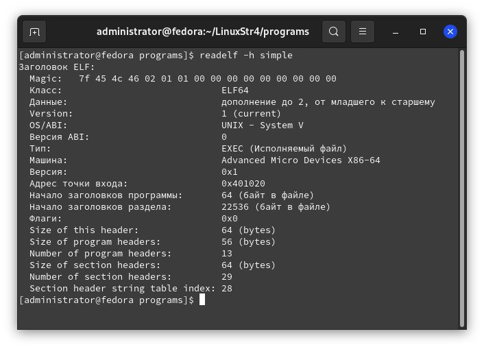

# Строение ELF-файла

Это уже четвёртая часть из цикла статей о строении Linux. Надеюсь, что вам этот цикл нравится.

## Теория, теория и ещё раз теория
`ELF` - это сокращение от "Executable and Lincable Format" (формат исполняемых и связываемых файлов). ELF определяет структуру бинарных файлов, библиотек и некоторых других файлов. Данная спецификация позволяет операционной системе корректно интерпретировать содержащиеся в файле машинные команды.

Почему понимание формата ELF полезно и в некоторых случаях может пригодиться пользователю? Это позволяет изучить строение операционной системы, а этот цикл нацелен на это. Так же, эта информация может быть ценна для лучшего понимания процесса разработки, а так же поиска всевозможных дыр в безопасности и обнаружения подозрительных файлов. Однако, на русском очень мало информации о строении ELF. Что ж, будем исправлять это :)

## Начальное строение
Для начала напишем какую-нибудь простую программу:

```bash
cat > simple.c << "EOF"
main()
{
	return(0);
}
EOF
```

Программа на языке С. А теперь компиляция:

```bash
gcc -o simple simple.c
```

Выполните:

```bash
file simple
```

Я специально выделил часть вывода последней команды. Да, тип файла - действительно ELF:



## Структура

Структура у каждого файла может различаться. В общем, ELF файл состоит из:
* Заголовка
* Данных


При помощи команды `readelf` можно просмотреть структуру файла:

```bash
readelf -h simple
```



> Прочитать заголовок можно так же с помощью скрипта на Python:
```python
import lief

binary = lief.parse("simple")
header = binary.header

print("Entry point: %08x" % header.entrypoint)
print("Architecture: ", header.machine_type)

for section in binary.sections:
    print("Section %s - size: %s bytes" % (section.name, section.size)
```

На скриншоте выше отчётливо видно, что заголовок начинается с магического числа (как театр с вешалки). Это число содержит информацию о файле. Первые 4 байта определяют, что это ELF файл (`45`=`E`, `4c`=`L`, `46`=`F`).

Заголовок является обязательным - он служит для того, чтобы данные корректно интерпретировались при линковке и исполнении.

После типа файла следует класс (архитектура, для которой предназначен файл). Значение `01` - 32 бит, `02` - 64 бит.

> Значение `02` так же может отображаться как `ELF64`.

После находится поле "Данные". Так же два варианта: `01` - LSB (не путать с форматом, описанным в первой части статьи) и `02` - MSB. Разные типы процессоров по разному обрабатывают структуры данных, а эти два значения помогают правильно интерпретировать объекты в файле.

OS/ABI описывает, какой ABI используется (и его версию). Значение равно `00` (показано как `System V`).

Поле "Тип" указывает предназначение файла.
