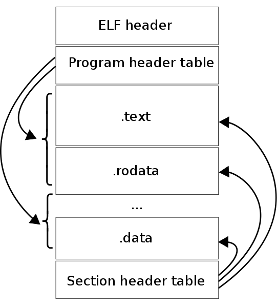

# Строение ELF-файлов

## Теория
ELF - сокращение от "Executable and Lincable Format" - формат исполняемых и связываемых файлов. ELF определяет их структуру. Данная спецификация позволяет UNIX-подобным(/образным) системам правильно интерпретировать содержащиеся в файле машинные команды. Используется во многих операционных системах: GNU/Linux, FreeBSD, Solaris, etc.

Понимание строения ELF файла может редко пригодиться, но, тем не менее, оно будет полезно для понимания процесса разработки программного обеспечения, поиска дыр в безопасности и обнаружения подозрительных программ или файлов.

## Начальное строение



Для начала создадим директорию, в которой будут расположены тестовые программы, на которых будем "упражняться":
```bash
mkdir ~/LinuxPrograms
cd ~/LinuxPrograms
```

Для того, чтобы вывод всех команд, приведённых ниже, был краток, прост и понятен, напишите какую-нибудь простейшую программу, в которой нет **ничего** лишнего, что затраднит чтение:
```c
vim simple.c

int main() {
	return(0);
}
```

И скомпилируйте её:
```bash
gcc -o simple simple.c
```

Убедитесь в том, что это ELF файл:
```bash
file simple
```

Структура у каждого файла может различаться. Грубо говоря, ELF файл состоит из:
* Заголовка
* Данных

Подробнее:
* **Таблица заголовков программы**: 0 или более сегментов памяти (только в исполняемом файле). Сообщает, как исполняемый файл должен быть помещён в виртуальную память процесса. Это необходимо для образа процесса, исполняемых файлов и общих объектов. Для перемещаемых объектных файлов это не требуется.
* **Таблица заголовков разделов**: 0 или более разделов. Сообщает, как и куда нужно загрузить раздел. Каждая запись раздела в таблице содержит название и размер раздела. Таблица заголовков раздела должна использоваться для файлов, используемых при редактировании ссылок.
* **Данные:** тпблицы заголовка программы или раздела
* **Заголовок ELF** *(54/64 байта для 32/64 бит)*: определяет использование 32/64 бит (смотреть `struct Elf32_Ehdr`/`struct Elf64_Ehdr` в `/usr/include/elf.h`)
* **Заголовок программы:** как создать образ процесса. Используются во время выполнения. Сообщают ядру или компоновщику время выполнения `ld.so`, что загружать в память и как найти информацию о динамической компоновке.
* **Заголовок разделов:** используются во время компоновки или компиляции. Сообщают редактору ссылок `ld`, как разрашать символы и как группировать похожие потоки байтов из разных двоичных объектов ELF.

--*--

* *Разделы* - самые мелкие неделимые единицы в ELF файле, которые могут быть обработаны. Разделы содержат основную часть информации об объектных файлах для представления связывания. Эти данные включают инструкции, таблицу символов и информацию о перемещении. (просмотр ссылок)
* *Сегменты* - наименьшие отдельные единицы, которые могут быть отображены в памяти с помощью `exec` или компоновщика. (исполняемые)

> Разделы и сегменты не имеют определённого порядка в ELF. Только заголовок имеет фиксированную позицию.

При помощи утилиты `readelf` можно просмотреть основную информацию о файле.

> Эта утилита входит в состав пакета `binutils`, поэтому ничего доустанавливать не надо.

**Основные возможности `readelf`:**

* Просмотр заголовка файла:
```bash
readelf -h simple
```

* Просмотр информации о сегментах и сейкиях:
```bash
readelf -S -W simple
```

* Чтение информации о символах:
```bash
readelf -s -W simple
```

### Заголовок

Введите:
```bash
readelf -h simple
```


> Заголовок является обязательным - он служит для того, чтобы данные корректно интерпретировались при линковке и исполнении.

Из вывода утилиты `readelf` следует, что заголовок начинается с т.н. *магического числа* (magic number). Это число содержит информацию о файле. Первые 4 байта определяют, что это ELF: `45 4c 46`.

После типа файла следует поле класса (архитектура, для которой предназначен бинарник).

**Значения:**
* 0 - некорректный класс
* 1 - 32 бит
* 2 - 64 бит

Ниже находится поле данных. Это зависимый от процессора метод кодирования данных.

**Значения:**
* 0 - некорректный тип
* 1 - Little Endian (LSB)
* 2 - Big Endian (MSB)

Разные типы процессоров по разному обрабатывают структуры данных, а эти значения помогают правильно интерпретировать объекты в файле.

> Эффект LSB становится видимым при использовании утилиты hexdump на бинарном файле. Просмотрите заголовок ELF у нашего файла `simple`:
```bash
hexdump -n 16 simple
```

Получите такой вывод:
```
0000000 457f 464c 0102 0001 0000 0000 0000 0000
0000010
```

Пары значений другие из-за интерпретации порядка данных.

Затем следует поле "Версия". На данный момент, используется только версия 01.

Каждая ОС имеет свой способ вызова функций. Что-то похоже, а что-то различается. В поле OS/ABI описываются специфичные для операционной системы или ABI расширения, используемые в файле. В некоторых других структурах ELF файла имеются флаги и поля, значения которых зависят от ОС или ABI, интерпретация этих полей определяется значением данного байта. В таблице ниже представлена таблица значений:
| Значение | Описание |
|:--------:|:---------|
| 0 | UNIX System V |
| 1 | HP-UX |
| 2 | NetBSD |
| 3 | GNU ELF (GNU/Linux) |
| 6 | Solaris |
| 7 | AIX |
| 8 | IRIX |
| 9 | FreeBSD |
| 10 | Tru64 UNIX |
| 11 | Modesto |
| 12 | OpenBSD |
| 13 | OpenVMS |
| 15 | Amiga Research OS |
| 18 | OpenVOS |

При необходимости, так же может быть указана версия ABI.

В поле "Машина" указывается архитектура аппаратной платформы, для которой предназначен файл. В таблице ниже представлены некоторые из них:
| Значение | Описание |
|:--------:|:---------|
| 0 | Не определено |
| 3 | Intel 80386 |
| 20 | PowerPC |
| 21 | PowerPC (64 бит) |
| 62 | x86_64 |

В поле "Тип" указывается предназначение файла. В таблице ниже они приведены:
| Значение | Описание | Значение поля |
|:--------:|:---------|:--------------|
| 0 | Некорректный тип | --- |
| 1 | Перемещаемый файл (файл до линковки) | REL |
| 2 | Исполняемый файл | EXEC |
| 3 | Разделяемый объектный файл (библиотека) | DYN |
| 4 | Core file | CORE |
