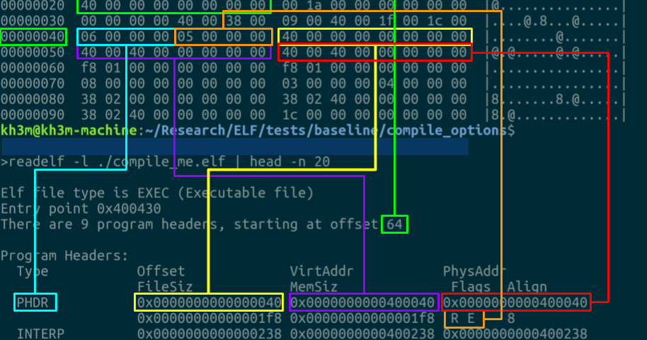
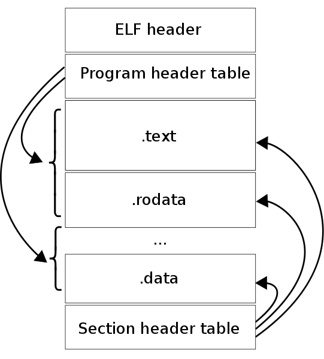
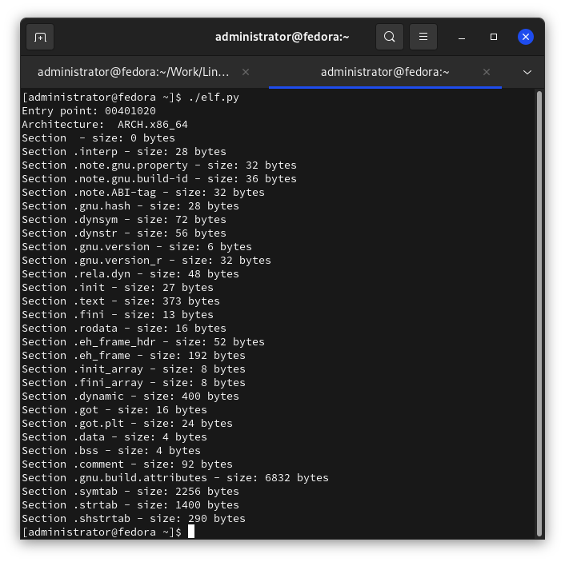

# Строение ELF-файлов

[Статьи](../../stats.md) > [Строение GNU/Linux](../LinuxStr.preview.md)

<pre>
<strong>Автор:</strong> <a href="/LinuxSovet/Group/authors.d/Linuxoid85.html">Михаил Краснов</a>
<strong>Дата написания:</strong> 29.05.2021 00:00
</pre>



## Теория
ELF - сокращение от "Executable and Lincable Format" - формат исполняемых и связываемых файлов. ELF определяет их структуру. Данная спецификация позволяет UNIX-подобным(/образным) системам правильно интерпретировать содержащиеся в файле машинные команды. Используется во многих операционных системах: GNU/Linux, FreeBSD, Solaris, etc.

Понимание строения ELF файла может редко пригодиться, но, тем не менее, оно будет полезно для понимания процесса разработки программного обеспечения, поиска дыр в безопасности и обнаружения подозрительных программ или файлов.

## Начальное строение



Для начала создадим директорию, в которой будут расположены тестовые программы, на которых будем "упражняться":
```bash
mkdir ~/LinuxPrograms
cd ~/LinuxPrograms
```

### Типы
Есть несколько типов ELF файлов (см. таблицы в конце статьи):
* **Перемещаемый файл** - хранит инструкции (и данные), которые могут быть связаны с другими объектными файлами. Результатом может быть объектный или исполняемый файл. Так же к этому типу относятся объектные файлы статических библиотек.
* **Разделяемый объектный файл** - так же как и первый тип, содержит инструкции и данные, может быть связан с другими перемещаемыми и разделяемыми объектными файлами, в результате чего будет создан новый объектный файл, либо же при запуске программы ОС может динамически связывать его с исполняемым файлом программы , в результате чего будет создан исполняемый образ программы (в посл. случае речь идёт о разделяемых библиотеках).
* **Исполняемый файл** - содержит полное описание, позволяющее ОС создать образ процесса. В т.ч.: *инструкции*, *данные*, *описания необходимых разделяемых объектных файлов* и др.

Для того, чтобы вывод всех команд, приведённых ниже, был краток, прост и понятен, напишите какую-нибудь простейшую программу, в которой нет **ничего** лишнего, что затраднит чтение:
```c
vim simple.c

int main() {
	return(0);
}
```

И скомпилируйте её:
```bash
gcc -o simple simple.c
```

Убедитесь в том, что это ELF файл:
```bash
file simple
```

Структура у каждого файла может различаться. Грубо говоря, ELF файл состоит из:
* Заголовка
* Данных

Подробнее:
* **Таблица заголовков программы**: 0 или более сегментов памяти (только в исполняемом файле). Сообщает, как исполняемый файл должен быть помещён в виртуальную память процесса. Это необходимо для образа процесса, исполняемых файлов и общих объектов. Для перемещаемых объектных файлов это не требуется.
* **Таблица заголовков разделов**: 0 или более разделов. Сообщает, как и куда нужно загрузить раздел. Каждая запись раздела в таблице содержит название и размер раздела. Таблица заголовков раздела должна использоваться для файлов, используемых при редактировании ссылок.
* **Данные:** тпблицы заголовка программы или раздела
* **Заголовок ELF** *(54/64 байта для 32/64 бит)*: определяет использование 32/64 бит (смотреть `struct Elf32_Ehdr`/`struct Elf64_Ehdr` в `/usr/include/elf.h`)
* **Заголовок программы:** как создать образ процесса. Используются во время выполнения. Сообщают ядру или компоновщику время выполнения `ld.so`, что загружать в память и как найти информацию о динамической компоновке.
* **Заголовок разделов:** используются во время компоновки или компиляции. Сообщают редактору ссылок `ld`, как разрашать символы и как группировать похожие потоки байтов из разных двоичных объектов ELF.

--* *--

* *Разделы* - самые мелкие неделимые единицы в ELF файле, которые могут быть обработаны. Разделы содержат основную часть информации об объектных файлах для представления связывания. Эти данные включают инструкции, таблицу символов и информацию о перемещении. (просмотр ссылок)
* *Сегменты* - наименьшие отдельные единицы, которые могут быть отображены в памяти с помощью `exec` или компоновщика. (исполняемые)

> Разделы и сегменты не имеют определённого порядка в ELF. Только заголовок имеет фиксированную позицию.

При помощи утилиты `readelf` можно просмотреть основную информацию о файле.

> Эта утилита входит в состав пакета `binutils`, поэтому ничего доустанавливать не надо.

**Основные возможности `readelf`:**

* Просмотр заголовка файла:
```bash
readelf -h simple
```

* Просмотр информации о сегментах и сейкиях:
```bash
readelf -S -W simple
```

* Чтение информации о символах:
```bash
readelf -s -W simple
```

### Заголовок

Введите:
```bash
readelf -h simple
```


> Заголовок является обязательным - он служит для того, чтобы данные корректно интерпретировались при линковке и исполнении.

Из вывода утилиты `readelf` следует, что заголовок начинается с т.н. *магического числа* (magic number). Это число содержит информацию о файле. Первые 4 байта определяют, что это ELF: `45 4c 46`.

После типа файла следует поле класса (архитектура, для которой предназначен бинарник).

**Значения:**
* 0 - некорректный класс
* 1 - 32 бит
* 2 - 64 бит

Ниже находится поле данных. Это зависимый от процессора метод кодирования данных.

**Значения:**
* 0 - некорректный тип
* 1 - Little Endian (LSB)
* 2 - Big Endian (MSB)

Разные типы процессоров по разному обрабатывают структуры данных, а эти значения помогают правильно интерпретировать объекты в файле.

> Эффект LSB становится видимым при использовании утилиты hexdump на бинарном файле. Просмотрите заголовок ELF у нашего файла `simple`:
```bash
hexdump -n 16 simple
```

Получите такой вывод:
```
0000000 457f 464c 0102 0001 0000 0000 0000 0000
0000010
```

Пары значений другие из-за интерпретации порядка данных.

Затем следует поле "Версия". На данный момент, используется только версия 01.

Каждая ОС имеет свой способ вызова функций. Что-то похоже, а что-то различается. В поле OS/ABI описываются специфичные для операционной системы или ABI расширения, используемые в файле. В некоторых других структурах ELF файла имеются флаги и поля, значения которых зависят от ОС или ABI, интерпретация этих полей определяется значением данного байта. В таблице ниже представлена таблица значений:

| Значение | Описание |
|:---------|:---------|
| 0 | UNIX System V |
| 1 | HP-UX |
| 2 | NetBSD |
| 3 | GNU ELF (GNU/Linux) |
| 6 | Solaris |
| 7 | AIX |
| 8 | IRIX |
| 9 | FreeBSD |
| 10 | Tru64 UNIX |
| 11 | Modesto |
| 12 | OpenBSD |
| 13 | OpenVMS |
| 15 | Amiga Research OS |
| 18 | OpenVOS |

При необходимости, так же может быть указана версия ABI.

В поле "Машина" указывается архитектура аппаратной платформы, для которой предназначен файл. В таблице ниже представлены некоторые из них:

| Значение | Описание |
|:---------|:---------|
| 0 | Не определено |
| 3 | Intel 80386 |
| 20 | PowerPC |
| 21 | PowerPC (64 бит) |
| 62 | x86_64 |

В поле "Тип" указывается предназначение файла. В таблице ниже они приведены:

| Значение | Описание | Значение поля |
|:---------|:---------|:--------------|
| 0 | Некорректный тип | --- |
| 1 | Перемещаемый файл (файл до линковки) | REL |
| 2 | Исполняемый файл | EXEC |
| 3 | Разделяемый объектный файл (библиотека) | DYN |
| 4 | Core file | CORE |

(смотрите блок "Типы" этой статьи, чтобы узнать больше информации).

## Продолжение
Помимо заголовка, есть данные. Оно, в свою очередь, подразделяется ещё на несколько:
* программные заголовки (сегменты)
* заголовки секций/секции
* данные

О первых двух пунктах было уже говорено в пункте "Типы".

> **Для начала**. Файл ELF имеет два различных «вида». Один из них предназначен для линкера и разрешает исполнение кода (сегменты). Другой предназначен для команд и данных (секции). В зависимости от цели, используется соответствующий тип заголовка. Начнём с заголовка программы, который находится в исполняемых файлах ELF.

## Продолжение про заголовки программы
ELF файл состоит из нуля и более сегментов. И описывает, как создать процесс, образ памяти для исполнения в рантайме. Когда ядро видит эти сегменты, оно размещает их в виртуальном адресном пространстве, используя системный вызов `mmap`...

> **Смотрите также:**

> `man 2 mmap`

... Т.е., конвертирует заранее подготовленные инструкции в образ памяти. Для разделяемых библиотек (*shared libs*) процесс схож.

И примеры заголовков:

### `GNU_EH_FRAME`
Сортированная очередь, используемая компилятором GCC. В неё хранятся обработчики исключений. Они используются для того, чтобы корректно обработать ситуацию, если что-то пошло не так.

### `GNU_STACK`
Используется для сохранения информации о стеке. Он не должен быть исполняемым, так как это может быть очень небезопасным.

Если сегмент `GNU_STACK` отсутствует, то используется исполняемый стек. Для того, чтобы показать детали устр-ва стека, используйте утилиты `scanelf` и `execstack`.

> **Смотрите также:**

> `man scanelf`

> `man execstack`

## Секции
Секции появляются в файле после преобразования компилятором GNU C кода С в ассемблер (и ассемблер GNU создаёт объекты).


### `.text`
Содержит исполняемый код, упакованный в сегмент с правами на чтение и исполнение (но не редактирование).

### `.data`
Инициализированные данные с правами на чтение и запись.

### `.bss`
Неинициализированные данные с правами на чтение/запись

## Ещё немного о секциях
Так же, некоторую информацию о секциях можно просмотреть, написав скрипт на Python с применением библиотеки `lief`:

```python
#!/bin/python
import lief

binary = lief.parse("simple")
header = binary.header
print("Entry point: %08x" % header.entrypoint)
print("Architecture: ", header.machine_type)

for section in binary.sections:
	print("Section %s - size: %s bytes" % (section.name, section.size))
```

Запуск:
```
chmod +x elf.py
./elf.py
```

> Название `elf.py` замените на нужное.

Вывод такой:



## Смотрите также:
```bash
man readelf
man objdump
man mmap
man hexdump
man file
man gcc
```
