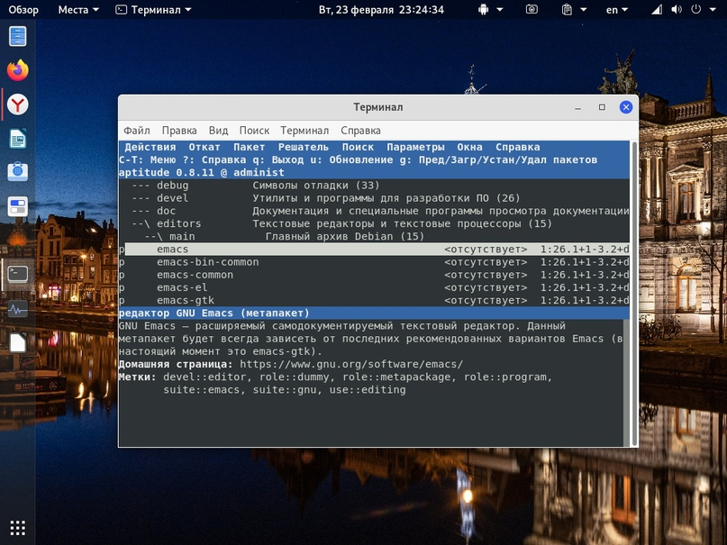
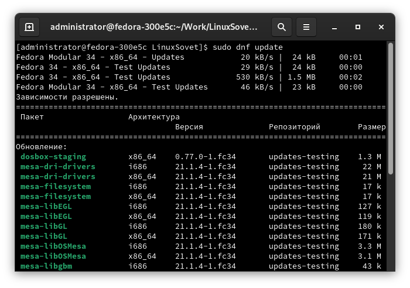

# Пакетные менеджеры

[Статьи](../../stats.md) > [Строение GNU/Linux](../LinuxStr.preview.md)

В пятой части статьи из цикла "Строение GNU/Linux" пойдёт речь об управлении пакетами. Тема очень простая и понятная.

Как известно, в Linux программное обеспечение распространяется в пакетах. Конечно, есть редкие случаи, когда приводится один голый бинарный файл - это для совсем простых программ. Даже портативный Appimage, построенный по принципу *одна программа == один файл*, является пакетом.

Проще говоря, пакет - это архив с данными программы и её описанием. В описание входят:

1. Имя пакета/программы
2. Версия программы
3. Описание пакета/программы
4. Информация о мейнтейнере (сборщике) пакета
5. Зависимости пакета
6. Все файлы, включённые в пакет (во многих ПМ это отсутствует, ибо они умеют сами их перечислять, а, например, для [cpkg](https://github.com/Linuxoid85/cpkg) нужно руками указать всё содержимое этого пакета)

Для удобного управления пакетами были написаны всевозможные пакетные менеджеры (далее: ПМ). ПМ умеют устанавливать, удалять и просматривать информацию о пакете. В большинстве ПМ так же присутствует обработка зависимостей.

## Debian


*Пакетный менеджер aptitude*

Для этого дистрибутива было разработано несколько ПМ:

* `dpkg` - низкоровневый пакетный менеджер без обработки зависимостей, являющийся основой для высокоуровневых `apt`, `apt-get`, `aptitude`. `dpkg` устанавливает только локальный пакет, т.е. тот, который находится на компьютере. Он только не устанавливает зависимости пакета, но если он заметил, что в системе не установлена какая-то зависимость пакета - он просто прервёт установку. Про репозитории ПО ему ничего не известно.
* `apt-get` - надстройка над `dpkg`, умеющая разрешать зависимости, скачивать пакеты из репозиториев.
* `apt` - следующая итерация apt-get. В нём унифицировано большое число функций (например, поиск, установка, удаление и просмотр информации теперь в одном `apt`, когда как раньше предоставлялись разные программы для этого: `apt-get` для установки, удаления и просмотра информации, `apt-cache` для поиска и пр.). apt намного быстрее и стабильнее предыдущего apt-get. Но у него не очень хорошая обработка зависимостей. Иногда пакетник без каких-либо проблем может удалить то, что удалять не требуется. Хотя в этом ещё и сборщики пакетов виноваты.
* `aptitude` - надстройка над apt. В этом ПМ присутствует интерактивный режим (запустите в терминале `aptitude` без аргументов), улучшена обработка зависимостей, а так же много других плюшек. В aptitude улучшены поиск и просмотр информации о пакете, доступно использование регулярных выражений.

### Примеры работы

**Установка ПО:**

```bash
dpkg -i          $PACKAGE
apt-get install  $PACKAGE
apt install      $PACKAGE
aptitude install $PACKAGE
```

**Удаление ПО:**

```bash
dpkg -r         $PACKAGE
apt-get remove  $PACKAGE
apt remove      $PACKAGE
aptitude remove $PACKAGE
```

Таким образом, удалится только пакет без его зависимостей. Чтобы удалить пакет с зависимостями, замените опцию `remove` на `purge`. Чтобы очистить систему от ненужных зависимостей, выполните:

```bash
apt-get autoremove
apt autoremove
aptitude autoremove
```

**Информация о пакете:**

```bash
apt-cache depends $PACKAGE # Просмотреть зависимости пакета
dpkg -L           $PACKAGE # Установленные файлы из пакета
apt info          $PACKAGE # Основная информация о пакете
```

Инструмент apt совмещает функциональность apt-get и apt-cache, а также по умолчанию использует красивый цветной формат вывода, что очень удобно. Для использования в сценариях или для продвинутого использования предпочтительнее использовать apt-get (а иногда он просто необходим). [источник](https://www.debian.org/doc/manuals/debian-faq/ch-pkgtools.html).

Несмотря на свои недостатки, ПМ из Debian GNU/Linux для меня самые лучшие. Может быть потому что я к ним привык, ибо с Debian и его говносборками типа убунты или Devuan я работал на протяжении долгого времени.

### Сборка бинарного deb-пакета

В данном примере вы узнаете, как собрать deb-пакет. Несмотря на то, что я работаю с rpm-дистрибутивами, мне очень импонирует deb.

Начну с теории. deb-пакет представляет собой ar-архив, в котором содержатся данные пакета (`data.tar.xz`) и информация о пакете (`control.tar.xz`). 

## RHEL

В rpm-дистрибутивах зоопарк пакетных менеджеров. В одном дистрибутиве одно, в другом - другое и так далее. Поэтому здесь будет написано только о самых популярных ПМ - `yum` и `dnf`.

`dnf` - форк `yum`. В этом ПМ была произведена чистка кода и оптимизация работы, усовершенствованы некоторые функции, была добавлена очень хорошая киллер-фича, позволяющая расширять функционал ПМ с помощью расширений. Синтаксис `dnf` почти тот же самый, что и у `yum`.


*Пакетный менеджер dnf*

* `rpm` - низкоуровневый ПМ. Так же как и `dpkg` из Debian, `rpm` ставит только локальные пакеты, зависимости разрешать не умеет.
* `dnf` - пакетный менеджер из Fedora Linux, форк `yum`. Является надстройкой над `rpm`.
* `yum` - ПМ из RHEL и CentOS, раньше был в Fedora. Написан на Python.
* `apt-get` - да, вы не ошиблись. Некоторые дистрибутивы (такие как Alt Linux) предоставляют такой ПМ из Debian Linux. Так как все эти высокоуровневые ПМ являются надстройкой над низкоуровневыми dpkg/rpm, то переделать их для другого низкоуровневого ПМ не составит труда. И `apt-get` из Альта как раз использует `rpm` в качесте бекенда, нежели `apt-get` из Debian (там используется `dpkg`).

### Примеры работы

**Установка пакетов:**

```bash
rpm -i          $PACKAGE
dnf install     $PACKAGE
dnf reinstall   $PACKAGE # Переустановка пакета
yum install     $PACKAGE
apt-get install $PACKAGE
```

Кстати, мне нравится низкоуровневый `rpm` тем, что он может ставить пакеты даже в том случае, если в системе не установлены его (пакета) зависимости. Для этого используйте:

```bash
rpm -i $PACKAGE --nodeps
```

ПМ `dpkg` этого не умеет. Если зависимости нужного пакета не установлены, то он просто прервёт установку.

**Удаление пакета:**

```bash
rpm -e     $PACKAGE
dnf remove $PACKAGE
yum remove $PACKAGE
dnf autoremove # Удаление осиротевших пакетов (ненужных зависимостей)
```

**Информация о пакете:**

```bash
rpm -qa            # Список установленных пакетов
rpm -qi  $PACKAGE  # Информация об установленном пакете
dnf info $PACKAGE  # Информация о пакете
dnf list           # Вывод всех доступных и установленных пакетов
dnf list installed # Вывод всех установленных пакетов
dnf list available # Вывод всех доступных пакетов
dnf repolist       # Вывод списка подключенных репозиториев
dnf repolist all   # Вывод списка всех репозиториев
```

Помимо этого, в дистрибутиве Fedora присутствует автоматическая загрузка обновлений. Для того, чтобы отключить, выполните:

```bash
systemctl disable dnf-makecache.service
systemctl disable dnf-makecache.timer
gsettings set org.gnome.software download-updates false
```

### urpmi

Так же есть пакетный менеджер `urpmi` (User Redhat Package Manager). Используется в Mageia, OpenMandriva и, до, недавнего времени, в отечественной Роса. Он не такой распространённый, поэтому о нём подробно написано здесь не будет.

```bash
urpmi             $PACKAGE   # Установить пакет
urpme             $PACKAGE   # Удалить пакет
urpmi -i          $PACKAGE   # Информация о пакете
urpmi --changelog $PACKAGE   # Просмотр списка изменений пакета
urpmi.update -a              # Обновление списка пакетов
urpmi --update --auto-select # Установить обновления
```

## Arch

В Arch Linux свой ПМ и свой формат пакетов для него. ПМ - pacman.

```bash
pacman -S  $PACKAGE # Установка пакета
pacman -Su $PACKAGE # Обновление пакета
pacman -R  $PACKAGE # Удаление пакета
pacman -Qdt         # Список осиротевших пакетов (ненужных зависимостей)
pacman -Ql $PACKAGE # Список файлов пакета
```

**Поиск пакета:**

```bash
pacman -Ss $PACKAGE # Простой поиск
pacman -Ss '^vim-'  # Поиск с использованием регулярных выражений
pacman -Qs $PACKAGE # Поиск среди установленных пакетов
```

## Принцип работы пакетного менеджера

Выше был краткий обзор известных пакетных менеджеров. А сейчас их принцип работы. Расскажу на примере `cpkg`, что включался в минимальную поставку Calmira Linux (о которой можно прочитать на этом сайте), но временно убрали. Я специально не рассказываю про процесс рассчёта и установки нужных зависимостей.

Грубо говоря, есть два типа пакетных менеджеров (ПМ):
* те, которые устанавливают ТОЛЬКО локальные пакеты;
* те, которые скачивают пакеты из репозиториев и устанавливают их. Нередко они умеют устанавливать и локальные пакеты.

Что делает пакетный менеджер? Первым делом, ищет пакет в файловой системе или в списке пакетов, если ПМ качает пакеты из репозиториев. Если находит - продолжает свою работу. В случае второго типа ПМ, скачивает пакет в свой кеш (например, в `/var/cache/apt/archives`).

После чего ПМ распаковывает пакет. Если у него есть `pre-install` скрипты, которые обычно служат для настройки системы/окружения перед установкой, то выполняются эти скрипты. После их удачного выполнения ПМ копирует данные пакета в нужное место (обычно в корень, однако некоторые ПМ могут копировать содержимое и в другие места файловой системы, например, пакетный менеджер `pkg` из FreeBSD или `cpkg` из CalmiraOS так умеют) и заносит пакет в базу данных. Туда входит следующая информация:

* Имя пакета;
* Версия пакета;
* Мейнтейнер (сопровождающий; сборщик);
* Категория, в которую входит пакет;
* Описание пакета;
* Зависимости пакета;
* Установленные файлы пакета.

После чего выполняется настройка пакета и выполнение `post-install` скриптов, а так же добавление пакета в базу данных.
