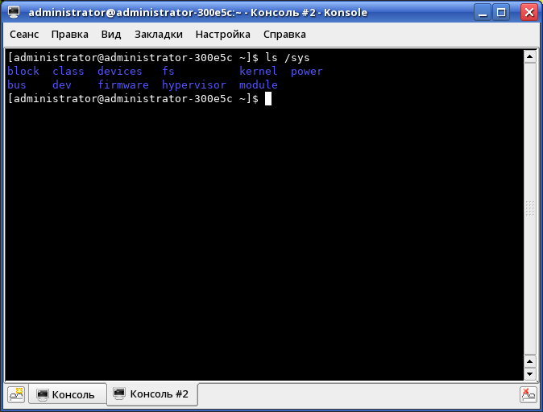
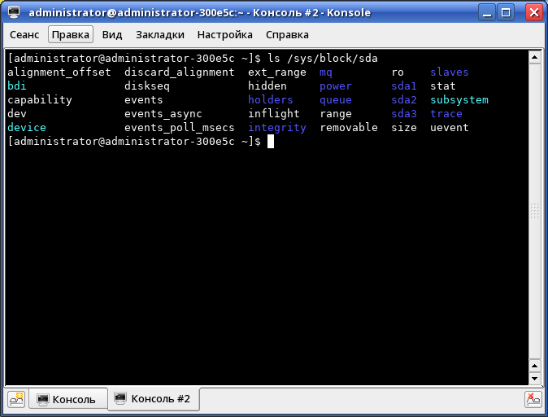

# Пару слов про sysfs

[Статьи](../../stats.md) > [Строение GNU/Linux](../LinuxStr.preview.md)



## Введение

sysfs - псевдофайловая система (ПФС) в GNU/Linux, экспортирующая в
пространство пользователя информацию ядра Linux о присутствующих в системе
устройствах и драйверях.

Многие из файлов этой ПФС доступны только для чтения, но есть и те, которые
доступны для записи.

Часть из этих файлов можно использовать в каких-либо простых программах для
получения всевозможной информации. Например, в программе
[batstat](https://github.com/Juve45/batstat) файлы из
`/sys/class/power_supply` используются для получения информации об АКБ
ноутбука.

### Что говорит kernel.org?

sysfs - это ram-based ФС, изначально основанная на ramfs. Она предоставляет
средства для экспорта структур данных ядра, их атрибутов и связей между ними в
пространство пользователя.

sysfs неотъемлемо связан с инфраструктурой `kobject`. Для получения сведений о
нём прочитайте [эту](https://www.kernel.org/doc/Documentation/kobject.txt)
страницу.

## Использование sysfs

Обычно sysfs монтируется во время старта системы. Кроме того, при сборке ядра он
собирается, если определён `CONFIG_SYSFS`. Если эта ПФС у вас не смонтирована,
выполните:

```bash
mount -t sysfs sysfs /sys
```

## Атрибуты

Атрибуты могут быть экспортированы для объектов в виде обычных файлов в ФС.
sysfs перенаправляет операции I/O файлов на методы, определённые для атрибутов,
предоставляя ср-ва для чтения и записи атрибутов ядра.

Атрибуты должны быть текстовыми ASCII файлами.

## Макет директории верхнего уровня

```
/sys/
|--- block/
|--- bus/
|--- class/
|--- dev/
|--- devices/
|--- firmware/
|--- net/
|--- fs/
```

### `/sys/block`

В этой директории содержатся символьные (символические: прим. автора) ссылки
на каждое блочное устройство, найденное в системе.



Символьные ссылки указывают на соответствующие директории в `/sys/devices`

### `/sys/bus`

Здесь содержится по одной поддиректории на каждый тип шины ядра. Внутри каждой
поддиректории есть ещё две директории:

- `devices/` - содержит симлинки на элементы в `/sys/devices`, соответствующим
  устройствам, обнаруженным на этой шине.
- `drivers/` - содержит по одному подкаталогу на каждый драйвер устройства,
  загруженный для этой шины.

## `/sys/class`

Здесь я хочу остановиться подробнее :). В данной директории отражается
группировка классов подключенных устройств в
поддиректории: для каждого класса устройств ядро создаст новый подкаталог здесь.

Что это за "классы устройств"? Это всевозможные сетевые устройства, блочные
устройства, звуковые и пр. Например, в директории `/sys/class/power_supply`
содержатся директории `ADPx` и `BATx` (где `x` - определённый номер).

Внутри каждого из подкаталогов находятся симлинки на каждое устройство этого
класса. Эти символьные ссылки указывают на файлы в `/sys/devices`.

## `/sys/dev`

Содержит две поддиректории:

- `block/` - блочные устройства;
- `char/` - символьные устройства.

## `/sys/devices`

Представление для дерева устройств ядра.

## `/sys/firmware`

Интерфейсы для просмотра и изменения атрибутов микропрограмм.

## `/sys/kernel`

Всевозможные файлы, содержащие информацию о ядре Linux.
