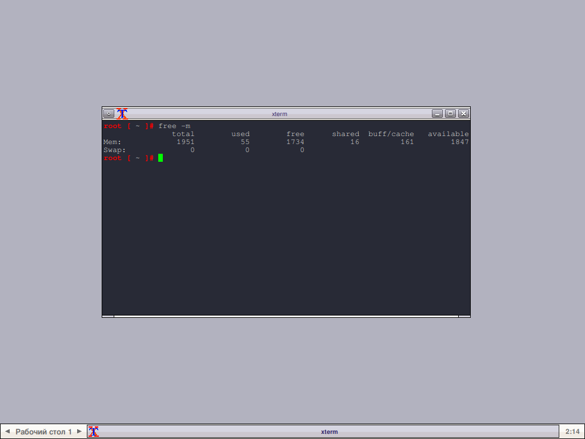
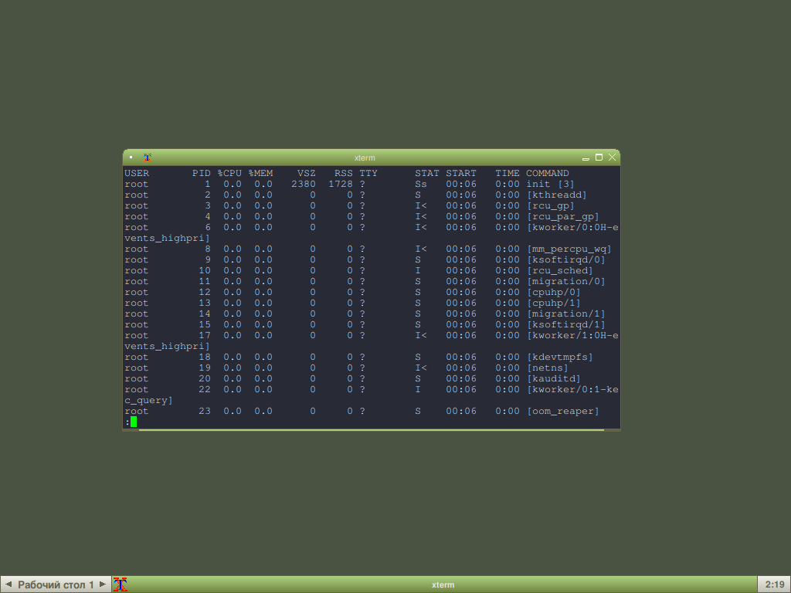

# Немного об оконном менеджере Fluxbox. Установка и настройка на LFS.

Скомпилировал себе на LFS оконный менеджер Fluxbox. До этого "тыкал" его на MX Linux, не зашло вообще. Слижком перегружен он там. Перегружен ненужным (мне) калом. И конфиг не понравился, котя изменить его как мне надо - дело пяти минут.

Fluxbox - легковесный оконный менеджер. И на LFS свою легковесность он показывает во всей красе: если система без иксов в гоглом TTY кушает 22 Мб ОЗУ, то с загруженными Xorg + Fluxbox - 54 Мб. В 2021 году это очень мало. Для сравнения: KDE кушает примерно в 100 раз больше, про GNOME молчу.



Этот оконный менеджер обладает всем необходимым набором настроек, конфигурируется довольно легко. И в данный момент я не вижу никаких причин использовать другой WM или DE. Особенно после опыта компиляции GNOME Shell, у которого 100500 зависимостей, а их компилить мне, честно говоря, лень. И разрешать конфликты и прочие несостыковки.

**ВНИМАНИЕ** ! Это не инструкция по настройке. Их в интернете тысячи. Это же простая заметка.

## Установка
Установка Fluxbox на популярные дистрибутивы Linux проста до безобразия, поэтому это я пропущу. Но расскажу про компиляцию из исходных текстов на LFS. Хотя это может подойти и для других ОС.

Скачать пакет [отсюда](https://downloads.sourceforge.net/fluxbox/fluxbox-1.3.7.tar.xz)
Время сборки небольшое: 0.9 SBU. На моём железе это примерно 2 минуты.

Естесственно, зависит от `X Window System`. Больше зависимостей у него нет, не считая опциональных: `dbus-1.12.20, FriBidi-1.0.9, imlib2-1.7.1`. Хотите ставьте их, хотите - нет.

### Подготовка к компиляции
Нужно создать `Makefile`, дабы собрать пакет:
```
./configure --prefix=/usr
```
Ключ `--prefix=/usr` говорит о том, что Fluxbox будет установлен в директорию **/usr**, как и положено.

### Компиляция
```
make          # Компиляция пакета
make install  # Установка пакета
```

## Настройка
Для того, чтобы Fluxbox запускался вместо уже установленного WM/DE, или же это первый оконный менеджер, то выполните:
```
echo startfluxbox > ~/.xinitrc
```

Если вы используете GDM, LightDM или любой другой Display Manager, то выполните следующее:
```
mkdir -pv /usr/share/xsessions
cat > /usr/share/xsessions/fluxbox.desktop << "EOF"
[Desktop Entry]
Encoding=UTF-8
Name=Fluxbox
Comment=Tris session logs you into Fluxbox
Exec=startfluxbox
Type=Application
EOF
```

> Это действие нужно выполнить в том случае, если вы собрали Fluxbox из исходных кодов

И создайте конфигурационные файлы оконного менеджера:
```
mkdir ~/.fluxbox
cp /usr/share/fluxbox/init ~/.fluxbox/init
cp /usr/share/fluxbox/keys ~/.fluxbox/keys
```

Скопируйте конфиг меню:
```
cp /usr/share/fluxbox/menu ~/.fluxbox/menu
```

Либо же, если вы не хотите комировать готовое меню, а сгенерировать его автоматически, выполните:
```
cd ~/.fluxbox
fluxbox-generate_menu
```

Fluxbox установлен и настроен! Выполните `startx` в консоли, чтобы увидеть результат.


## Сочетания клавиш
Список дефолтных сочетаний клавиш в Fluxbox 1.3.7:
* **Alt+LeftClick** на окне программы - переместить окно (кстати, можно и без **Alt**)
* **Alt+RightClick** на заголовке программы и перетащить курсор мыши в нужное направление - изменить размер окна
* **Alt+Tab** - переключение между окнами
* **Alt+F1** - запустить `XTerm`
* **Alt+F2** - запустить строку запуска
* **Alt+F4** - закрыть окно
* **Alt+f9** - свернуть окно
* **Alt+F10** - развернуть окно
* **Alt+F11** - развернуть окно в полноэкранном режиме
* **Ctrl+F1-F12** - переместиться на нужный рабочий стол (коих в дефолтном состоянии 4 штуки)
* **RightSuper+F1-F12** - переместить активное окно на нужный рабочий стол
* **Ctrl+RightSuper+F1-F12** - переслать активное окно на нужный рабочий стол и переместиться на этот раб.стол

### Назначение своих сочетаний клавиш
Быть может, приведённых выше сочетаний вам не будет достаточно, или вы захотите настроить имеющиеся так, как вам удобно, тогда откройте файл `~/.fluxbox/keys`:
```
vim ~/.fluxbox/keys
```

И добавляете туда строчку следующего вида:
```
SC :Exec PR
```

* SC - scan code. Код нужной клавиши
* PR - нужная команда или программа, которую надо запустить

Для того, чтобы узнать код нужной клавиши, выполните:
```
xev
```

И нажмите нужную клавишу. Найдите строчку `state 0x0, keycode...` - номер после слова `keycode` и есть нужный. Запишите его в конфиге ~/.fluxbox/keys вместо `SC`

## Установка фона
Есть прекрасная утилита `fbsetbg`, работающая с таким ПО, как `feh` (может, есть другие? Обязательно напишите). Установите `feh` и выполните:
```
fbsetbg -f /путь/до/картинки
```



Чтобы последний установленный фон ставился и после последующего запуска Fluxbox, добавьте в `~/.fluxbox/init` строку:
```
session.screen0.rootCommand: fbsetbg -l
```
