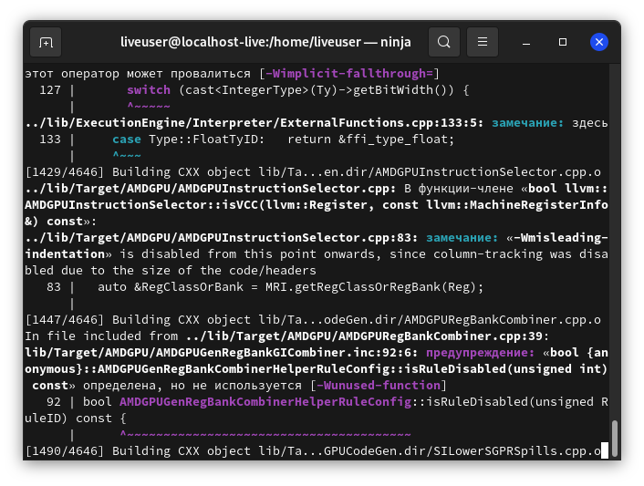

# Немного об LFS, моей невнимательности и компиляции ПО.

[Статьи](../stats.md)

<pre>
<strong>Автор:</strong> <a href="/LinuxSovet/Group/authors.d/Linuxoid85.html">Михаил Краснов</a>
<strong>Дата написания:</strong> 00.00.2021 00:00
</pre>

Я это сообщество первоначально задумывал как блог. Но не то, что сейчас творится у инстатёлок с большими губищами и жопами... Которые выкладывают каждый шаг своей жизни в интернет. Я хотел сделать блог, в котором фиксирую всякие заметки, решения и прочее. Есть у меня проблема и я её решил - пишу на стену описание проблемы и решение. Ну и всё в этом духе. Кстати, отголоски этого можно встретить во многих записях. Ну, а сейчас типичная запись из "правильного блога линуксоида".

Я пользователь LFS, как вы знаете. Его самое главное достоинство в том, что всё компилируется из исходных кодов, а так же максимальная настройка дистрибутива для себя, полный контроль над системой и знание того, как работает дистрибутив.

Но есть и минус - это очень сильная оптимизация для конкретного железа, ибо всё компилируется из исходных кодов. С одной стороны, это хорошо, ибо система будет работать чуть быстрее и стабильнее на том железе, на котором собирался дистрибутив, однако от этого ещё и страдает переносимость.

Я компилировал LFS на ноутбуке с процессором `Intel Core i3`, а запускал на ноуте с `Intel Celeron`. В целом, система работает быстро и стабильно, особых ошибок в работе я не заметил (за исключением отсутствия драйверов на определённые железки, но их доустановить не проблема совершенно). И я бы использовал эту систему и дальше на этом ноутбуке, если бы не одно НО. Программы на ней просто отказывались компилироваться и make выдавал ошибку "`Illegal Instruction`". А на том железе, на котором изначально ставил дистрибутив... Нужное ПО собирается отлично.

Короче, ту "проблемную" LFS я перенёс на тот ноут, на котором её собирал, а на старом ноутбуке с Intel Celeron я собираю ещё одну LFS с нуля. Это интересно, хоть и запарно и долго. Кстати, я приобрёл большой опыт в компиляции ПО и настройке ОС. Однозначно, сборка LFS пойдёт всем на пользу, было бы свободное время. Денька два-три-четыре.

Кстати, я всё ещё мучаюсь с этой тринити. Пытаюсь скомпилировать её, пробираясь через горы ошибок и неправильно введённые команды.

Далее. Возникла проблема с компиляцией иксов. Я заметил, что проблема возникает тогда, когда установлен префикс `/usr` или `/usr/X11`. make выдавал ошибку "`Превышен уровень символьных ссылок`" и прекращал компиляцию. Проблема возникла при компиляции Xorg Libraries. После чего их компиляция прерывалась. А после них пакеты Mesa и другие, для компиляции которых нужны эти самые Xorg Libraries, без которых ничего не соберётся и работать не будет. На форумах всяких, кстати, решения проблемы я не нашёл. Ну, решил пойти против стандартов LSB и FHS (нужное подчеркнуть) и установить иксы в `/opt`. И, на удивление, всё установилось и всё работает. Скомпилировал, в общем, иксы. И всё работает так, как надо... Ура. Иксы скомпилированы, все приложения, драйвера и прочее.

Кстати, в BLFS советуется скомпилировать оконный менеджер TWM. Это минимальный оконный менеджер, который в данный момент уже заброшен. И он очень олдскульный, я бы сказал, спартанский. Посмотрел на скриншоты... Он чем-то напомнил мне Windows 1 и 2. Когда винда не была ещё операционкой, а всего лишь глючной надстройкаой над MS-DOS 😁.
Компилировать его я не советую, только время потратите, а особой пользы-то и не будет. Всё равно потом скомпилируете нормальный WM или замахнётесь на DE... А TWM будет лежать мёртвым грузом, если не удалите.

Далее. Насчёт управления пакетами. Есть много пакетных менеджеров. Есть "дистрибутиво-независимые", можно скомпилировать тот же dpkg из дебиана (кстати, я компилировал - он работает отменно), apt, ещё какие-то ПМ... Но они мне не очень нравятся. Да и я захотел сделать настолько независимый от других сборок дистрибутив, насколько это возможно. Так, чисто для себя. И начал писать свой ПМ. На баше, естесственно. Bash'a вполне хватит для того, чтобы написать скрипты для установки и удаления ПО. Ну и ведения своей базы данных пакетов. Кстати, о пакетном менеджере напишу позже. Скажу только то, что я не завозил в него обработки зависимостей. Ибо я с этим намучался на дебиане и других дистрибутивах. Устал. Хочу полного контроля над системой.

Далее. Отойду от темы LFS. Сейчас напишу о группе. Я начал писать статью о строении Linux. Первая часть весьма поверхностна. Так сказать, галопом по гейропам. Так и задумывалось. Первая часть статьи - введение. А я пишу вторую часть. О чём - узнаете тогда, когда она выйдет. А то загуглите ещё и будете знать всё, что в статье написано 😁.
