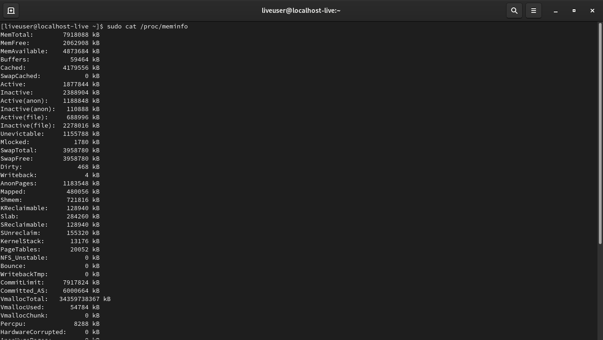
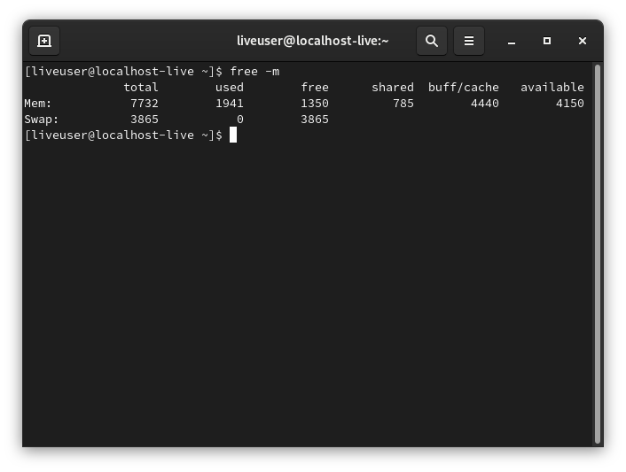
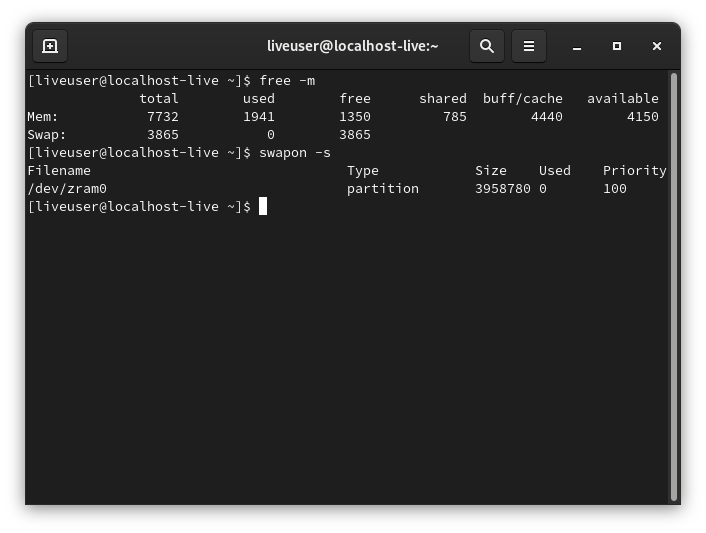

# Об ОЗУ и подкачке. LFS.

В данной статье пойдёт речь о двух вопросах. Первый: "Как Linux работает с оперативной памятью?" и второй: "Как создать подкачку, если не хватает ОЗУ?". Тема довольно объёмная и сложная, поэтому читать вдумчиво и понимать, что здесь написано. Другие UNIX-системы не трогаю, но в них примерно так же.
Сей трактат я начал писать, когда собирал LFS. Не хватило ОЗУ. Решил написать о создании подкачки, а уже после сборки и настройки LFS (Linux From Scratch) начал писать о работе Linux с оперативной паматью. Интересная и полезная тема.


***

# Работа Linux с оперативной памятью.

Одной из наиболее важных и базовых подсистем в любой операционной системе является подсистема работы с оперативной памятью (`Memory Management Unit`). Конструкция данной подсистемы является очень сложной. Да и развитие Linux не стоит на месте и он развивается очень активно (сравните то, что было, предположим, в 2011 году и то что сейчас!). Благо, всё отлично задокументировано, а в интернете можно найти информацию на любой вкус, цвет и возраст.

Поговорим о виртуальной памяти. Если с физической всё понятно (это, собственно, сама планка оперативной памяти), то вот с виртуальной памятью иногда возникают всяческие непонятки.
В отличие от физической памяти, которую можно расширить только на аппаратном уровне, виртуальная память является совокупностью физической памяти и подкачки (swap).
Swap является механизмом управления памятью, при котором отдельные фрагменты памяти (как правило неактивные или малоактивные) могут быть перемещены из RAM на диск (либо же, если использовать zram, то в виртуальный раздел в оперативной памяти). Поэтому можно утверждать, что размер виртуальной памяти можно неограниченно расширять с помощью дисков, однако стоит учесть то, что доступ к фрагментам памяти расположенных на диске будет значительно медленнее, чем непосредственно к RAM. Хотите скорости - используйте zram. Так будет немного быстрее, чем использовать подкачку на HDD или SSD.

Базовой единицей в организации памяти для систем на базе ядра Linux является страница памяти. Страница имеет размер от 4 Кбайт, которому соответствует объём физического пространства в оперативной или виртуальной (область подкачки на диске или другом устройстве хранения) памяти. Также существуют страницы другого размера: так называемые Huge Pages размером 2 MБ и страницы размером 1 ГБ, но о них писать здесь не буду, дабы не захламлять статью.

Процесс работает не с физической памятью напрямую, а с виртуальной. Виртуальная память – это адресное пространство процесса.
Такая абстракция позволяет проще писать код приложений, не думать о том, что можно случайно обратиться не на те адреса памяти или адреса другого процесса. Это упрощает разработку приложений, а также позволяет превышать размер основной оперативной памяти за счёт описанных ниже механизмов. Виртуальная память состоит из основной памяти и swap (раздела или файла подкачки). Т.е., объём виртуальной памяти может быть, в принципе, неограниченного размера.

При запуске процессов, они запрашивают у системы (т. е. у ядра посредством соответствующих системных вызовов) память для своей работы, а в ответ на это ядро выделяет для них достаточное количество страниц памяти. Виртуальная память, или как её ещё называют, «резервное ЗУ» (резервное запоминающее устройство) для страниц памяти, которые содержат, к примеру, исходный текст исполняемого приложения, представляют собой обычные исполняемые файлы на диске. Ровно как и для других файлов данных, резервным ЗУ являются сами файлы. Информация о том как взаимосвязаны страницы физической и виртуальной памяти хранится в соответствующих таблицах страниц памяти.

Для работы с памятью в Linux характерно такое явление, как «страничный обмен» (paging). Оно заключается в том, что ядро выделяет процессам столько памяти, сколько им необходимо. В том смысле, чтобы её (памяти) всегда хватало. Это достигается за счёт расширения физической памяти за счёт виртуальной, т. е. «подкачки». Поскольку выполнение процессов должно происходить в реальной физической памяти, то ядро постоянно перемещает страницы памяти процессов между физической и виртуальной памятью. Забегая вперёд, следует отметить, что в виртуальной памяти хранятся «неактивные» страницы, которые не задействованы процессом в данный момент, но необходимые ему для полноценной работы впоследствии.

Следует обратить внимание на то, что ядро старается управлять памятью таким образом, чтобы недавно используемые процессом страницы находились в физической памяти, а неактивные или редко используемые страницы перемещаются и хранятся в виртуальной памяти в области `подкачки` (`swap`). Такой механизм распределения памяти называется LRU (least recently used) — замещение наиболее редко используемых страниц. О подкачке речь пойдёт во второй части статьи.

Вторым важнейшим аспектом в работе памяти является использование кеш-буфера страниц. Это вытекает из работы алгоритма LRU, который довольно сложен в своей реализации. Поскольку следить за всеми обращениями к страницам — это в некоторых случаях, довольно ощутимые потери в производительности системы. Использование же страничного кеш-буфера куда проще в своей реализации при тех же самых результатах. К тому же, данный подход имеет огромный модернизационный потенциал (в отличие от LRU) и алгоритмы анализа содержимого кеш-буфера (для определения, какие страницы должны быть перемещены из виртуальной памяти) постоянно совершенствуются. Что заметно сказывается на производительности и эффективности управления памятью.

Когда процессу не хватает памяти, то ядро начинает искать «занятые» страницы, которые можно использовать для «голодающего» процесса. Обычно такими страницами являются те, что давно не были использованы. Ядро проверяет их на предмет модификации каким-либо процессом, для этого существуют определённые признаки, при последнем обращении и если изменения были, то такие страницы помечаются ядром как «грязные». Т. е. такие, которые ещё нужны процессам. Для повторного использования памяти, такие страницы сначала обязательно переносятся в виртуальную память. Все же остальные страницы являются «чистыми». И поэтому ядро их использует для предоставления другим или «голодающим» процессам.

Когда происходит обращение к страницам памяти, которые некоторое или долгое время не использовалис, т. е. к «неактивным» страницам. То ядро выполняет с ними несколько важных задач:
* возвращает ссылки на эти страницы в соответствующей таблице страниц;
* сбрасывает в нулевое значение время «неиспользования» этих страниц;
* помечает эти страницы как «активные».

Со страницами, находящимися в виртуальной памяти не всё так однозначно. Дело в том, что для того, чтобы «активизировать» такие страницы, они должны быть предварительно прочитаны с диска.

Системное ядро комплектуется специализированными модулями. Которые содержат алгоритмы и даже целые технологии. С помощью которых система довольно эффективно «предсказывает», сколько может потребоваться памяти при разной степени активности и загруженности процессов. Эти алгоритмы имеют своей целью обеспечение процессов свободной памятью с максимальной эффективностью. Т. е. так, чтобы процессам как можно реже приходилось простаивать в «ожидании» выгрузки очередной страницы в свободную память. Таким образом, наблюдая за состоянием страничного обмена во время рабочей нагрузки системы, можно делать выводы о том, нужна ли ей дополнительная память. Если страничный обмен интенсивный — то однозначно следует установить дополнительные модули ОЗУ.

Если же происходит так, что процессам не хватает ни реальной физической, ни виртуальной памяти. Т. е. когда память полностью исчерпана, то система начинает завершать (а точнее уничтожать) целые процессы. Либо запрещает создание новых. Конечно в этом случае в первую очередь уничтожаются наиболее «безболезненные» для системы процессы. Однако в таких случаях даже «на глаз» и по собственным ощущениям видно что она большую часть времени тратит на управление памятью, а не на выполнение рабочих задач.

*Смотрите так же:*
* oom-killer

В Linux можно настроить параметр, который задаёт, насколько быстро ядро должно «отбирать» страницы памяти у процессов. Которым они менее нужны для процессов, которым они на данный момент необходимы. Этот параметр содержится в файле /proc/sys/vm/swappiness и по-умолчанию равен 60. Если задать его меньшим значением (например 0), то ядро будет забирать страницы процесса в самую последнюю очередь, используя вместо этого любые другие варианты. Если это значение в пределах между 60 и 100, то страницы будут отбираться у процессов с более высокой вероятностью. О настройке vm.swappiness читать в конце статьи.
В отличие от физической памяти, которую можно расширить только на аппаратном уровне, виртуальная память является совокупностью физической памяти и swap.
SWAP является механизмом управления памятью, при котором отдельные фрагменты памяти (как правило неактивные или малоактивные) могут быть перемещены из RAM на диск. Поэтому можно утверждать что размер виртуальной памяти можно неограниченно расширять с помощью дисков, однако стоит учесть то, что доступ к фрагментам памяти расположенных на диске будет значительно медленнее, чем непосредственно к RAM.

Говоря простыми словами, чем больше значение vm.swappiness, тем чаще будет использоваться swap, т.е, чаще данные из ОЗУ будут перемещаться туда.

Ну и немного практики. Покопаемся в системных файлах.
```
# cat /proc/meminfo
```



**Объяснение пунктов**
* `MemTotal` отображает доступный объем оперативной памяти
* `MemFree` указывает объем неиспользуемый объем оперативной памяти
* `Buffers` — область памяти, в которой хранятся данные ожидающие записи на диск, буфер позволяет процессам продолжать работу не дожидаясь физической записи на диск
* `Cached` отображает объем памяти занятый под кэш (файлы, каталоги, файлы блочных устройств и т.д)
* `SwapCached` указывает на объем памяти, который был помещен в swap, а затем перенесен обратно в RAM, при этом данные все еще присутствуют в swap
* `Active` отображает объем памяти, который наиболее часто используется страницами памяти, данные страницы памяти освобождаются довольно редко
* `Inactive` в свою очередь не используются в данный момент, данные страницы являются первоочередными кандидатами для выгрузки в swap в случае необходимости
* `Unevictable` -- страницы памяти, которые по каким-либо причинам не могут быть помещены в swap
* `Mlocked` отображает память, внесенную в адресное пространство с помощью системного вызова mlock
* `SwapTotal` и `SwapFree` — общий объем и свободный объем подкачки
* `Dirty` — измененные страницы памяти, которые все еще находятся в RAM, но еще не сброшены на диск
* `Writeback` это память которая в данный момент сбрасывается на диск
* `AnonPages` — объем анонимной памяти
* `Mapped` отображает объем памяти, внесенный в адресное пространство с помощью mmap
* `Slab` — объем памяти выделенный под структуры ядра небольшого объема
* `PageTables` — память выделенная под страничную таблицу
* `NFS_Unstable` указывает на объем памяти используемый для передачи данных по NFS v3+
* `Bounce` — память используемая блочным устройством
* `CommitLimit` — общий объем памяти, основанный на коэффициенте избыточного выделения (vm.overcommit_ratio), доступный в настоящее время для выделения в системе. Это ограничение соблюдается только в том случае, если включен строгий учет переопределения (режим 2 в vm.overcommit_memory)
* `Committed_AS` — объем памяти, выделенный в настоящее время в системе. Выделенная память - это сумма всей памяти, которая была выделена процессами, даже если она еще не была «использована» ими.
* `VmallocTotal` — виртуальное пространство, доступное для vmalloc
* `VmallocUsed` — объем использованного пространства vmalloc
* `VmallocChunk` — наибольший свободный блок внутри vmalloc
* `HugePages_Total` — количество huge страниц выделенных ядром
* `HugePages_Free` — количество huge страниц, которые не выделяются
* `HugePages_Rsvd` — количество huge страниц, которые должны были выделиться из пула, но еще этого не сделали
* `Hugepagesize` — количество huge страниц
* `DirectMap1G` — память выделенная под huge страницы размером 1GB.

Ну и выхлоп `free`:
```
free -m
```

В строке buffers/cache показывается, сколько памяти используется и сколько памяти свободно с точки зрения ее использования в приложениях. В этом примере приложениями уже используется 972 Мб памяти и еще 534 МБ памяти могут быть использованы.

## Смотрите так же:
* Программы `htop`, `top`, `atop`, `ps`
* man 5 proc


***

# Swap (подкачка)
Если оперативной памяти Вашего компьютера недостаточно (3 Гб и менее), то наиболее простым и быстрым решением проблемы является использование файла/раздела подкачки. В данной инструкции речь пойдёт о файле, так как это наиболее хорошее решение для сборки системы: размер файла очень быстро регулируется, быстро удаляется.

Эту статью я писал, когда собирал LFS. Часть пришлось собирать на одном ноуте, мощном и надёжном, а продолжать пришлось на старом и слабом. Именно на втором ноутбуке и не хватало ОЗУ... 2 Гб оперативки в 2021 довольно мало.

Для сравнения. На компьютере с ОЗУ 8 Гб, в среднем, при компиляции того или иного пакета было занято 4-6 Гб. И на том ПК я обходился без подкачки вовсе, а вот на другом, на котором продолжал сборку, не всё так хорошо.

Чтобы узнать, существует ли уже подкачка или нет, выполните:
```
swapon -s
```

А чтобы просмотреть использование ОЗУ и Swap:
```
free -m
```

## Рассчёт размера подкачки (swap)
Обычно объём подкачки равен половине объёма ОЗУ/объёму ОЗУ умноженного на 2, но не всегда этого может хватить, особенно на слабых ПК. Поэтому рассчитайте размер файла или раздела так, чтобы обеспечить минимум 4 Гб в общей сложности (ОЗУ+Swap). Для сборки базовой системы этого хватит, а для сборки таких программ, как, например, Pale Moon, этого не хватит - нужно мощное железо. Не проще ли, в таком случае, не компилировать такое "тяжёлое" ПО, а найти бинарные пакеты?


## Создание файла подкачки
Чтобы создать файл подкачки, выполнить:
```
sudo fallocate -l 1G /swapfile &&
sudo chmod 600 /swapfile &&
sudo mkswap /swapfile &&
sudo swapon /swapfile
```

### Объяснение новых команд
* `sudo fallocate -l 1G /swapfile` - создать файл `/swapfile`, размером 1 Гб. Чтобы выбрать другой размер, заменить "1G" на нужное значение.
* `sudo chmod 600 /swapfile` - в целях безопасности, выставить нужные права на файл. О правах на файлы читать в интернете.
* `sudo mkswap /swapfile` - создать файловую систему `swap`.
* `sudo swapon /swapfile` - включение подкачки.



## Настройка vm.swappiness
Теперь настройка свопа. Есть параметр, сообщающий ядру, как часто использовать подкачку. Параметр имеет значения от 0 до 100, чем выше значение, тем чаще будет использоваться swap.

Для того, чтобы проверить, какой параметр используется, выполнить:
```
cat /proc/sys/vm/swappiness
```

Например, в Rosa R11 значение равно шестидесяти. Если хотите изменить это значение, выполните:
```
sudo sysctl vm.swappiness=X
```

Где X - нужное значение.


## Сохранение изменений после перезагрузки
Как только система перезагрузится, придётся опять включать подкачку и выставлять vm.swappiness, что, конечно, неудобно. Чтобы этого избежать, нужно сделать соответствующую запись в `/etc/fstab`:
```
echo '/swapfile none swap sw 0 0' |sudo tee -a /etc/fstab
```

И записать в `/etc/sysctl.conf` нужное значение swappiness:
```
echo 'vm.swappiness=X' |sudo tee -a /etc/sysctl.conf
```


## Удаление файла подкачки
После сборки и настройки системы, вероятно, swap вам больше не понадобится. Поэтому лучше его удалить.

Выполнить:
```
sudo swapoff /swapfile
sudo rm /swapfile
```

И удалить записи в `/etc/fstab` и `/etc/sysctl.conf`.

### Объяснение новых команд
* `sudo swapoff...` - отключить подкачку
* `sudo rm /swapfile` - удалить подкачку

## ВАЖНО!!!
Когда полностью отключить подкачку, то ОС будет использовать только ОЗУ и в случае его нехватки система может просто зависнуть.

**Ну и пару нужных вещей:**
* Подкачка нужна для ровного и эффективного высвобождения оперативной памяти и использовать swap в качестве "экстренной памяти" не рекомендуется в принципе.
* Отключение `swap` не спасает от проблемы дискового ввода/вывода при конкуренции за память - дисковый `I/O` перемещается с анонимных страниц на файловые, что не только может быть менее эффективным, поскольку остаётся меньший пул страниц, доступных для высвобождения, но и само по себе может способствовать появлению этой высокой конкуренции.

Удачи!
