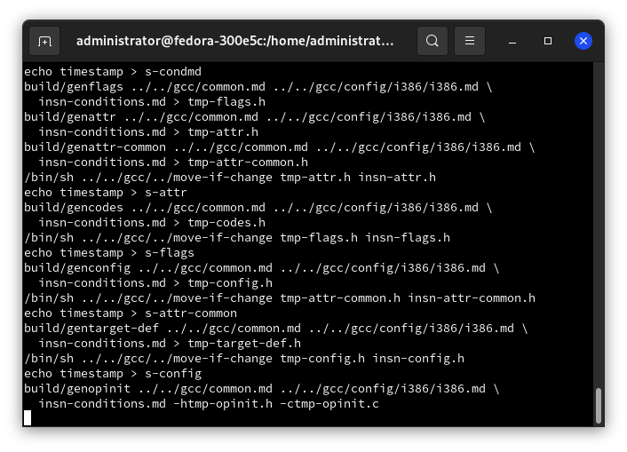

# Релиз дистрибутива Calmira LX 1.1 - улучшение поддержки EFI, позиционирование дистрибутива для других групп пользователей и многое другое

Calmira GNU/Linux - очень молодой дистрибутив Linux, предназначенный для небольшого круга задач. На данный момент, пилится одним разработчиком долгими вечерами "для души". Он неплохо подойдёт опытным пользователям, у которых в приоритете контроль над системой, и владельцам слабого железа.

Готовится релиз Calmira LX4 1.1, в котором будет много интересных и полезных изменений. Об этом, а так же о дате выхода дистрибутива читайте в этой статье.

## Введение

В корректирующем релизе Calmira LX4 1.1 будет введено большое число изменений. Дистрибутив станет быстрее и стабильнее. А использование нового алгоритма установки программного обеспечения сделает использование системы намного удобнее.

В версию LX4 1.1 вернётся пакетный менеджер `cpkg` (напомним, что в предыдущей LX4 1.0 он был убран ввиду своей нестабильности). Продолжена новая "старая" система нумерации версий - классическая, вместо т.н. годовой, когда числа до точки (мажорная версия) - год выпуска дистрибутива, после точки (минорная версия) - билд дистрибутива. Вместе с переходом на классическую систему нумерации релизов, выполнен переход на [LX4](https://lx4u.ru) с LFS. Во-первых, новый проект подаёт очень большие надежды. Во-вторых, он предоставляет более новые, но протестированные версии ПО. А так же много других достоинств. Так же, переход на Linux for Yourself поможет искать в ней ошибки и повышать её стабильность.

Вместе с переходом на LX4 вскрылся очень серьёзный недостаток - упрощённая система каталогов в корне. Это значит, что нет привычных `/bin`, `/sbin`, `/usr/sbin` и `/lib`. Они заменены на ссылки, ведущие на `/usr/bin` и `/usr/lib` соотв. Эти ссылки существуют лишь для совместимости с другим ПО. С одной стороны, это верный шаг, так как сборка программ действительно упрощается, но есть и минусы - невозможность выноса `/usr` в отдельный раздел, меньшая безопасность (так как большинство программ из `/sbin` и `/usr/sbin` теперь можно выполнить и обычному пользователю (особенно если стоят специальные биты `SGID` и `SUID`), а так же меньшая надёжность, ибо при случайном удалении `/usr` система превратится в нерабочий набор никому не нужных файлов (когда используется классическая иерархия директорий, то жизненно важные компоненты системы остаются в рабочем состоянии)). И в Calmira LX4 1.0 эта структура как раз использовалась.

При использовании классической структуры каталоги `/bin`, `/sbin`, `/usr/bin`, `/usr/sbin`, `/lib`, `/usr/lib` - разные директории. `/usr` можно вынести в отдельный раздел, либо же вообще загружать по сети. При случайном удалении `/usr/*` система останется в работоспособном состоянии, а программы из `/sbin` и `/usr/sbin` сможет выполнять только root. В релизе Calmira LX4 1.1 возвратится эта классическая иерархия.

## Идеология

Так же как и раньше, дистрибутив следует принципу KISS - Keep It Simple, Stupid! Как и что делать в системе решает только пользователь. Ему отдан полный контроль над системой. Так же дистрибутив неотступно следует концепции Unix Way - предоставляет ПО, отвечающие его требованиям, да и сам пытается быть максимально компактным и выполнять только то, что от него требуется, но не более. Однако, о следовании стандартам FHS и LSB ничего не сказано. Оно и понятно - в первом случае, часть собственного ПО от разработчиков Calmira LX4 использует несоответствующие FHS каталоги и файлы, а LSB соблюзти трудно само по себе.

Основной упор делается на сборке ПО из исходного кода. С версии 2021.2 стало возможным нормально устанавливать скомпилированное в бинарные пакеты программное обеспечение. Но сборка так и остаётся основным инструментом работы с ПО. В Calmira LX4 сборка ПО из исходного кода заметно упростится за счёт введения системы портов (находится в `/usr/ports`). Она планировалась для LX4 1.0, но из-за некоторых проблем её презентацию было решено отложить до версии LX4 1.1. На данный момент нужно только обновить часть пакетов и актуализировать инструкции по сборке пакетов для нового релиза.

## Позиционирование

Дистрибутив подходит для слабого железа ввиду своего небольшого потребления ресурсов ПК. В кодексе разработчиков строго прописаны ограничения на размер дистрибутива и его потребление ресурсов ПК. Так же Calmira предлагается для использования опытными пользователями, которым не нужно ничего лишнего в системе, а так же необходим полный контроль и детальная настройка дистрибутива для своих целей.

Однако, с релиза 2021.3 (разработка прекратилась во время тестирования, заменён LX4 1.0), произошло небольшое изменение позиционирования и ход разработки дистрибутива. Теперь он предназначается не только для владельцев слабого железа или опытных пользователей, но и для решения каких-либо общих задач, где не нужны никакие лишние навороты и большое потребление ОЗУ, ЦП, и места на жёстком диске. Например, для тестирования ПО. А это значит, что Calmira будет довольно актуальной на протяжении долгого времени хотя бы для небольшого числа людей.

Так же Calmira используется для администрирования сообщества LinuxSovet. Именно с неё было написано большинство статей и выдвинуто множество решений о блокировке пользователей предыдущим владельцем Михаилом Красновым.

В системе не предусмотрено использование GUI, однако есть порты с сервером Xorg, оконными менеджерами Fluxbox и Window Maker. Рабочих окружений нет ввиду их громоздкости и высоких системных требований.

> Трудно сказать, будет ли полезно столь крутое расширение целевой аудитории системы. Поживём - увидим.

## Цикл разработки и выход обновлений пакетов

Спустя достаточно большое время с выхода первого релиза, наконец, можно говорить о цикле разработки дистрибутива. Теперь каждая версия готовится не несколько недель, а несколько месяцев (в зависимости от типа релиза). Мажорные версии разрабатываются на протяжении пяти месяцев - только после этого можно считать дистрибутив *нестабильным*. В течение этих месяцев возможна выкладка предварительных альфа-версий для тестирования. После прошествия 5 месяцев начинается этап тестирования, во время которого не только фиксируются баги и недоработки, но и параллельно исправляются. На тестирование и исправление багов затрачивается от 1 до 2 месяцев. Итого, на выход мажорной версии затрачивается 6-7 месяцев.

Процесс разработки промежуточных версий, естесственно, намного короче. Промежуточные версии включают в себя только обновления пакетов/портов и фиксы багов/недоработок. Разработка длится от одного до двух месяцев, после чего начинается этап тестирования, который длится месяц. Итого, на разработку минорной версии затрачивается до трёх месяцев. В некоторых случаях процесс разработки такой версии может либо сокращаться, либо увеличиваться.



*Рис.1. - дистрибутив Calmira LX4 1.1. Сборка пакета gcc в chroot*.

## Изменения

> Приведено только то, что уже доступно в дистрибутиве, этот список со временем может стать не полным.

В дистрибутиве было обновлено несколько жизненно важных компонентов. Смотрите более подробную информацию в Changelog дистрибутива. Несмотря на то, что самое главное в системе - надёжность, но, зачастую, используются одни из последних версий ПО. Кому-то это понравится, а кому-то - нет. Дело пользователя.

Так как дистрибутив предоставляется с минимально необходимым набором ПО, то и над интерпретатором `bash` извращаться не стали. Сократили profile и bashrc, оставив самые необходимые для обслуживания ОС функции, а так же сократили приглашение к вводу (`PS1`) до лаконичного и безцветного `'\u:\w\$ '`. Некоторым пользователям это не понравится, но следует повториться - дистрибутив предоставляет минимально необходимое ПО, в том числе, и настройки системы так же минимальны. В случае необходимости, пользователь всегда может открыть для редактирования `/etc/profile` и отредактировать значение `PS1` до нужного формата.

В пакетный менеджер `cpkg` были введены функции, облегчающие работу с системой портов. Так, например, как у cpkg, так и у портов одинаковые функции для установки дополнительной документации пакета. По умолчанию, она не устанавливается, ввиду уменьшения размера системы. Используется псевдографический интерфейс на ncurses (`dialog`) для формирования этого окна (и нескольких других).

Обеспечение поддержки EFI (не включено по умолчанию). EFI - давняя проблема дистрибутива. Она длится с самой первой версии до сих пор. Были попытки исправления этого в релизе 2021.2 и 2021.2.1, но они не увенчались успехом. Однако сейчас всё изменилось - дистрибутив умеет работать с EFI, однако для этого требуется собрать порты из раздела `base/grub-efi` примерно так:

```bash
cd /usr/ports/base/grub-efi
cd $PACKAGE

./install
```

Разметить жёсткий диск, скопировать на него дистрибутив и установить загрузчик `GRUB2`.

Из наименее крупных изменений можно отметить:
* Работа по оптимизации как системы, так и её отдельных компонентов (таких как `cpkg`).
* Обновление пакетов:
   * iproute2-5.13
   * linux-5.13.1
   * texinfo-6.8
   * less-590
   * cpkg 1.0
* Использование собственных/модифицированных конфигов для `bash`, `vim`, `grub` и других.
* Добавление конфига `/etc/system.version`, содержащий информацию о текущем релизе Calmira (аналог `/etc/lsb-release`, `/etc/redhat.version` и пр.). Файл `/etc/os-release` было принято оставить для совместимости с некоторыми пакетами.
* Утверждён план выхода дистрибутивов: тестовые дистрибутивы выходят 05 числа, стабильные - 15 числа. Частота выхода дистрибутивов будет рассмотрена позже. Для каждой версии создаётся соответствующая ветка в репозитории [GitHub](https://github.com/Linuxoid85/CalmiraLinux), фиксирующая изменения конфигов, документации и отдельных компонентов системы. Так же создаётся отдельная ветка в репозитории `calmira_ports` на [GitLab](https://Linuxoid85/calmira_ports), в которой фиксируются изменения в портах в рамках текущего релиза. Поддержка ветки `calmira_ports` с портами для системы заканчивается через 5 лет после выхода версии дистрибутива.
* Добавление пакета `isl` в порты - раздел с базовым ПО (`base/isl`), однако в минимальную поставку дистрибутива он не входит.

## Выводы

На данный момент, изменений не так много, но эту версию начали пилить недавно. Тестовая версия должна выйти 05.08.2021, а стабильная - 15.09.2021. Посмотрим, что будет дальше 😉️.
