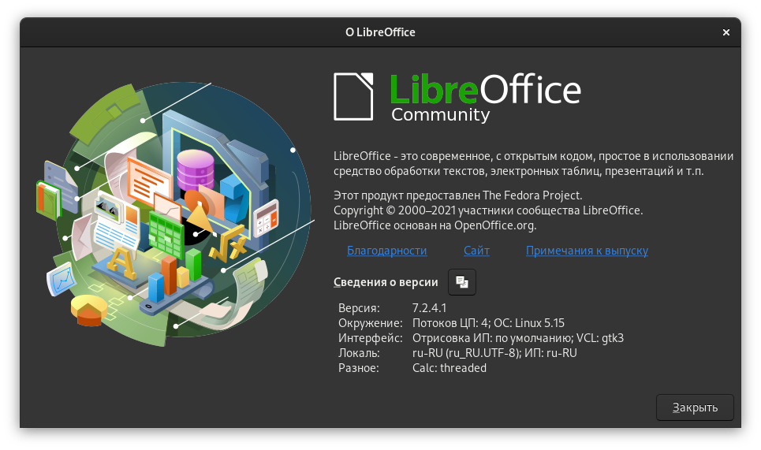

# Конвертация форматов офисных документов - автоматизируем процесс

[Статьи](../stats.md) > [Блог](README.md)

<pre>
<strong>Автор:</strong> <a href="/LinuxSovet/Group/authors.d/Linuxoid85.html">Михаил Краснов</a>
<strong>Дата написания:</strong> 11.12.2021 22:00
</pre>



Иногда на основном ноуте приходится создавать/редактировать какие-либо документы и прочие файлы. И, так как я винду не использую очень долгое время (тащемта, на том ноуте она и не работает корректно), приходится юзать LibreOffice. Мне очень нравится этот офисный пакет, но совместимость с форматом Microsoft Office у него не идеальная, поэтому часто в сложных доках едет форматирование.

Выход - конвертировать доки в несколько разных форматов: OASIS, MSO, PDF и пр. Если документ одного формата окажется кривым, будет другой, и так далее. И сохранение файла в нескольких форматах раздражает, особенно тогда, когда за день приходится по многу раз это выполнить. Поэтому написал простой скрипт для автоматизации этого.

```bash
#!/bin/bash
# Скрипт для конвертации различных форматов офисных документов
# с помощью LibreOffice
# ИСПОЛЬЗОВАНИЕ:
# convert.sh type file

if [ ! -e "$2" ]; then
    echo "Не указан файл для конвертации!"
    exit 1
fi

if [ ! -f "$2" ]; then
    echo "Не найден файл для конвертации!"
    exit 1
fi

# Закрытие всех запущенных процессов LibreOffice
killall -u `whoami` -q soffice

# Конвертация
soffice --headless --convert-to "$1" "$2"

if [ $? != 0 ]; then
    echo "soffice вернул код завершения, отличный от нуля!"
    exit $?
fi
```

Особо изгаляться по поводу принципа работы не буду - из комментариев всё понятно. Поясню следующее - здесь используется LibreOffice для конвертации. Были варианты использовать довольно старый Python-скрипт (вероятно, для Python2, не смотрел), который отказался работать сразу же. А то, что предложено здесь - довольно простое и быстрое решение.

`--convert-to` для конвертации документа `$2` в указанный формат `$1`. Соответственно, использование такое:

```bash
./convert.sh [формат] [конвертируемый файл]
```

Из недостатков отмечу то, что окончательной автоматизации даже этот скрипт не обеспечивает. Приходится держать открытым терминал с рабочим скриптом. Но это уже намного лучше того, что было ("Экспорт", "Сохранить как..." и пр.).

## Смотрите также:

- `man soffice`.

Удачи!
