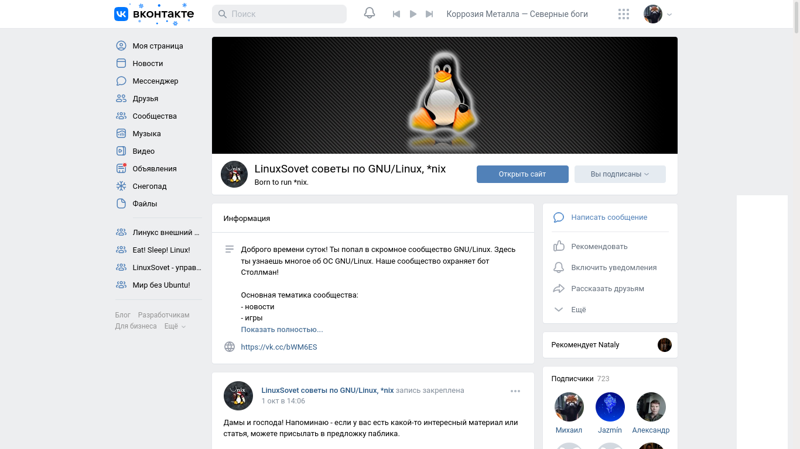

# Группе два года!

За эти два года прошло многое, и первую часть повествования вы можете увидеть [здесь](https://vk.com/wall-190836544_3134). Этот год был довольно тяжёлым как для самого сообщества, так и для меня. Однако, наиболее важные изменения были совершены именно в этом году:

- Создание дистрибутива Calmira GNU/Linux;
- Написание нескольких статей о рабочем окружении GNOME и GTK;
- Были написаны статьи о программировании на Python, а так же отдельные заметки о C и C++;
- В конце концов, был создан этот репозиторий со статьями.

И самое главное - наше сообщество живет, чаты ВКонтакте живут, в них вечно происходят всякие споры, люди дискутируют, общаются, помогают друг другу. Общаемся не только о Linux, Unix и подобных вещах. О всяком. Ну не без холиваров, понятное дело.

## Январь – Март
После блокировки нескольких человек в январе, они подняли настолько сильный шум, что мне пришлось временно отстраниться от администрирования сообщества. 11 февраля создал обсуждение о неактуальности «Лампового чата» с текущим на то время составом (https://vk.com/wall-190836544_4081). Проблемы действительно имели место быть: я планировал эту беседу для *лампового, спокойного, уважительного* обсуждения Linux, BSD*, решения проблем и прочего. Но вместо этого беседа превратилась в дичайший сральник, где обсуждалось абсолютно всё, но не то, что нужно. Да, можно было заблокировать всех, кто портил воздух, но, вынеся урок из прошлого конфликта, я не делал этого, к тому же, бОльшую часть времени чатами занимался другой человек.

Уже весной пришлось вернуться (https://vk.com/wall-190836544_5012), но это уже другая история.

## Июнь – 28.12.2021
В июне принял решение о своём окончательном уходе из состава руководителей сообщества. На то было несколько причин, о которых сейчас писать не хочу - кому надо, те поняли 😉️.

Не могу сказать, что мне нравилась ситуация в группе после ухода. Были проблемы с материалом. Было написано пару статей, больше ничего. Пришлось мне предлагать некоторые собственные записи. Однако потом они нашли нормального контентмейкера, который радует участников новыми записями почти каждый день. К тому же, новый владелец сообщества не дал ему кануть в лету, за что, однозначно, огромное спасибо!

Поначалу неплохо развивался и канал группы в Telegram. Было написано много статей о строении Linux, статьи об LFS, LX4U, Calmira Linux и прочих. Но сейчас и у меня возникли проблемы с материалом - после ухода из состава руководителей группы я деградировал как контентмейкер. К тому же, некоторые люди критикуют меня за то, что статьи стали сложнее и теперь не ориентированы на обычного пользователя.

***

Заканчивая этот год (с наступающим!), а так же это повествование.

На данный момент у нас получается два хороших сообщества: в ВК и в Telegram. Да, делаем разный материал, разные администраторы и взгляды на контент. Что скажете по этому поводу?
