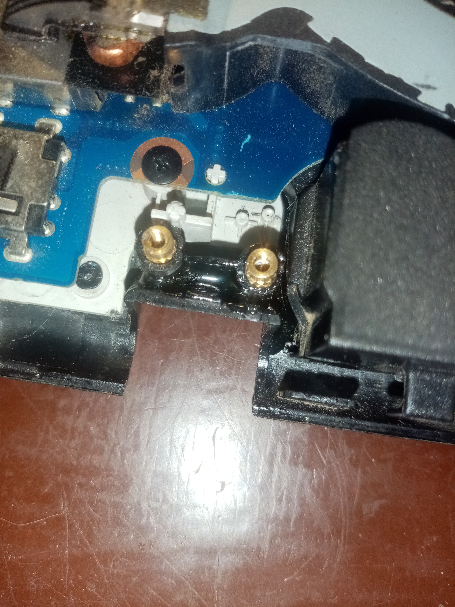
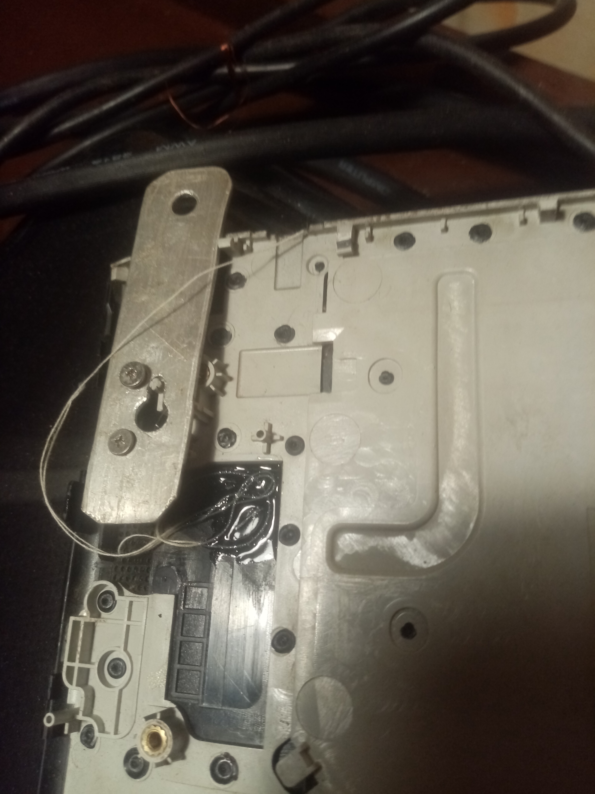

# Мучения с ноутом Samsung NP300E5C

Доброго времени суток! Дано на сайте не выходило никаких обновлений, поэтому решил написать небольшую заметку по поводу ноутбука Samsung NP300E5C. Да, это будет полезным не для всех читателей, но для пользователей, возможно, сможет пригодиться.

> UPD.

> Статья о парсинге JSON-ов в Bash всё ещё пишется, наберитесь терпения!

## №1. После установки GNU/Linux ноутбук не загружается с жёсткого диска, а уходит в вечную перезагрузку

Выглядит это так: ноут включается, показывает логотип, и сразу же перезагружается. Либо так же, но отображается меню выбора системы, которую требуется загрузить, и после выбора оной он перезагружается. В BIOS войти невозможно, а его сброс не приносит никаких результатов.

Такая проблема довольно распространена, и не писал о ней только ленивый (гуглить что-то вроде "Linux убивает новые модели ноутбуков Samsung"). Писали-то новость, а решение приходится искать самостоятельно. И да, было старое [решение](https://forum.ubuntu.ru/index.php?topic=223661.0), а [здесь](https://forum.ubuntu.ru/index.php?topic=223661.15) ближе к сути, и оно могло бы быть именно тем решением, по которому обязательно нужно восстанавливать ноут, но оно устарело.

Как я выяснил, в этих ноутах уже нет BIOS в привычной нам форме, вместо него - UEFI. И как раз-таки в нём заключается беда. Он очень кривой, и, судя по найденной мною информации (за достоверность отвечать, увы, не могу), под область переменных EFI выделено чуть больше памяти, чем дейстительно нужно, и при попытке записать туда какую-либо информацию (не важно какую совершенно) и возникает данная проблема. Как итог - ноут невозможно загрузить с жёсткого дика, в Setup по нажатию F2 он не входит, и представляет собой кирпич, который просто умеет включаться и перезагружаться.

И одно время Samsung даже меняла материнские платы *по гарантии*, но такие времена давно прошли, да и GNUSMAS уже давно не производят ноутбуков...

Казалось бы, просто сбросить BIOS до заводских. И тут есть два способа - либо замкнуть определённые для этого контакты, либо просто вытащить батарейку CMOS (для того, чтобы добраться до неё, нужно разобрать почти весь ноут, ибо засунули её на обратную сторону материнки). Но такое решение мне не помогло, поэтому единственным рациональным способом решения оказалась перепрошивка BIOS.

Тут так же есть два способа:

1. Купить программатор, сдуть с материнки микросхему BIOS, перепрошить. Но для этого ещё и требуется второй ПК в рабочем состоянии. Таковым я на тот момент не обладал, да и пришлось бы долго ожидать, пока там придёт в наши ебеня этот программатор...
2. Без программатора. Загрузиться с лайва GNU/Linux или WinPE и "обновить" BIOS специализированным софтом. Но как загрузиться, если не работает ни Boot-меню, ни вход в BIOS? Но, всё-таки, на втором способе требуется остановиться подробнее.

Методом научного тыка выяснил, что загрузить ноут можно с флешки по нажатию клавиши F9 (чудо, не иначе 😁️). И тут надо определиться с софтом, который может обновить BIOS. Для линукса есть `flashrom`. Чего-то другого я не знаю, если у вас есть какая-то подобная софтина, то просьба написать мне о ней. Я попытался опробовать её в действии, но у меня ничего не получилось, ибо поддержки моей материнской платы в этой программе нет. Очень жаль. Поэтому пришлось качать Windows PE, под которой так же есть какой-то подобный софт.

Сборку WinPE я "позаимствовал" у Сергея Стрельца. Загружается, но сеть не работает никак. В винде я не спец, да и уже около 12 лет её на постоянке не пользуюсь.

У Samsung есть программа для обновления BIOS, но она уже очень давно не работает. Даже не может скачать архив с прошивкой. Короче, она непригодна к использованию. Поэтому нашёл [этот](files/bios_np300.tar.xz) архив и с программатором (WinFlash), и с нужной прошивкой именно для модели NP300E5C. Где нашёл уже не помню :). В любом случае, скачать этот архив вы можете с этой страницы 😉️.

Следуете по инструкции, что а архиве. НО! Вы один раз прошили биос, но он только перепрошился, не более, нужно сбросить настройки и очистить область переменных! После первой прошивки перезагрузитесь. Это обязательно. Опять загружаетесь с флешки с виндой, выбираете Windows 8, запускаете программу WinFlash, в ней выбираете свою прошивку биоса. Ставите галочку напротив очистки Variables (а остальное оставляете как есть) и прошиваете снова.

Но и это ещё не всё! Биос чистый, и ноутбук можно загружать. Но только в том случае, если хотите установить винду, но её вы не хотите, вместо этого вам нужен GNU/Linux. Его загружать в UEFI-режиме на этом ноуте нельзя, иначе придётся опять перепрошивать ноут. Поэтому заходите в BIOS по нажатию клавиши F2, ищете в пункте Boot/Security настройку "UEFI Boot Support" и выключаете её (Disable). Дальше загружаетесь с лайва Linux и устанавливаете его.

Далее. Расскажу про схему разметки. Тут она будет уже не такая, как в случае с UEFI. Да, таблица разделов должна быть GPT, это понятно. Но никаких разделов для EFI. Только один раздел в 2 Мб с типом BIOS Boot (легко сделать с помощью консольной cfdisk). Раздел должен быть без файловой системы. Ну а всё остальное так, как захотите. Ну, корень, хомяк и подкачка - дальнейшие разделы размечаете так, как требуется.

После разметки диска запускаете установщик и далее всё так как обычно.

## №2. Проблемы с петлями и треснувшим топкейсом в месте крепления петель к нему

Как раз это место в ноутбуке - самое слабое. Петли сами по себе очень тугие, а пластик, из которого топкейс - очень тонкий и хрупкий. Поэтому в месте крепления петель могут возникнуть трещины, которые портят внешний вид ноута, да и не факт, что на этом "поломка" остановится.

Кроме трещины на топкейсе, которая только увеличивалась (а я ещё и боялся, что когда-нибудь вообще вырву здоровенный кусок топкейса при открытии ноута, ахах 😁️), у меня были проблемы с креплением левой петли - были вырваны бонки, куда прикручивались эти самые петли, поэтому держались они на честном слове (не удивительно, почему в том месте у меня треснул топкейс).

В целом, всё очень просто и понятно. Разобрать ноут, достать топкейс, обезжирить место дальнейших действий (область, где находится трещина и место, где в своё время были бонки).

Для того, чтобы точно расположить бонки, требуется использовать какой-либо шаблон. Конечно, можно разобрать экран, достать петли и использовать их в качестве шаблона - это неплохо, но очень муторно. Поэтому из алюминиевой пластины сделал тебе небольшой шаблон. Просто отверстия как на петлях, с помощью которых они должны прикручиваться к топкейсу. Просто и понятно. Далее располагаю бонки на своих местах и заливаю эпоксидкой. Вместе с тем, залитию подверглась и сама трещина. на топкейсе.

*Рис. 1: Залитые эпоксидкой бонки.*

*Рис. 2: Шаблон.**

## Выводы

В данной статье рассказал об основных мучениях с этим ноутом. В целом, мне его вполне хватает для основной работы, и об обновлении я пока не задумываюсь. Надеюсь, что описанные проблемы и способы их решения помогут пользователям как этого ноута, так и наведут на решение схожих пользователей других ноутов.

Удачи!
