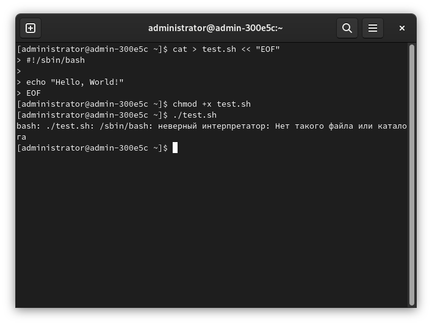
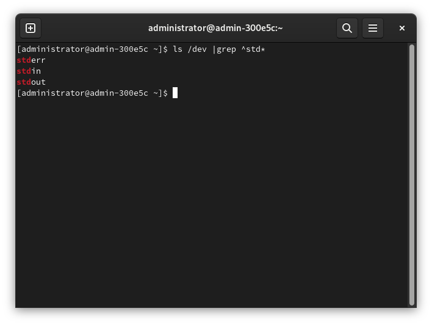

# Использование BASH для написания простых скриптов

Доброго времени суток! [Первая статья](jq.md) об этом интерпретаторе вышла на тему парсинга JSON, но я очень давно планировал написать материал, в кратком формате описывающий основы использования bash, поэтому вот очень небольшая часть из этих планов.

## Запуск скриптов

Файлы с bash-скриптами содержатся в файлах с расширением `*.sh`, хотя в UNIX понятие "расширение" не используется для определения типа файла.

### Пару слов о правах доступа

Для того, чтобы запустить какой-либо файл как программу, требуется выдать этому файлу право запуска. Если его нет, то оболочка выдаст ошибку ***отказано в доступе***.

Для изменения прав доступа к файлам используется программа `chmod`. Для того, чтобы выдать право исполнения файла требуется ввести:

```bash
chmod +x $FILE
```

Где `$FILE` - имя нужного файла.

`+` означает включение определённого права, а `x` - право исполнения (от слова `eXecutable`).

Далее по тексту не буду заострять на этом внимания, так как разбор прав доступа к файлам в UNIX - это не тема статьи, а тем, кто хочет узнать про это больше, рекомендую почитать [третью часть](/LinuxSovet/stats/LFS/LinuxStr3/LinuxStr3.md) статьи о строении GNU/Linux, где как раз написано об этом.

### Пару слов о sha-bang

Кроме того, в первую строку файла вставляется последовательность, именуемая *шебангом*. Шебанг содержит путь до интерпретатора, с помощью которого требуется запустить скрипт. Он не нужен в следующих случаях:

* Если скрипт запускается путём передачи нужному интерпретатору пути до этого скрипта, например:
```bash
bash /usr/local/bin/myscript.sh
```
* Если этот скрипт написан для того интерпретатора, который установлен по умолчанию для пользователя, от имени которого запускается скрипт.

Например, дан такой bash-скрипт:

```bash
#!/bin/bash

echo -n "Enter your name: "
read name

echo "Hello, $name !"
```

И запускается он следующей командой:

```bash
./myscript.sh
```

Здесь `./` означает путь до файла скрипта, означающий, что он находится в текущей рабочей директории. Для того, чтобы запустить какой-либо исполняемый файл (программу или скрипт, не важно), директория, в которой он находится, должна содержаться в переменной `$PATH`. В случае, если директории, в которой содержится необходимый для запуска файл, нет в `$PATH`, то нужно либо добавить её туда (плохой способ), либо просто указать путь до файла.

### Особенности использования sha-bang

От системы к системе вид шебангов может незначительно изменяться. Например, в большинстве UNIX-систем, в том числе и в GNU/Linux, шебанг будет выглядеть так:

```bash
#!/путь/до/интерпретатора
```

Но в некоторых системах семейства *BSD вид будет таким:

```bash
#! /путь/до/интерпретатора
```

Кроме того, следите за тем, чтобы в шебанге был указан правильный путь до интерпретатора, т.е., чтобы по указанному пути он существовал, иначе вызовется следующая ошибка:



Как видно из скриншота, шебанг имеет вид `#!/sbin/bash`, а `bash`'a там нет, так как он содержится в директории `/bin/`.

Кроме того, не стоит путать шебанги с комментариями. Различие в том, что шебанг, грубо говоря, указывает оболочке, какой интерпретатор использовать при выполнении скрипта, а так же он содержится в первой строке файла. Если он будет где-то на других строках, то он будет уже обычным *комментарием*.

## Потоки данных



### `stdout` 1

Стандартный поток вывода данных для программ. К примеру, команда `ls` выводит список файлов и директорий именно в этот поток.

### `stderr` 2

Поток вывода ошибок. Если программа (конечно же, нормальная, а не кривая) возвратила ошибку, то она пишет сообщение об этом именно сюда. Например, когда программа `killall` не находит нужный процесс для "убийства", то сообщение об этом пишет сюда.

### `stdin` 0

Поток ввода данных. Для терминала *стандартный ввод* - это клавиатура. Некоторые команды bash/программы принимают ввод из `stdin`, если в командной строке не указан файл или что-то прочее, откуда следует брать данные. Например, `cat`.

### Cтандартные дескрипторы файлов

Как известно, в UNIX всё есть файл, и GNU/Linux - не исключение. Файлы, в том числе, ввод и вывод также (см. фото выше). Операционная система идентифицирует файлы с использованием дескрипторов.

Каждому процессу позволено иметь до девяти открытых дескрипторов файлов.

Рядом с именами потоков вы видели номера (0, 1, 2). Оболочка bash резервирует первые три дескриптора с этими идентификаторами:

- 0, он же `stdin` - standart input - стандартный поток ввода;
- 1, `stdoutput` - standart output - стандартный поток вывода;
- 2, `stderr` - standart error - стандартный поток ошибок.

## Перенаправление потоков

У пользователя во время написания своих скриптов по каким-то причинам может возникнуть потребность в перенаправлении обычных сообщений (`stdout`) и сообщений об ошибках (`stderr`). Например, перенаправление в файл. Это может быть полезным при организации логирования (журналирования) скрипта.

Для этого используются команды перенаправления для соотв. дескрипторов с указанием файлов или команд, куда должны перенаправляться сообщения. Например:

```bash
killall sdfgsdghsdg 2> ./killall.log
```

Здесь `sdfgsdghsdg` - специально допущенная мною абракадабра путём рандомного нажатия пальцев по клавиатуре 😁️. Просто для того, чтобы спровоцировать ошибку. С помощью `2>` я перенаправил вывод `killall` сообщения об ошибке из `stderr` в файл `./killall.log`. Уберите двойку из команды и посмотрите на результат:

```bash
killall sdfgsdghsdg 2> ./killall.log
```

Или вот:

```bash
ls -l / > ./ls.log
```

Здесь я перенаправил вывод `ls -l /` из `stdout` в файл `./ls.log`.

Если надо перенаправить выводы в `stderr` и `stdout` куда-то, например, в один и тот же файл, можно воспользоваться `&>`.
