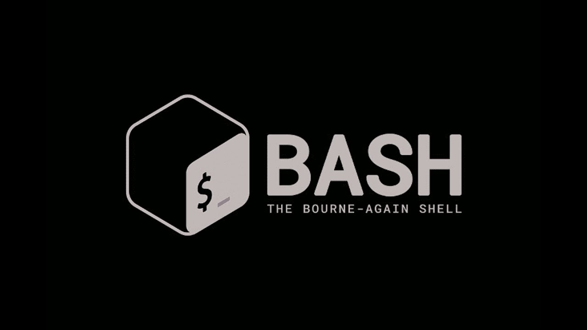

# Использование BASH для написания скриптов. Часть 2.

Доброго времени суток! В [первой части](README.md) рассмотрел несколько базовых конструкций BASH, а именно: ввод/вывод информации, перенаправление и конструкции ветвления и выбора. Сейчас же будет рассмотрено ещё несколько конструкций, часто используемых не только в BASH, но и в других командных оболочках.

## Содержание
