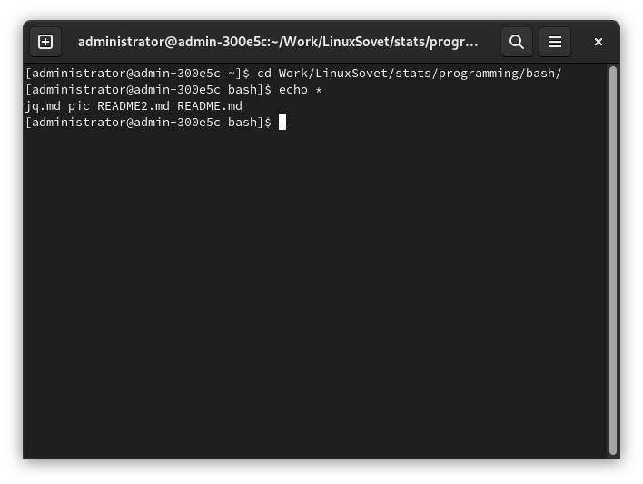
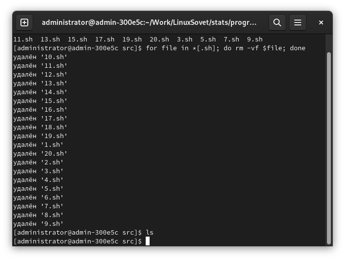
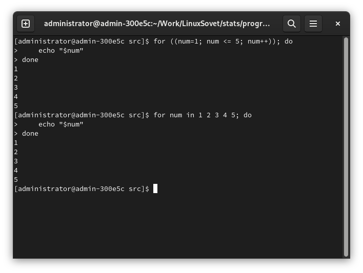

# Использование BASH для написания скриптов. Часть 2.

[Статьи](../../stats.md)

<pre>
<strong>Автор:</strong> <a href="/LinuxSovet/Group/authors.d/Linuxoid85.html">Михаил Краснов</a>
<strong>Дата написания:</strong> 00.00.0000 00:00
</pre>


Доброго времени суток! В [первой части](README.md) рассмотрел несколько базовых конструкций BASH, а именно: ввод/вывод информации, перенаправление и конструкции ветвления и выбора. Сейчас же будет рассмотрено ещё несколько конструкций, часто используемых не только в BASH, но и в других командных оболочках.

## Содержание

- 1 Циклы
    - 1.1. for
        - 1.1.1. Цикл for с двумя параметрами в каждом из эл-тов списка

## 1. Циклы

*Цикл* - блок команд, выполняющийся многократно, пока истинно определённое условие, либо пока не будет выполнено условие выхода из цикла.

### 1.1. `for`

`for` - одна из самых распространённых разновидностей циклов. Синтаксис:

```bash
for ЗНАЧЕНИЕ in [СПИСОК ЗНАЧЕНИЙ]; do
    КОМАНДЫ
done
```

Например:

```bash
for arg in "Debian" "RHEL" "Slackware" "Gentoo" "Ubuntu"; do
    if [ "$arg" -eq "Ubuntu" ]; then
        echo "$arg - вредоносный дистрибутив. Не используйте его."
    else
        echo "$arg - хороший дистрибутив
    fi
done
```

**1.1.1. Цикл `for` с двумя параметрами в каждом из эл-тов списка.**

```bash
for distro in "Debian 93" "Slackware 93" "Gentoo 02" "Ubuntu 04"; do
    set -- $distro  # Разбиение $distro на множество позиционных параметров
                    # Разбита на $1 и $2

    echo "Дистрибутив $1 был создан в $2 году"
done
```

**1.1.2. Обработка файлов в цикле `for`.**

Вывод информации о каждом файле:

```bash
# * - список всех файлов в $PWD (или $(pwd), как считаете нужным).
# 'do' перенесён на новую строку для читабельности
for file in *
do
    file $file
done
```



Удаление файлов по определённому шаблону:

```bash
# Удаление файлов, заканчивающихся на '.sh': конструкция *[.sh]
for file in *[.sh]; do
    rm -vf $file
done

# Удаление файлов, начинающихся на 'READ': конструкция [READ]*
for file in [READ]*; do
    rm -vf $file
done

# Сделайте и другие примеры с использованием подобной конструкции
```



**1.1.3. Подстановка команд.**

Кроме того, можно подставлять значения списка в цикл `for`:

```bash
DISTROS="debian ubuntu rhel slackware gentoo arch crux"

for distro in `echo $DISTROS`; do
    echo "$distro"
done
```

**1.1.4. Си-подобный синтаксис.**

```bash
# Синтаксис bash
for num in 1 2 3 4 5; do
    echo "$num"
done

# Си-подобный синтаксис
for ((num=1; num <= 5; num++)); do
    echo "$num"
done
```


