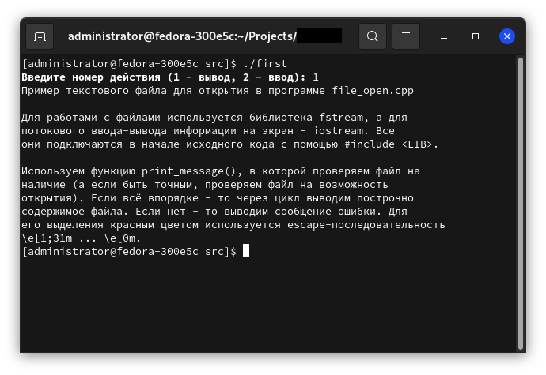
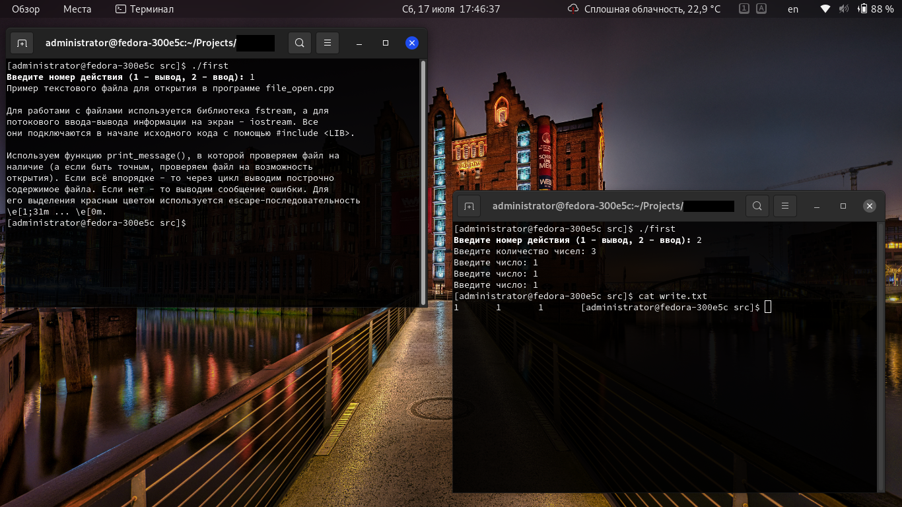

# Пример работы с файлами в C++

Рано или поздно у любого человека, пишущего на С++ (да и на другом ЯП) может возникнуть потребность в работе с файлами. Либо писать информацию в них, либо выводить содержимое файла. В данной статье будет рассмотрена работа с библиотекой `fstream`.

Для работы с файлами используются специальные типы данных, называемые *потоками*. Поток `ifstream` служит для работы с файлами в режиме чтения, а `ofstream` в режиме записи. Для работы с файлами в режиме как записи, так и чтения служит поток `fstream`.

## Вывод содержимого текстового файла

Вывод содержимого файла на экран может пригодиться в нескольких случаях. Например, чтобы не писать в исходном коде очень много строк с выводом длинных сообщений - намного проще записать их в отдельный файл. А если сообщения вдруг изменятся - не нужно производить перекомпиляцию программы.

Для вывода текстового файла используется следующий алгоритм:

* Объявляется переменная строкового типа (`string`), в которой будет "храниться" содержимое текстового файла.
* Открыть файл.
* Считать информацию из файла.
* **Обязательно** закрыть его.

Для начала создадим какой-либо текстовый файл:

```bash
cat > file.txt << "EOF"
Пример текстового файла для открытия в программе file_open.cpp

Для работами с файлами используется библиотека fstream, а для
потокового ввода-вывода информации на экран - iostream. Все
они подключаются в начале исходного кода с помощью #include <LIB>.

Используем функцию print_message(), в которой проверяем файл на
наличие (а если быть точным, проверяем файл на возможность
открытия). Если всё впорядке - то через цикл выводим построчно
содержимое файла. Если нет - то выводим сообщение ошибки. Для
его выделения красным цветом используется escape-последовательность
\e[1;31m ... \e[0m.
EOF
```

На самом деле, содержимое файла может быть любым. Запишите нужное между строками:
```bash
cat > file.txt << "EOF"

 ...

EOF
```

Всё содержимое:
```c++
/*
 * Проект, демонстрирующий работу с библиотекой fstream
 */
#include <iostream>
#include <fstream>
using namespace std;

// Функция для открытия файла
void print_text() {
    string line; /*
		  * Объявление переменной line строкового типа,
		  * в которой будет находиться содержимое файла
		  */

    ifstream file("file.txt");
    
    // Проверка на наличие файла
    if (file.is_open()) {
        while (getline(file, line)) {
            cout << line << endl; // Вывод информации из текста
        }
    } else {
        cout << "\a\e[1;31mОШИБКА: файл \e[0m\e[35mhello.txt\e[0m\e[1;31m не существует!\e[0m\n";
        exit(1); // Завершение программы с кодом ошибки 1
    }
    file.close(); // Закрытие файла
}

int main() {
    print_text();
    return 0;
}
```

Для того, чтобы прочитать содержимое из файла, нужно объявить несколько переменных. Первая, типа `string`, будет выводиться на экран с помощью `cout` из библиотеки `iostream`, а вторая, типа `ifstream`, будет использоваться для прочтения файла.

```c++
string line;
ifstream file("file.txt");
```

После чего проверяем файл на то, что его удалось открыть:

```c++
if (file.is_open()) {
	...
} else {
	cout << "ERROR\n";
	exit(1);
}
```

Здесь мы используем оператор `is_open`. Если он возвратил `true`, то выполняет действия, отмеченные многоточием (`...`). Если нет (`false`), то выводит сообщение об ошибке и завершает свою работу с кодом ошибки `1` (`exit(1);`).

Теперь то, что подставляется вместо многоточия. Это вывод содержимого файла:

```c++
while (getline(file, line)) {
	cout << line << endl;
}
```

Здесь содержимое строки из `file` присваивается переменной `line`. И после выводится на экран с помощью `cout`. После чего операция повторяется до тих пор, пока все строки в файле не закончатся.

После выполнения всех этих операций файл нужно **обязательно** закрыть:

```c++
file.close();
```

Всё это содержится в функции `print_text()`.

Собственно, всё понятно по комментариям. Вы могли заметить ненужное объявление функции `print_text()`. Да, можно всё сделать в `main()`, но в будущем программа станет "умнее". В неё добавится ещё несколько функций, а `main()` заметно расширится.

Скомпилируйте программу с помощью `g++`, например так:

```bash
g++ CODE.cpp -o CODE
```

Для запуска выполните:

```bash
./CODE
```

`CODE` замените на нужный файл.


## Запись информации в файл

Теперь поинтереснее. Запись в файл. Объявите функцию `write_text()`:

```c++
void write_text() {
	int i, num;
	double a;
	ofstream file("write.txt");
```

Теперь задача. Записать в файл несколько вещественных чисел. Переменная `num` используется для хранения количества чисел, `a` - само число, а `i` - счётчик цикла.

```c++
	cout << "Введите количество чисел: ";
	cin >> n;
	
	for (i = 0; i < n; i++) {
		cout << "Введите число: ";
		cin >> a;
		
		file << a << "\t"; // Запись числа в файл
	}
	
	file.close(); // Закрытие файла
}
```

Процедура `file << a << "\t";` записывает в файл число, потом ставит знак табуляции (здесь escape-последовательность `/t` для этого).

Полный исходный код полученной функции:
```c++
void write_text() {
	int i, num;
	double a;
	
	ofstream file("write.txt");
	cout << "Введите количество чисел: ";
	cin >> num;
	
	for(i = 0; i < num; i++) {
		cout << "Введите число: ";
		cin >> a;
		
		file << a << "\t"; // Запись числа в файл
	}
	
	file.close(); // Закрытие файла
}
```

Теперь нужно вставить это в исходный код. До или после функции `print_text()` - дело ваше. Теперь расширим функцию `main()` для того, чтобы можно было выбирать нужное действие: вывод содержимого файла, либо запись в него.

```c++
int main() {
	int run; // Объявление переменной, содержащей номер нужного действия
	
	cout << "\e[1mВведите номер действия (1 - вывод, 2 - ввод):\e[0m ";
	cin >> run;
	
	switch(run) {
		case 1:
			print_text();
			break;
		case 2:
			write_text();
			break;
		default:
			cout << "\e[1;31mОШИБКА: неправильно введена опция!\e[0m";
			exit(1);
	}
	
	return 0;
}
```

Полный исходный код теперь выглядит так:

```c++
/*
 * Проект, демонстрирующий работу с библиотекой fstream
 */
#include <iostream>
#include <fstream>
using namespace std;

// Функция для открытия файла со справкой
void print_text() {
    string line; /*
		  * Объявление переменной line строкового типа,
		  * в которой будет находиться содержимое файла
		  */

    ifstream file("file.txt");
    
    // Проверка на наличие файла
    if (file.is_open()) {
        while (getline(file, line)) {
            cout << line << endl; // Вывод информации из текста
        }
    } else {
        cout << "\a\e[1;31mОШИБКА: файл \e[0m\e[35mfile.txt\e[0m\e[1;31m не существует!\e[0m\n";
        exit(1); // Завершение программы с кодом ошибки 1
    }
    file.close(); // Закрытие файла
}

// Функция для записи информации в файл
void write_text() {
	int i, num;
	double a;
	
	ofstream file("write.txt");
	cout << "Введите количество чисел: ";
	cin >> num;
	
	for(i = 0; i < num; i++) {
		cout << "Введите число: ";
		cin >> a;
		
		file << a << "\t"; // Запись числа в файл
	}
	
	file.close(); // Закрытие файла
}

int main() {
	int run; // Объявление переменной, содержащей номер нужного действия
	
	cout << "\e[1mВведите номер действия (1 - вывод, 2 - ввод):\e[0m ";
	cin >> run;
	
	switch(run) {
		case 1:
			print_text();
			break;
		case 2:
			write_text();
			break;
		default:
			cout << "\e[1;31mОШИБКА: неправильно введена опция!\e[0m";
			exit(1);
	}
	
	return 0;
}
```

Пример работы:



Здесь программа спрашивает номер действия (введён 1), после чего выполняет функцию `print_text()`.



Здесь в первом терминале тоже самое, что и на предыдущем скриншоте, а на втором терминале (справа внизу) демонстрация работы функции `write_text()`. После чего вывод файла `write.txt` с помощью утилиты `cat`.

## Дополнение
Теперь мне захотелось усовершенствовать программу. Чтобы она принимала в качестве аргумента нужное действие (вывод содержимого на экран, либо редактирование файла), а так же имя нужного файла, так как прописывать его в самой программе западло.

И тут загвоздка. Хочу использовать в качестве аргументов действий программы строковый тип данных (чтобы можно было использовать аргументы `print` и `write`), но `switch` не поддерживает этот тип. Можно использовать только числа. А мне это не нравится. На помощь пришёл [этот](https://github.com/Efrit/str_switch/blob/master/str_switch.h) заголовочный файл. Поэтому скачиваю его в ту же директорию, в которой находится файл с исходным кодом программы, и подключаю его:

```c++
#include "str_switch.h"
```

И полностью меняю функцию `main()`:

```c++
int main(int argc, char* argv[]) {
	SWITCH(argv[1]) {
		CASE("print"): // Вывод содержимого файла
			print_text(argv[2]);
			break;
		CASE("write"): // Ввод в файл
			write_text(argv[2]);
			break;
		DEFAULT:
			cout << "ОШИБКА: неправильно введена опция " << argv[1] << endl;
			exit(1);
	}
	
	return 0;
}
```

Я добавил возможность использования аргументов (`int argc, char* argv[])`), а так же использую аналог `switch` из новой библиотеки. Так же функции `print_text()` и `write_text()` обзавелись аргументами. Поэтому привожу их к следующему виду. Я добавляю переменные для аргументов в обе эти функции:

```c++
// Функция для открытия файла со справкой
void print_text(string text)

 ... 

// Функция для записи информации в файл
void write_text(string text)
```

Здесь используется переменная `text` типа `string`. Это второй аргумент программы (в функции `main()` ему передаётся значение переменной `argv[2]`).

Теперь содержимое этих функций по отдельности:

```c++
// Функция для открытия файла со справкой
void print_text(string text) {
	/***********************************************
	 * Объявление переменной line строкового типа, *
	 * в которой будет находиться содержимое файла *
	 **********************************************/
	string line;

	ifstream file(text);
    
	// Проверка на наличие файла
	if (file.is_open()) {
		while (getline(file, line)) {
			cout << line << endl; // Вывод информации из текста
		}
	} else {
		cout << "\a\e[1;31mОШИБКА: файл \e[0m\e[35m" << text << "\e[0m\e[1;31m не существует!\e[0m\n";
		exit(1); // Завершение программы с кодом ошибки 1
	}
	file.close(); // Закрытие файла
}

// Функция для записи информации в файл
void write_text(string text) {
	int i, num;
	string a;
	
	ofstream file(text, ios_base::app);
	
	cout << "Введите количество строк: ";
	cin >> num;
	
	for(i = 0; i < num; i++) {
		cin >> a;
		file << a << "\n"; // Запись числа в файл
	}
	
	file.close(); // Закрытие файла
}
```

В функции `write_text()` слегка изменился оператор `ofstream`. Добавился аргумент `ios_base::app`. Он нужен для того, чтобы не затирать содержимое файла до записи в него при его открытии, а записывать новые значения в конец (если этот файл уже существует). Так же я удалил строку `cout << "Введите число: ";`, так как она больше не нужна.

Если вы хотите изменить поведение `ofstream`, то замените `ios_base::app` на нужное вам из таблицы ниже:

| Аргумент           | Значение                                         |
|:------------------:|:-------------------------------------------------|
| `ios_base::in`     | Открыть файл только для чтения                   |
| `ios_base::out`    | Открыть файл для записи                          |
| `ios_base::ate`    | При открытии переместить указатель в конец файла |
| `ios_base::app`    | Открыть файл для записи в его конец              |
| `ios_base::trunc`  | Если файл существует, то затереть его содержимое |
| `ios_base::binary` | Открыть файл в двоичном режиме                   |

И всё вместе выглядит так:

```c++
/*
 * Проект, демонстрирующий работу с библиотекой fstream
 */
#include <iostream>
#include <fstream>
#include "str_switch.h"
using namespace std;

// Функция для открытия файла со справкой
void print_text(string text) {
	/***********************************************
	 * Объявление переменной line строкового типа, *
	 * в которой будет находиться содержимое файла *
	 **********************************************/
	string line;

	ifstream file(text);
    
	// Проверка на наличие файла
	if (file.is_open()) {
		while (getline(file, line)) {
			cout << line << endl; // Вывод информации из текста
		}
	} else {
		cout << "\a\e[1;31mОШИБКА: файл \e[0m\e[35m" << text << "\e[0m\e[1;31m не существует!\e[0m\n";
		exit(1); // Завершение программы с кодом ошибки 1
	}
	file.close(); // Закрытие файла
}

// Функция для записи информации в файл
void write_text(string text) {
	int i, num;
	string a;
	
	ofstream file(text, ios_base::app);
	
	cout << "Введите количество строк: ";
	cin >> num;
	
	for(i = 0; i < num; i++) {
		cin >> a;
		file << a << "\n"; // Запись числа в файл
	}
	
	file.close(); // Закрытие файла
}

int main(int argc, char* argv[]) {
	SWITCH(argv[1]) {
		CASE("print"): // Вывод содержимого файла
			print_text(argv[2]);
			break;
		CASE("write"): // Ввод в файл
			write_text(argv[2]);
			break;
		DEFAULT:
			cout << "ОШИБКА: неправильно введена опция " << argv[1] << endl;
			exit(1);
	}
	
	return 0;
}
```

Синтаксис прост:

```bash
CODE <OPTION> <FILE>
```

Замените `CODE` на имя полученного бинарника, `<OPTION>` на нужную опцию, а `<FILE>` - на нужный файл.

Опций всего две:
* `print` - вывести содержимое файла на экран;
* `write` - записать в файл какое-либо содержимое.
