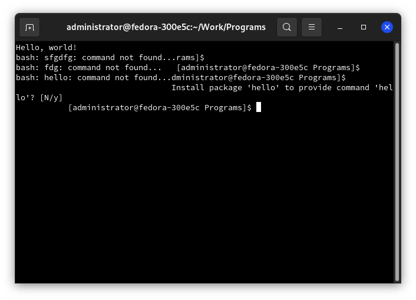
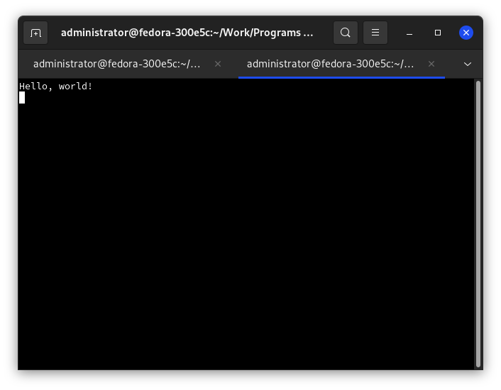

# Hello, World!

В данной статье напишем простейшую программу, способную выводить текстовое сообщение на экран.

```cpp
#include <ncurses.h>

int main() {
	initscr();                  /* Переход в curses-режим */
	printw("Hello, World!\n");  /* Вывод сообщения в буфер */
	refresh();                  /* Вывод сообщения на экран */
	getch();                    /* Ожидание нажатия пользователем какой-либо клавиши */
	endwin();                   /* Выход из curses-режима. В нашем случае, вывод программы будет очищен с экрана */
	return 0;
}
```

## Описание новых параметров

* `#include <ncurses.h>` - подключение заголовочного файла `ncurses`, в котором объявлены функции и константы библиотек. Без этого файла ничего работать не будет.
* `initscr();` - переход в `curses-режим`, при котором очищается экран, выделяется память под необходимые данные и инициализируется окно `stdscr`. В некоторых случаях функция может завершиться с ошибкой, например, если не хватило памяти. Но на 2021 год это большая редкость.
* `printw(...);` - выводит сообщение в буфер. Эта функция аналогична `printf()`, но последняя не работает в curses-режиме.
* `refresh();` - проверяет буфер, если там что-то есть, отправляет на экран. Вызов не обязателен, хотя советуется.
* `getch();` - ожидает нажатия любой клавиши на экран, после чего возвращает её код.
* `endwin();` - выход из curses-режима. Если пропустить эту функцию, то терминал будет работать некорректно. Например, вы не сможете увидеть вводимые вами символы. Смотреть скриншот ниже.



## Сборка и запуск
Для того, чтобы скомпилировать программу, используйте:

```bash
gcc $SOURCE -o $BINARY -lncurses
```

Замените:
* `$SOURCE` на файл с исходным кодом программы;
* `$BINARY` на имя бинарника.

Например:

```bash
gcc first.cpp -o firsh -lncurses
```

Запуск:

```bash
./$BINARY
```

Замените `$BINARY` на имя бинарника. Например:

```bash
./first
```

Вывод:



***

[Назад - установка](../installation.md)

[Далее - режим работы терминала](ncurses2.md)
