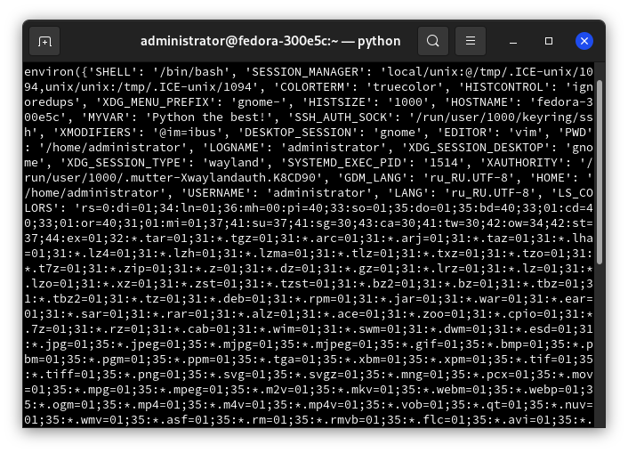

# Получение значений переменных bash в Python

<pre>
Дата написания статьи: 09.09.2021 19:20
Автор: Михаил Краснов
</pre>

Понадобилось сегодня мне получить значение какой-то переменной (пусть будет `MyVar`) BASH в скрипте Python. Применений может быть множество. Например, получение доступа к PATH (не путать с `sys.path` в Пайтоне). Либо к любым другим переменным окружения, в которых могут храниться настройки программы, либо ещё какие-то данные.

Как всегда, всё просто. `environ` из модуля `os` может работать с переменными BASH довольно просто. Рассмотрим на примере скрипта:

```python
#!/usr/bin/python3

import os

print(os.environ.get('PATH'))
```

Вывод `os.environ.get(variable)` выведен на экран.

`os.environ` ведёт себя как словарь Python, поэтому могут быть выполнены все стандартные операции со словарём (например, `get` и `set`). Так же можно изменить значение `os.environ`, но изменения будут доступны только для текущего процесса. Навсегда они не применятся.

**Пример 1**. Введите в терминале:

```bash
MyVar="Python the best!"

# Проверка:
echo $MyVar
```

Теперь (python):

```python
>>> import os
>>> os.environ['MyVar']
'Python the best!'
```

**Пример 2**. `os.environ['HOME']`. Выведет значение переменной окружения `$HOME`.

Эквивалентно `getenv("HOME")` в C.

**Пример 3**. *Получаем список переменых*. Обращение к `os.environ` (без каких-либо аргументов и указания элементов) выведет не только установленные в текущем сеансе переменные, но и алиасы.



> **ВАЖНОЕ ЗАМЕЧАНИЕ**

> Изменения в переменных во время работы нашего скрипта с `os.environ.*()` невозможно будет зафиксировать, за исключением изменений, внесённых путём непосредственного изменения с помощью `os.environ`.

## `os.environb`

"Байтовая" версия: переменные отображаются в виде байтовых строк. В отличие от предыдущего `environ`, `environ` так же отслеживает изменения переменных извне во время работы скрипта.

`environb` доступен только если `supports_bytes_environ` имеет значение `True`.

## Смотрите так же:

* [Документация модуля os](https://docs.python.org/3/library/os.html)
* `help(os)`
