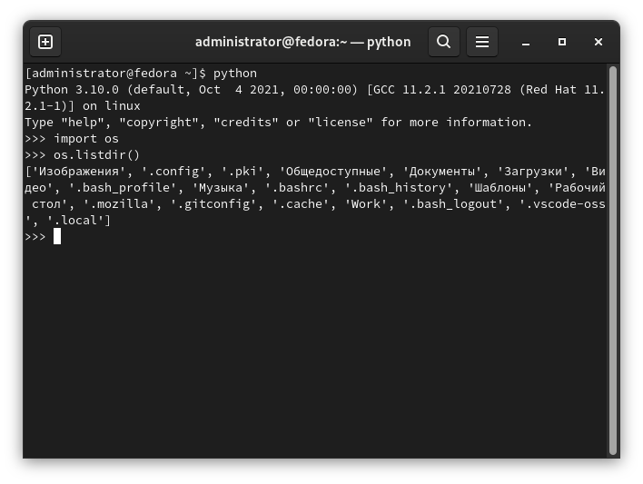
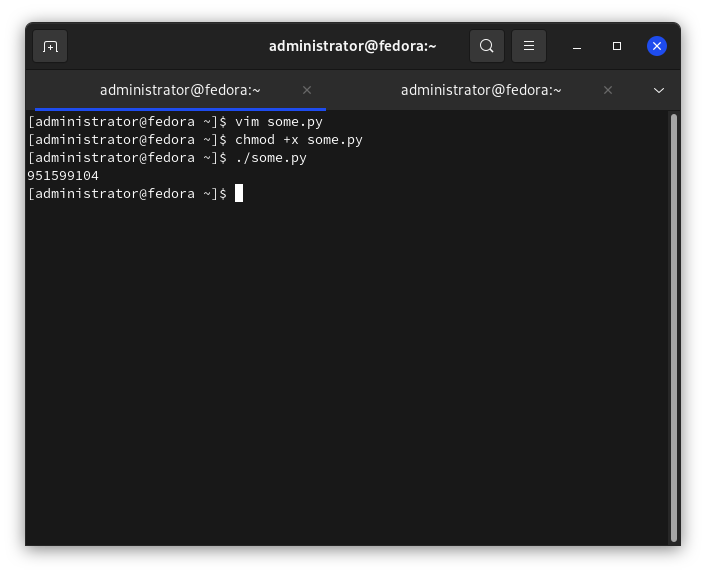

# Перенос и копирование файлов

[Статьи](../../stats.md) > Программирование > [Python](../README.md) > [Работа с файлами](README.md)

<pre>
<strong>Автор:</strong> <a href="/LinuxSovet/Group/authors.d/Linuxoid85.html">Михаил Краснов</a>
<strong>Дата написания:</strong> 10.10.2021 00:00
</pre>

Перенос и копирование файлов - одни из самых главных знаний. В данной статье пойдёт речь о просмотре содержимого каталога, копировании и переносе файлов и директорий.

## Содержимое директории

Для просмотра содержимого директории используется функция `listdir()` из модуля `os`:

```python
#!/usr/bin/python3

import os

os.listdir()
```

Синтаксис `os.listdir()`:

```python
os.listdir("Директория, содержимое которой вывести в stdout")
```

Если аргумент для `listdir()` не указан, то будет выведено содержимое текущего рабочего каталога:



## Получение размера файла

**Способ 1.** Для определения точного размера файла можно с помощью `getsize()` из модуля `os`. Эта функция возвращает величину файла в байтах.

```python
#!/usr/bin/python3

import os

# Вывод размера файла some.txt
print(os.path.getsize("./some.txt"))
```

Например, такой вывод:



**Способ 2.** Размер файла можно вычислить и с помощью `seek()`, но это немного сложнее. Этой функции требуется передать в качестве параметра область для чтения данных от начала и до конца. Поэтому нужно вызвать `tell()` через ссылку на текстовый файл. Выглядеть это будет примерно так:

```python
#!/usr/bin/python3

import os

with open("./some.txt", "r") as f:
	f.seek(0, os.SEEK_END)
	print(f.tell())
```

Вывод будет таким же, поэтому не думаю, что стоит его показывать снова.

## Проверка наличия определённого файла

Функции для проверки файла на существование представлены в классе `os.path()`.

### Тип файла не определён

Для этого используется функция `os.path.exists()`:

```python
#!/usr/bin/python3

import os

if os.path.exists("./some.json"):
	print("Файл существует")
else:
	print("Файл не существует!")
	exit(1)
```

### Обычный файл

Для этого используется `os.path.isfile()`:

```python
#!/usr/bin/python3

import os

if os.path.isfile("./some.json"):
	print("Файл существует")
else:
	print("Файл не существует!")
	exit(1)
```

### Директория

Для этого используется `os.path.isdir()`:

```python
#!/usr/bin/python3

import os

if os.path.isdir("./some"):
	print("Директория существует")
else:
	print("Директория не существует")
	exit(1)
```

## Создание файла

Для создания простого файла можно использовать следующую конструкцию:

```python
f = open("file", "x")
f.close()
```

`x` используется для более безопасного создания файла: в случае, если создаваемый файл *уже* существует, будет выдано исключение `FileExistsError`. Например, если использовать `w` или `a`, то файл будет перезаписан, либо в него будут добавлены в будущем ненужные данные. Конечно, можно использовать конструкцию `is os.path.isfile("file")...`, но это усложнит код.

## Создание директории

Для создание директории (без дополнительных вложенных поддиректорий) используется функция `os.mkdir()`. Если по указанному пути уже существует файл директория, то эта функция вызовет исключение.

Если вам нужно создать сразу несколько вложенных директорий, то используйте функцию `os.makedirs()`.

```python
#!/usr/bin/python3

import os

try:
	os.makedirs("./dir1/dir2/dir3")
except:
	print("Ошибка во время создания директорий")
	exit(1)
```

## Переименование файлов

Для переименования (внезапно) есть отдельная функция в модуле `os`. Называется `rename()`. В качестве аргументов она принимает старое и новое названия файла. Например, переименую `some.txt` в `file.txt`:

```python
#!/usr/bin/python3

import os

my_file = "./some.txt"

if os.path.isfile(my_file):
	os.rename(my_file, "./file.txt")
else:
	print("Файла {} не существует!".format(my_file))
	exit(1)
```

## Перемещение или переименование с помощью shutil

Для удобной работы с файлами используется встроенный модуль `shutil`. Этот модуль содержит функции для обработки файлов, групп файлов и директорий.

Далее я просто перечислю все необходимые функции и классы.

## Копирование файлов

`copyfile(src, dst)` - копирование содержимого (но не метаданных) файла `src` в файл `dst`. `dst` должен быть полным именем файла. Если этот файл существует, то он будет перезаписан.

`copymode(src, dst)` - копирование прав доступа из `src` в `dst`. Однако надо учитывать, что ни содержимое, ни владелец, ни группа не меняются.

`copystat(src, dst)` - копирование прав доступа, времени последнего доступа, изменения, флагов файла `src` в `dst`. Тоже самое, как и в предыдущем примере - содержимое, владелец и группа не меняются.

`copy(src, dst)` - копирование содержимого файла `src` в файл/папку `dst` (если в директорию, то в ней будет создан новый файл с тем же именем). Если использовать третий аргумент `follow_symlinks=False`, и `src` - ссылка, то и `dst` будет ссылкой. А если `follos_symlinks=True` и `src` - ссылка, то `dst` будет копия того файла, на который ссылкается `src`.

`copy(src, dst)` - тоже самое, но с копированием всех метаданных (по возможности).

`copytree(src, dst)` - рекурсивное копирование дерева директорий с корнем в `src`. Директория `dst` не должна существовать. Для этой функции возможно использование аргумента `ignore=...` для игнорирования каких-либо файлов. Например:

```python
#!/usr/bin/python3

import shutil

shutil.copytree(source, destination, ignore=ignore_patterns('*rpm', '*.tar', '1*'))
```

В данном примере копируются все файлы, кроме тех, кто оканчиваются на `*.rpm`, `*.tar`, или имеют в начале единицу.

`move(src, dst, copy_function=copy2)` - перемещает файл `src` в файл/директорию `dst`. Можно считать это ещё и переименованием, раз дело на то пошло. `copy_function` - какую функцию использовать для копирования.

`chown(file, user="User", group="Group")` - изменить владельца файла `file` на пользователя (`user`) = "User" и группу (`group`) = "Group".

> Кроме этого, модуль `shutil` умеет работать с архивами, но это будет рассмотрено в других статьях.
