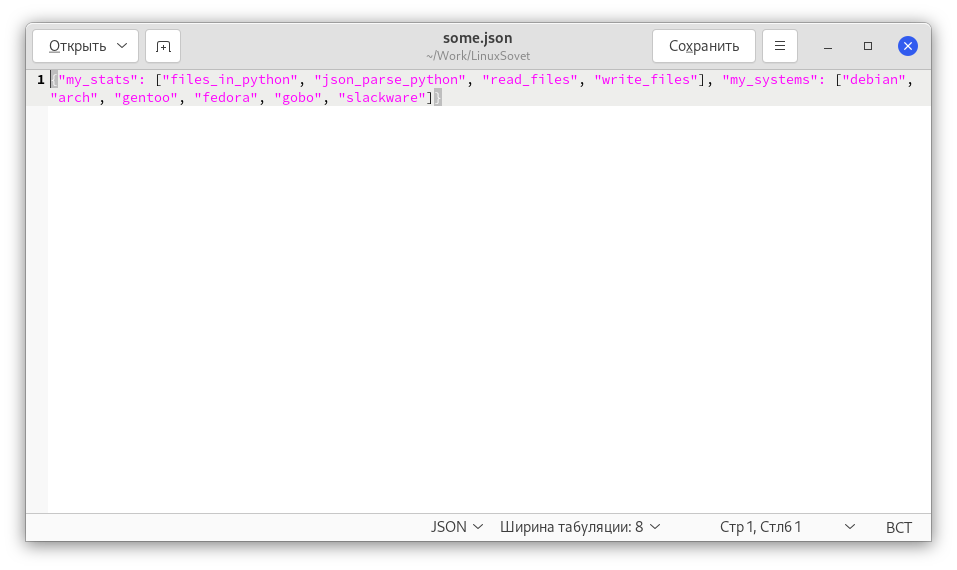
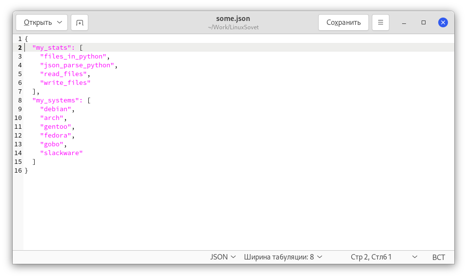

# Парсинг json

[Статьи](../../../stats.md) > Программирование > [Python](../README.md) > [Работа с файлами](README.md)

<pre>
<strong>Автор:</strong> <a href="/LinuxSovet/Group/authors.d/Linuxoid85.html">Михаил Краснов</a>
<strong>Дата написания:</strong> 10.10.2021 00:00
</pre>

JSON - формат обмена данными. Неплохо подходит для сериализации сложных структур ввиду своей простоты и лаконичности. Является подмножеством синтаксиса JavaScript, хотя независим от самогó языка.

## Введение

В данной статье я уделю синтаксис JSON в конце, а сейчас нужно познакомиться с тем, как выполнять обработку *.json.

В состав Python входит модуль `json` для кодирования и декодирования файлов одноимённого типа. Для того, чтобы начать работу с функциями из этого модуля, нужно его импортировать:

```python
import json
```

## Теория

### Сериализация и десериализация

Для хранения или передачи данных по сети используется термин под названием *сериализация*. Это трансформация данных в серию байтов для хранения и передачи. Понятно, что *десериализация* - процесс декодирования данных, которые хранятся в JSON.

### Сериализация

Для записи данных в файлы имеется метод `dump()`. Для записи данных не в файлы, а в строку, есть метод `dumps()`.

Для перевода объектов Python в JSON воспользуйтесь таблицей ниже.

| Python               | JSON     |
|----------------------|----------|
| `dict`               | `object` |
| `list`/`tuple`       | `array`  |
| `str`                | `string` |
| `int`/`long`/`float` | `number` |
| `True`               | `true`   |
| `False`              | `false`  |
| `None`               | `null`   |

### Простой пример

Например, вы работаете с каким-либо объектом Python в памяти, который выглядит примерно так:

```python
data = {
	"president": {
		"name": "Putin",
	}
}
```

Эту информацию нужно записать на диск. Например, так:

```python
#!/usr/bin/python3

import json

data = {
	"president": {
		"name": "Putin",
	}
}

# Записываем при помощи контекстного менеджера
with open("some.json", "a") as my_json:
	json.dump(data, my_json)
```

`dump()` принимает два аргумента: объект данных и файл, в который будет записана информация.

Способ 2 выглядит так:

```python
#!/usr/bin/python3

import json

data = {
	"president": {
		"name": "Putin",
	}
}

jsonData = json.dumps(data)
print(jsonData)
```

В данном случае заменил функцию `dump()` на `dumps()`, которая сериализует данные json в какую-либо переменную строкового типа. Потом полученную информацию можно будет записать в файл. Что-то по типу этой конструкции:

```python
f = open("./some.json", "a")

for index in jsonData:
	f.write(index)
```

#### Резюме

Для записи информации в формате JSON используются два метода:

* `json.dump()` - запись объектов Python в файл JSON;
* `json.dumps()` - возвращение строки в формате JSON, которую можно будет использовать в своих целях. Например, записать её в какой-либо файл.

### Десериализация

Для десериализации используются функции `load()` и `loads()` (как и в предыдущем примере, вторая для строк).

Для перевода данных из JSON в объекты Python воспользуйтесь таблицей из предыдущего примера.

### Простой пример

К примеру, есть файл `some.json` со следующим содержимым:

```json
{
	"name": "Михаил",
	"firstName": "Краснов",
	"age": 39,
	"hobbies": [
		"linux",
		"electrical engineering"
	],
	"distros": {
		"linux": [
			"debian",
			"fedora",
			"calmira"
		],
		"bsd": [
			"freebsd"
		]
	}
}
```

В данном примере так же я использовал некоторые массивы:

```json
"linux": [],
"bsd": []
```

И наш скрипт:

```python
#!/usr/bin/python3

import json

with open("some.json", "r") as my_json:
	data = json.load(my_json)

# Выводим какие-либо данные
print(data["name"])

# Через цикл выводим значение массива data["distros"]["linux"]
for distro in data["distros"]["linux"]:
	print(distro)
```

Как вы могли увидеть, в циклу `for distro in data["distros"]["linux"]` я вывел список элементов массива:

```json
"distros": {
	"linux": [
		"debian",
		"fedora",
		"calmira"
	],
	"bsd": [
		"freebsd"
	]
}
```

***
# Простые примеры

1. Преобразование объекта в строку формата JSON:
- Использование `json.dump()`:

```python
#!/usr/bin/python3

import json

# Статьи
stats_template = [
	'files_in_python', 'json_parse_python',
	'read_files', 'write_files'
]

# Дистрибутивы
systems_template = [
	'debian', 'arch', 'gentoo', 'fedora',
	'gobo', 'slackware'
]

# Нужное содержимое json-файла
json_file = {'my_stats': stats_template, 'my_systems': systems_template}

# Открытие some.json, в который
# отправятся нужные данные
with open("./some.json", "w") as f:
	json.dump(json_file, f)
```

Теперь прочитайте файл `some.json`. Примерное содержимое:



- Использование `json.dumps()`.

Для использования этой функции измените конструкцию:

```python
with open("./some.json", "w") as f:
	json.dump(json_file, f)
```

На следующую:

```python
with open("./some.json", "w") as f:
	f.write(json.dumps(json_file))
```

В итоге должно получиться следующее:

```python
#!/usr/bin/python3

import json

# Статьи
stats_template = [
	'files_in_python', 'json_parse_python',
	'read_files', 'write_files'
]

# Дистрибутивы
systems_template = [
	'debian', 'arch', 'gentoo', 'fedora',
	'gobo', 'slackware'
]

# Нужное содержимое json-файла
json_file = {'my_stats': stats_template, 'my_systems': systems_template}

# Открытие some.json, в который
# отправятся нужные данные
with open("./some.json", "w") as f:
	f.write(json.dumps(json_file))
```

Для небольших данных в JSON-файле этих скриптов вполне хватит. А если данных много? Такой формат записи будет нечитабельным! Поэтому нужно добавить аргументы `sort_keys` и `indent` к функциям `json.dump()` или `json.dumps()`:

```python
with open("./some.json", "w") as f:
	json.dump(json_file, f, sort_keys=True, indent=2)
```

Полученная программа будет выглядеть так:

```python
#!/usr/bin/python3

import json

# Статьи
stats_template = [
	'files_in_python', 'json_parse_python',
	'read_files', 'write_files'
]

# Дистрибутивы
systems_template = [
	'debian', 'arch', 'gentoo', 'fedora',
	'gobo', 'slackware'
]

# Нужное содержимое json-файла
json_file = {'my_stats': stats_template, 'my_systems': systems_template}

# Открытие some.json, в который
# отправятся нужные данные
with open("./some.json", "w") as f:
	json.dump(json_file, f, sort_keys=True, indent=2)
```

И вывод таким:



Подобный формат записи является более предпочтительным.

