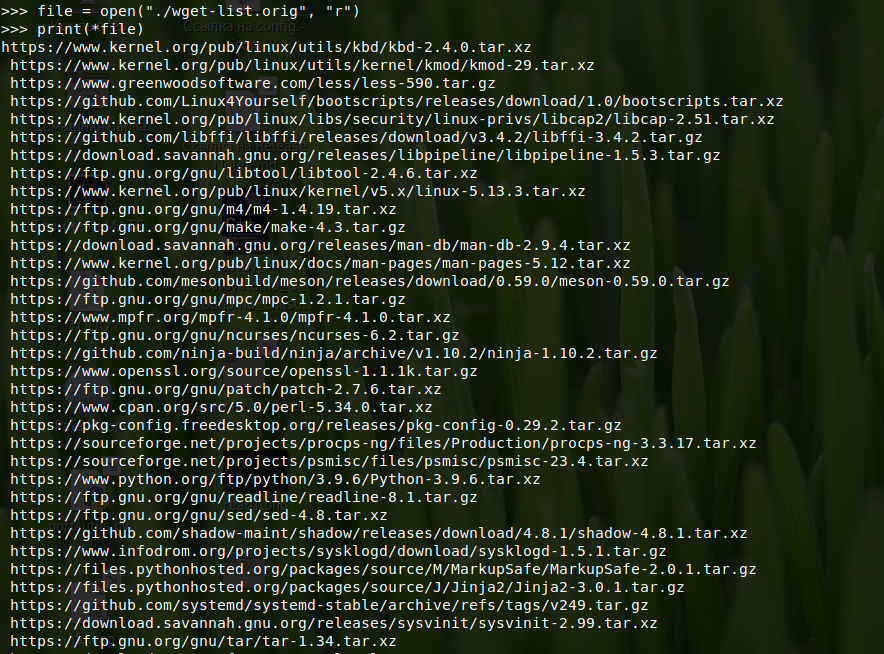
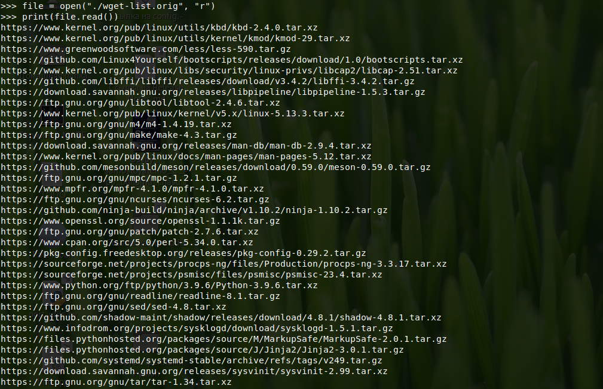
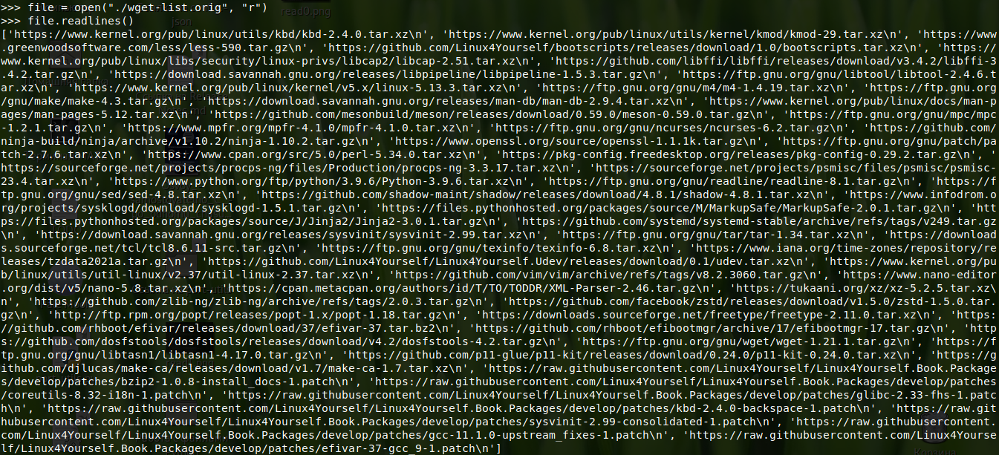

# Просмотр содержимого текстовых файлов

В данной статье речь пойдёт про самое простейшее - открытие файлов и их чтение. Способов несколько, но все они просты и понятны.

## Теория

Python различает два типа файлов:

- Текстовые;
- Бинарные.

Речь в основном про текстовые файлы, хотя и про бинарные тоже будет кое-что.

### Открытие файлов

Для того, чтобы работать с файлом (читать, редактировать), его нужно открыть. Для открытия предназначена функция `open()`. Её синтаксис:

```python
open("файл", "права доступа")
```

Режимов доступа несколько, все они перечислены в таблице ниже.

| Режим | Объяснение |
|-------|------------|
| `r`   | Чтение из файла. Используется по умолчанию, если второго аргумента `open()` не указано |
| `w`   | Только запись. Если файла не существует, то будет создан новый. Если файл существует и в нём записана какая-то информация, то она будет стёрта |
| `a`   | Так же запись, но с добавлением. Если указанного файла не существует, то будет создан новый, а если указанный файл присутствует в указанном месте, то он *не* будет предварительно очищен, новые данные будут в него *добавлены* |
| `t`   | Работа с текстовым файлом. Выбирается по умолчанию |
| `b`   | Работа с бинарным файлом |
| `x`   | Эксклюзивное создание, выдаст исключение `FileExistsError`, если файл уже существует |

Помимо этого, такие режимы можно комбинировать:

| Режим | Объяснение |
|-------|------------|
| `w+`  | Файл для чтения и записи |
| `rb`  | Бинарный файл только для чтения   |
| `rb+` | Бинарный файл для чтения и записи |

Пример использования:

```python
#!/usr/bin/python3

file = open("./some", "r")
```

Этот скрипт откроет файл `some`, находящийся в `./` только для чтения (`r`).

### Закрытие файлов

После работы с файлом его нужно **обязательно** закрыть. Это нужно для нескольких целей:

- Для освобождения ресурсов и очистки мусора;
- Для того, чтобы после работы с файлом в скрипте к нему не было повторного случайного (или умышленного) доступа (опять же в скрипте).

Для закрытия файла используется функция `close()`:

```python
#!/usr/bin/python

file = open("./some", "r")

# Какие-то действия с файлом #

file.close()
```

Синтаксис `close()`:

```python
file.close()
```

Где `file` - нужная переменная.

Прошу обратить ваше внимание на то, что при использовании менеджера контекста закрытие файла не требуется. Он закроется автоматически. Например:

```python
#!/usr/bin/python3

with open("./some", "r") as file:
    # Какие-то действия с файлом #

# Здесь закрытие уже не требуется!!!
```

## Вывод содержимого файла на экран

Для вывода содержимого файла (пусть текстового) есть несколько способов.

**Первый способ.** С помощью `print()`.

Дополним предыдущий скрипт:

```python
#!/usr/bin/python3

file = open("./some", "r")
print(*file)

file.close()
```

Здесь с помощью `print(*file)` вывели содержимое текстового файла в stdout. Если в файле только одна строка, то этот способ уместен, но когда в файле несколько строк, то первая строка будет отображаться как есть, а все остальные с небольшим смещением вправо.



Поэтому на помощь приходит следующий способ.

**Второй способ.** `read()`.

```python
#!/usr/bin/python3

file = open("./some", "r")
print(file.read())

file.close()
```

Здесь заменили `*file` на `file.read()`. Синтаксис `read()` прост:

```python
file.read(размер)
```

Где `file` - нужная переменная, а `размер` - число символов, которое нужно прочитать. Если не указывать этот аргумент, то файл будет выведен целиком.



**Третий способ**. `readline()`.

Если предыдущая `read()` предназначалась для чтения либо всего файла, либо нескольких символов, то эта функция используется для чтения строк. Например, в `./some` несколько строк:

```
Строка 1
Строка 2
Строка 3
```

И файл `read_line.py`:

```python
#!/usr/bin/python3

file = open("./some", "r")
file.readline(2) # Прочитать строку 2

file.close()
```

Синтаксис `readline()`:

```python
file.readline(строка)
```

Где `file` - нужная переменная, а `строка` - номер строки, которую нужно прочитать.

Для чтения всех строк замените `file.readline()` на `file.readlines()`:

```python
#!/usr/bin/python3

file = open("./some", "r")
file.readlines() # Прочитать все строки

file.close()
```

Прошу обратить ваше внимание на вывод этой функции.



**Четвёртый способ**. Так же построчный вывод, но с помощью цикла `for`.

Так же имеет место быть построчный вывод содержимого в stdout с помощью цикла `for`:

```python
#!/usr/bin/python3

file = open("./some", "r")

for line in file:
    print(line)

file.close()
```

**Заключительный способ**. Просто ради почти "круглой" цифры.

```python
#!/usr/bin/python3

# Использование менеджера контекста.
with open("./some", "r") as file:
    print(file.read())

# Действие для закрытия не требуется
```

Как и говорилось ранее, закрывать файл не нужно, если используется менеджер контекста. Он будет закрыт автоматически.
