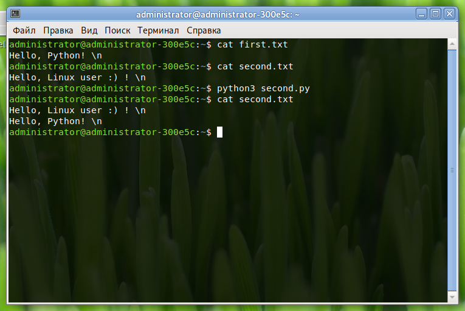

# Запись информации в текстовый файлы

[Статьи](../../stats.md) > Программирование > [Python](../README.md) > [Работа с файлами](README.md)

<pre>
<strong>Автор:</strong> <a href="/LinuxSovet/Group/authors.d/Linuxoid85.html">Михаил Краснов</a>
<strong>Дата написания:</strong> 07.10.2021 00:00
</pre>

Из прошлой статьи вы познакомились не только с чтением из файла, но и с основами работы с файлами. Здесь же речь пойдёт только о записи какой-либо информации в *текстовый* файл.

## Теория

Как следует из предыдущей статьи, примерный алгоритм работы с файлами таков:

- Открытие нужного файла с нужными правами доступа;
- Выполнение каких-либо действий с файлом (его чтение, запись, парсинг и пр.);
- Обязательное закрытие файла (кроме случаев работы с файлом с помощью менеджера контекста).

## Запись в файл

Для записи в файл используется функция `write()`. Синтаксис:

```python
file.write("Information")
```

Где `file` - нужная переменная, а `"Information"` - нужные данные, которые должны быть записаны в открытый файл `file`.

Пример:

```python
#!/usr/bin/python3

file = open("./some", "w")
file.write("Hello, World!") # Запись в файл
file.close()
```

В этом примере мы открыли файл с именем `some` (находящийся в ./) в режиме записи с предварительной очисткой файла. Если этого файла не существует, то будет создан новый.

Пример 2:

```python
#!/usr/bin/python3

with open("./some", "a") as file:
    file.write("Hello, LinuxSovet!")
```

В этом примере мы записываем в файл `./some` строку "Hello, LinuxSovet!". Закрытие файла не нужно, так как используется менеджер контекста.

Пример 3:

```python
#!/usr/bin/python3

# Открытие первого файла
first_f = open("first.txt", "r")
first_r = first_f.read() # Чтение файла

# Открытие второго файла
second_f = open("second.txt", "a")
second_r = second_f.write(first_r) # Запись информации из первого файла
# Запись в режиме добавления. Т.е., предыдущая
# информация из файла не сотрётся

# Закрытие файлов
first_f.close()
second_f.close()
```

Здесь открываются два файла: `first.txt` и `second.txt` в режиме чтения и записи соотв. Далее читаем файл `first_f` и пишем его содержимое в `second_f`.

Перед тем, как запускать этот скрипт, создайте два вышеуказанных файла и запишите какую-либо информацию в них. Прочитайте их после работы скрипта.


