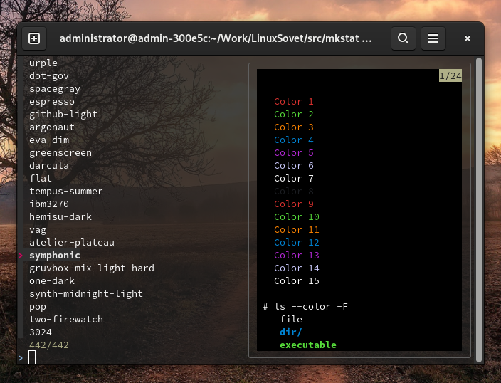
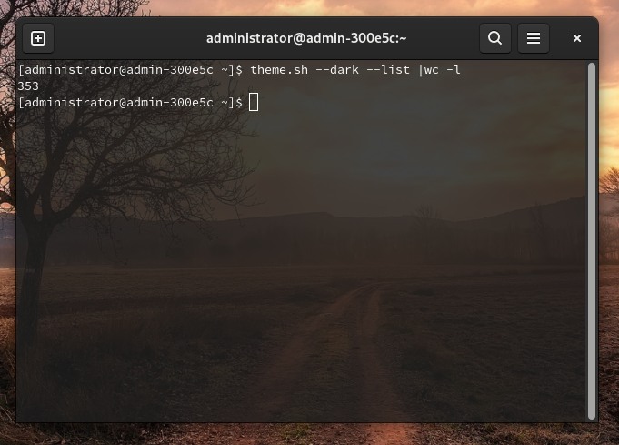
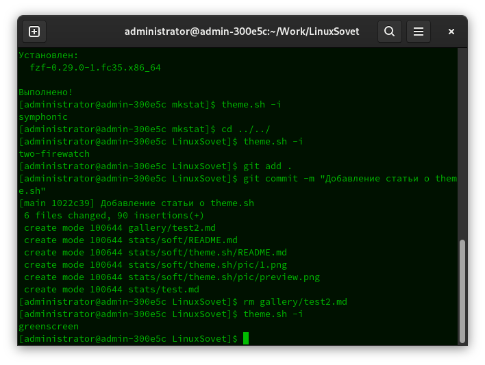

# Переключение цветовых схем в терминале GNOME с помощью theme.sh

[Статьи](../../stats.md) > [Софт](../README.md)

<a href="pic/preview.png"></a>

<pre>
<strong>Автор:</strong> <a href='/LinuxSovet/Group/authors.d/Linuxoid85.html'>Михаил Краснов</a>
<strong>Дата написания:</strong> 28.12.2021 16:32
</pre>

[theme.sh](https://github.com/lemnos/theme.sh) - интерактивный скрипт для быстрого изменения цветовых схем терминала. Вообще, он независим от терминала.

В поставку входит около 400 тем! Он может установить тему терминала напрямую или, если в вашей системе установлен fzf, предоставляет меню терминала для интерактивного выбора темы. Кроме того, есть поддержка тёмных и светлых расцветок.

<p align="center"><a href="pic/1.png"></a></p>

<p align="center">Одних тёмных тем 353 штуки</p>

## Установка

Для установки введите:

```bash
sudo curl -Lo /usr/bin/theme.sh 'https://git.io/JM70M' && sudo chmod +x /usr/bin/theme.sh
```

## Итог работы скрипта

<p align="center"><a href="pic/2.png"></a></p>
